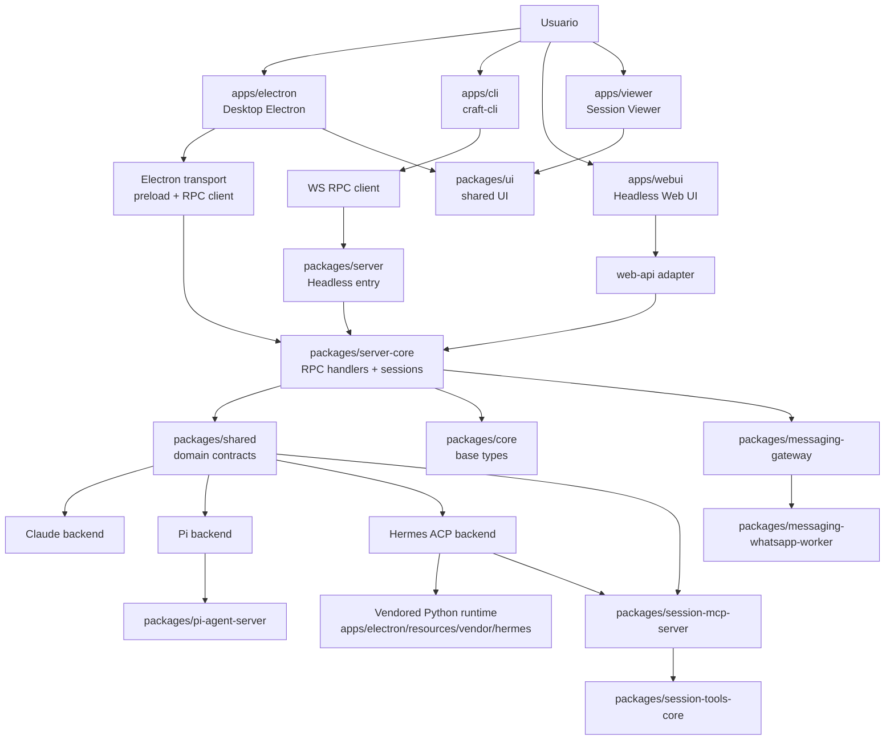
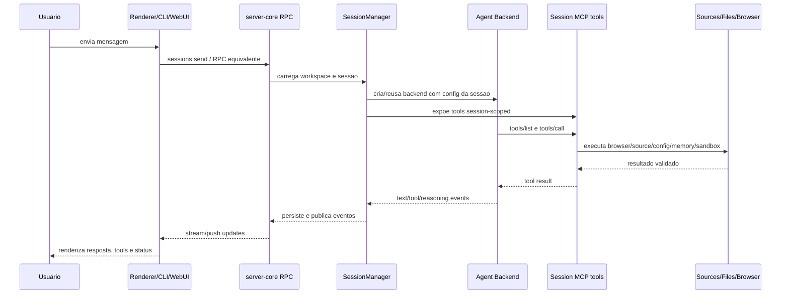
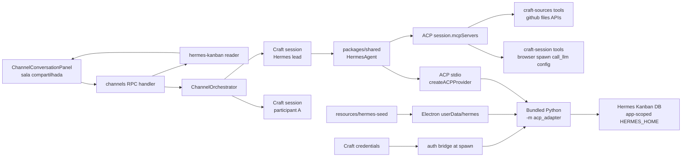

# Functional Baseline - Craft Agents OSS

Data: 2026-05-11

## Identidade

Craft Agents OSS e um monorepo Bun/TypeScript para operar agentes em uma experiencia desktop, headless e CLI. O produto principal e um app Electron/React que organiza workspaces, sessoes, fontes, skills, permissoes, automacoes, canais tipo Slack/War Room e backends de agente. O fork local adiciona uma integracao forte com Hermes: runtime Python/ACP embutido, isolado por `HERMES_HOME` app-scoped, atualizado por pin upstream da NousResearch mais patches overlay de Craft.

O repo esta versionado como `0.8.12`, usa workspaces `apps/*` e `packages/*`, e publica multiplas entradas:

- `apps/electron`: experiencia desktop primaria.
- `packages/server` + `packages/server-core`: servidor headless WebSocket/RPC para sessoes remotas e thin-client.
- `apps/cli`: cliente terminal para servidor Craft e modo `run` autocontido.
- `apps/webui`: UI web Vite para o servidor.
- `apps/viewer`: visualizador standalone de sessoes/artefatos.
- `packages/shared`, `packages/core`, `packages/ui`: contratos, logica de dominio e componentes compartilhados.
- `packages/session-mcp-server` + `packages/session-tools-core`: ferramentas MCP session-scoped para agentes.
- `packages/pi-agent-server`: subprocesso/servidor de agente Pi e computer-use.
- `packages/messaging-gateway` + `packages/messaging-whatsapp-worker`: gateway de mensagens e worker WhatsApp.

### Contratos centrais

- `AGENTS.md` e a fonte de verdade para fork sync, Hermes, Channels/War Room e validacoes locais.
- Hermes e dependencia upstream pinada em `apps/electron/scripts/hermes-version.txt`, nao um fork manual. Patches locais vivem em `apps/electron/scripts/hermes-patches/*.patch`.
- `apps/electron/docs/hermes-embed.md` deve ser atualizado quando mudarem bundling Hermes, ACP config, auth bridge, session tools, RPC Hermes ou patches Hermes.
- `apps/electron/docs/channels-war-room.md` deve ser atualizado quando mudarem tipos/storage/CRUD de canais, orquestracao, Hermes Kanban, RPC de canais ou painel de conversa.
- Configuracao de usuario vive sob `~/.craft-agent/`; estado Hermes embutido vive sob `Electron userData/hermes`, nao `~/.hermes`.

## Mapa Funcional

### App desktop Electron

O app desktop e a superficie primaria. Ele combina Electron main process, preload bridge, renderer React/Vite, handlers RPC, BrowserView interno, notificacoes, menus, auto-update, onboarding, settings e packaging.

Principais areas:

- `apps/electron/src/main`: boot Electron, janelas, BrowserView, deep links, logs, power manager, network proxy, handlers e runtime Hermes.
- `apps/electron/src/preload`: bridges para renderer e toolbar do browser.
- `apps/electron/src/renderer`: AppShell, navegacao por paineis, chat, settings, browser UI, workspace picker, automacoes, canais, arquivos, markdown e preview.
- `apps/electron/src/transport`: mapa cliente/servidor entre renderer e RPC handlers.
- `apps/electron/scripts`: build, copy assets, bundle/update Hermes, packaging por plataforma.
- `apps/electron/resources`: assets e seed knowledge Hermes.

Funcionalidades cobertas:

- workspaces locais/remotos;
- sessoes com historico persistente, status, labels, branch/rollback e anexos;
- chat com streaming, ferramentas, permissoes e markdown rich;
- BrowserView interno com perfis, CDP, toolbar e ferramenta exposta para agentes;
- settings de app, workspace, AI, input, labels, permissoes, servidor, messaging e Hermes;
- Google Meet/Hermes bot via runtime embutido;
- build/distribuicao macOS/Windows/Linux com runtime Hermes vendorizado.

### Servidor headless e transporte

`packages/server` inicia o servidor Bun; `packages/server-core` contem a infraestrutura reutilizavel:

- WS RPC transport, codec, push events e capabilities;
- contratos `PlatformServices` para rodar sem Electron;
- handlers RPC para auth, workspace, sessions, sources, skills, statuses, labels, settings, files, transfer, automations, messaging, channels, Hermes e system;
- `SessionManager` e servicos de sessao;
- servidor web opcional para `apps/webui/dist`;
- bootstrap headless para thin-client e CLI.

O desktop pode operar como UI local completa ou thin client conectado a servidor remoto via `CRAFT_SERVER_URL` e `CRAFT_SERVER_TOKEN`.

### CLI

`apps/cli` e cliente WebSocket para operar Craft via terminal:

- `ping`, `health`, `versions`;
- listagem de workspaces, sessions, connections e sources;
- criar/deletar sessoes, listar mensagens, enviar prompts com streaming e cancelar;
- `invoke` e `listen` para RPC bruto/push events;
- `run` autocontido que sobe servidor temporario, cria sessao, envia prompt e encerra;
- `--validate-server`, validacao de 21 passos que cria e remove recursos temporarios.

### WebUI e Viewer

- `apps/webui` e uma UI React/Vite adaptada para ambiente web/headless, com shims para APIs Electron/Node e adapter `web-api`.
- `apps/viewer` e um visualizador standalone React/Vite para sessoes ou conteudos exportados, usando `@craft-agent/core` e `@craft-agent/ui`.

### Shared/domain

`packages/shared` concentra contratos e logica de produto:

- agentes/backends: Claude, Pi, Hermes/ACP, factory e eventos;
- auth, credentials e OAuth;
- configuracao, preferencias, temas, storage e migracoes;
- workspaces, sessions, statuses, labels e views;
- sources MCP/API/filesystem e validacao de conexoes;
- skills e mencoes;
- automacoes e scheduler;
- canais, mensagens e mention resolution;
- Hermes: ACP config, auth bridge, runtime config, seed skills e testes;
- MCP session tools server;
- memory, prompts, docs, resources, i18n e release notes.

`packages/core` contem tipos base compartilhados de mensagens, sessoes, workspaces e servidor. `packages/ui` contem componentes e utilitarios UI reutilizaveis, incluindo markdown, previews, parsing de tools, sanitizacao HTML, plataforma e Shiki.

### Session tools / MCP

`packages/session-tools-core` define ferramentas que agentes recebem por sessao:

- leitura de metadata da sessao;
- listagem e atualizacao de sessoes/status/labels/preferencias;
- envio de mensagem para agente;
- submit plan;
- validacao de config/skill/source;
- source OAuth/test;
- memoria recall/store;
- messaging;
- render template;
- transform data;
- Mermaid validate;
- script sandbox com isolamento de filesystem/path/network.

`packages/session-mcp-server` empacota essas ferramentas como servidor MCP CJS para o runtime de agentes. No contrato Hermes, essas ferramentas entram via ACP `session.mcpServers`, preservando nomes Craft como `mcp__session__browser_tool`.

### Backends de agente

- Claude: usa `@anthropic-ai/claude-agent-sdk`, suporta Anthropic API key/OAuth e endpoints customizados compativeis.
- Pi: usa SDKs `@earendil-works/pi-*`, cobre Google AI Studio, ChatGPT Plus/Codex OAuth, GitHub Copilot OAuth, OpenAI API key e computer-use.
- Hermes: backend Python/ACP separado, vendorizado no app Electron, configurado por `packages/shared/src/hermes/acp-config.ts` e implementado em `packages/shared/src/agent/hermes-agent.ts`.

Hermes deve permanecer isolado:

- sem fallback silencioso para `hermes` do `PATH` em build empacotado;
- sem ler/escrever `~/.hermes` durante operacao embutida;
- sem compartilhar estado/model fallback/tool registry com Claude ou Pi;
- sem mover ferramentas Craft para `mcp.json` global.

### Channels / Hermes War Room

Channels sao salas compartilhadas, nao apenas labels. A superficie funcional inclui:

- tipos e storage em `packages/shared/src/channels`;
- contrato RPC em `packages/shared/src/protocol/channels.ts`;
- handlers em `packages/server-core/src/handlers/rpc/channels.ts`;
- orquestracao em `packages/server-core/src/channels/channel-orchestrator.ts`;
- leitura de Hermes Kanban em `packages/server-core/src/channels/hermes-kanban.ts`;
- painel em `apps/electron/src/renderer/components/app-shell/ChannelConversationPanel.tsx`.

Modos de roteamento:

- `manual-tags`;
- `lead`;
- `all`;
- `orchestrator`.

Salas `lead` e `orchestrator` devem inferir lider Hermes quando `leadParticipantId` nao existir.

### Messaging

`packages/messaging-gateway` oferece registry, pairing, binding store, router, comandos e fanout para canais externos. `packages/messaging-whatsapp-worker` contem worker Baileys e filtro/protocolo WhatsApp. O renderer inclui settings de messaging e configuracao Hermes Messenger.

### Build, release e validacao

Scripts raiz principais:

- `bun run electron:dev`: desktop em desenvolvimento.
- `bun run electron:start`: build + start desktop.
- `bun run server:dev`: servidor headless dev com subprocessos.
- `bun run server:prod`: subprocessos + WebUI build + servidor.
- `bun run typecheck:all`: typecheck de core/shared/server-core/server/session-tools/pi/electron/ui.
- `bun run test`: todos os testes Bun e arquivos `.isolated.ts`.
- `bun run validate:dev`: typecheck amplo + testes shared + smoke de doc tools.
- `bun run validate:ci`: `validate:dev` + paridade i18n.
- `bun run electron:bundle:hermes`: bundle runtime Hermes.
- `bun run electron:dist:*`: build distribuivel por plataforma.

Validacoes focadas Hermes/Craft estao documentadas em `AGENTS.md` e `apps/electron/docs/hermes-embed.md`.

## Health Matrix

| Area | Estado | Evidencia | Risco | Validacao recomendada |
| --- | --- | --- | --- | --- |
| Monorepo/workspaces | Saudavel com escopo grande | `package.json` define workspaces `packages/*`, `apps/*` e scripts de build/test/typecheck | Drift entre apps/pacotes se `typecheck:all` nao rodar | `bun run typecheck:all` |
| Desktop Electron | Funcional principal | README e scripts `electron:dev`, `electron:build`, `electron:dist:*`; renderer/main/preload presentes | Build depende de assets, OAuth envs e runtime Hermes quando empacotado | `bun run electron:build` e smoke do app |
| Headless server | Coberto | `packages/server`, `packages/server-core`, README de server-core e scripts `server:dev/prod` | Divergencia entre Electron handlers e runtime headless | `bun run server:build:subprocess && bun run server:dev` |
| CLI | Coberto | `apps/cli` com testes e docs `docs/cli.md` | `--validate-server` muta workspace temporariamente; requer credenciais para LLM | `cd apps/cli && bun test src/` ou `craft-cli --validate-server` |
| WebUI | Presente | `apps/webui` Vite com adapter web e shims | Pode divergir de APIs Electron se transport mudar | `bun run webui:typecheck && bun run webui:build` |
| Viewer | Presente | `apps/viewer` Vite usando core/ui | Escopo menor; risco em compatibilidade de dados exportados | `bun run viewer:typecheck && bun run viewer:build` |
| Shared/domain | Critico | muitos modulos e testes em `packages/shared/src` | Contratos amplos; regressao afeta todos os apps | `cd packages/shared && bun test` e `bun run typecheck:shared` |
| Server-core RPC | Critico | handlers RPC e tests para sessions/channels/hermes/transfer/system | Mudanca de canal RPC pode quebrar renderer, CLI e webui | `cd packages/server-core && bun run typecheck && bun test src` |
| Session MCP/tools | Critico para agentes | `packages/session-tools-core` + `packages/session-mcp-server` | Tools devem permanecer session-scoped e path-safe | `cd packages/session-mcp-server && bun run build`; testes de session tools |
| Hermes embedded | Critico e sensivel | `apps/electron/docs/hermes-embed.md`, scripts bundle/update, patches overlay, seed skills | Upstream drift pode quebrar patches; packaged app deve falhar fechado sem runtime | overlay `git apply --check`, testes Hermes focados e `bun run electron:bundle:hermes` |
| Channels / War Room | Em evolucao funcional | docs e testes de channel orchestrator/Kanban/RPC | Roteamento silencioso ou leak de tasks Kanban entre canais | suite documentada em `channels-war-room.md` |
| Messaging/WhatsApp | Presente | gateway e worker com testes | Dependencias externas, pairing e worker runtime | `cd packages/messaging-gateway && bun test src` + typecheck worker |
| Pi agent server | Presente | build/typecheck dedicados e testes de model/computer-use | Subprocesso e assets `pi-computer-use` precisam acompanhar dist | `cd packages/pi-agent-server && bun run validate` |
| Packaging/release | Presente | electron-builder, scripts plataforma e Dockerfile.server | Assinatura, notarizacao e runtime Hermes vendorizado sao pontos de falha | `bun run electron:dist:dev:mac` ou plataforma alvo |
| Docs operacionais | Parcialmente cobertas | README, CLI, Hermes embed, channels-war-room, este baseline | Mudancas grandes podem ficar fora dos docs se nao forem atualizadas junto | exigir update docs em mudancas de contrato |

## Issues

### Abertos / riscos conhecidos

1. **Baseline global depende de worktree ja alterado.** No momento desta captura, `git status --short` mostra alteracoes nao commitadas em arquivos Hermes/build/settings e arquivos novos de seed/testes. Este baseline descreve o estado observado do checkout, mas nao afirma que essas mudancas estao revisadas ou prontas para merge.

2. **Hermes segue upstream dinamico quando pinado em `upstream/main`.** Isso e intencional no fluxo local, mas aumenta risco de quebra de overlay. Sempre validar `git apply --check` em todos os patches antes de empacotar ou dizer que update Hermes esta saudavel.

3. **Hermes packaged deve falhar fechado.** Qualquer mudanca que volte a spawnar `hermes` do `PATH` em app empacotado e regressao de contrato.

4. **Channels/War Room ainda tem alto acoplamento de contrato.** Alteracoes em tipos, mention resolution, RPC, Kanban ou painel de UI devem atualizar docs e rodar a suite focada. O risco principal e dispatch silencioso ou retorno de worker fora do canal correto.

5. **CLI `--validate-server` e invasivo por design.** Ele cria sessao, source e skill temporarios. Nao usar como health check cego em workspace de usuario sem aceitar essa mutacao.

6. **Scripts de validacao amplos podem ser caros.** `validate:dev` inclui typecheck amplo e smoke tests Python de doc tools; use suites focadas para mudancas pequenas, mas rode o amplo antes de releases ou mudancas cross-package.

7. **Apps web/viewer sao superficies secundarias.** Elas existem e buildam por scripts proprios, mas o contrato principal do produto continua no desktop/headless. Mudancas no core/ui precisam considerar esses consumidores.

### Gaps de documentacao

- Nao ha um baseline funcional unico anterior em `.planning`; este arquivo passa a ser o ponto inicial.
- README descreve arquitetura base, mas nao cobre todos os pacotes atuais adicionados ao monorepo.
- Os contratos mais precisos de Hermes e Channels estao em docs separados; este baseline referencia e resume, mas nao substitui esses arquivos.

## Parecer

O monorepo esta organizado como produto agent-native multi-runtime, com o desktop Electron como superficie principal e servidor/CLI/WebUI como modos operacionais complementares. A arquitetura atual e defensavel: contratos de dominio ficam em `packages/shared`, infraestrutura headless em `server-core`, UI reutilizavel em `ui`, e capacidades perigosas de agentes entram por ferramentas session-scoped em vez de config global.

O ponto mais sensivel e Hermes. A decisao correta do fork e trata-lo como runtime Python/ACP embutido, pinado a upstream mais patches overlay, com estado isolado e auth bridge controlado por Craft. Isso deve continuar separado dos backends Claude e Pi. O segundo ponto sensivel e Channels/War Room, que ja tem contrato de produto claro e precisa preservar a ideia de sala compartilhada com sessoes de agente como detalhe interno.

Para evoluir com seguranca, usar validacao por escopo:

- mudancas Hermes: testes focados Hermes/Craft + overlay check + bundle quando mexer em runtime;
- mudancas Channels: suite de channels/orchestrator/Kanban + renderer build;
- mudancas UI desktop: `apps/electron` typecheck/lint/build conforme impacto;
- mudancas shared/server: typecheck/test do pacote e consumidor relevante;
- release: `validate:ci` e build/distribuicao da plataforma alvo.

## Diagramas Mermaid

### 1. Arquitetura de alto nivel

### 2. Fluxo de sessao e ferramentas

### 3. Hermes embedded e War Room

