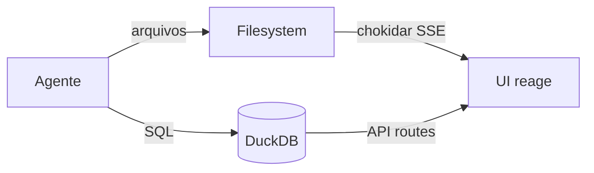
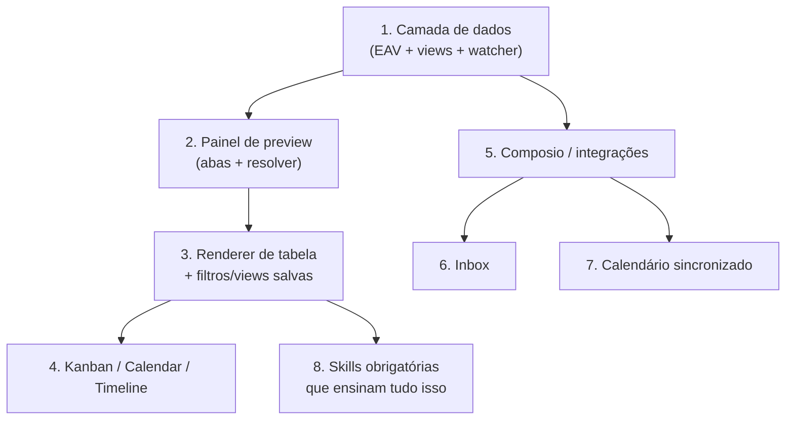

# DenchClaw → Craft Desktop — Mapa de Replicação

## Status da evidência e decisões Craft

Esta importação foi reconciliada contra
`DenchHQ/DenchClaw@f14eb4c239002d7b28673c60955b689b9d69db22`. As descrições
dos seis documentos técnicos abaixo são evidência do comportamento observado
nesse SHA, não um contrato normativo do Craft.

- **Confirmado no upstream:** EAV/DuckDB, manifests `.object.yaml`, reducer de
  tabs, resolver SWR, renderers especializados, watcher e o data loop descrito
  nos documentos abaixo.
- **Defeitos conhecidos no upstream:** o LRU mantém payloads além do limite, o
  cancelamento não cobre de forma uniforme load e refresh, e a identidade entre
  banco, diretório e manifest depende de alinhamento frágil.
- **Decisões Craft:** SQLite é a única autoridade; manifests são projeções
  reparáveis; a tool de agente é genérica e validada; eventos só saem após o
  commit como `ready` ou `projection-error`; cache, cancellation/generation e
  watcher têm lifecycle explícito. U5-U9 permanecem fora da Phase A.

As recomendações originais que sugerem SQL cru, DuckDB, escrita direta de YAML
ou assumptions sobre capacidades do Craft são contexto histórico e ficam
subordinadas às decisões acima e ao OpenSpec
`add-structured-workspace-objects`.

> Documentação técnica derivada de análise direta do repositório
> `github.com/DenchHQ/DenchClaw`
> (`f14eb4c239002d7b28673c60955b689b9d69db22`, clonado em 2026-08-01).
>
> **Escopo desta doc:** descrever como cada feature funciona no DenchClaw
> com detalhe suficiente para reimplementar, e propor o caminho de
> replicação no Craft Desktop.
>
> **Premissa declarada:** não tenho acesso ao código-fonte do Craft Desktop
> nesta sessão. As seções "Replicação no Craft" são especificações escritas
> contra a *superfície de capacidades documentada* do Craft (sources MCP/REST,
> skills, blocos de preview, `transform_data`, automations, browser tools).
> Onde eu afirmo "o Craft já tem X", isso vem da documentação do produto —
> vale validar contra o código antes de estimar.

---

## Documentos

| # | Documento | Área | Complexidade de réplica |
|---|---|---|---|
| 01 | [Tabelas / CRM](01-crm-tabelas.md) | Modelo de dados EAV, PIVOT views, tipos de campo, projeção filesystem | **Alta** — é a fundação |
| 02 | [Painel de Preview](02-painel-preview.md) | Abas, resolver de conteúdo, 25 renderers | **Média-alta** |
| 03 | [Composio / Integrações](03-composio-integracoes.md) | OAuth de terceiros, MCP dinâmico, health check | **Média** |
| 04 | [Inbox / E-mail](04-inbox-email.md) | Sync Gmail, classificador, UI 3 painéis | **Alta** |
| 05 | [Calendário](05-calendario.md) | Sync Google Calendar, grid, interactions | **Média** |
| 06 | [Tasks / Kanban](06-tasks-kanban.md) | Drag-and-drop, statuses, view settings | **Baixa-média** |

---

## O insight central da arquitetura

DenchClaw **não expõe uma API de UI para o agente**. Isso é a decisão de design mais importante do produto inteiro, e é o que precisa ser copiado antes de qualquer componente visual.

O agente escreve **SQL no DuckDB** e **arquivos no disco**. A UI observa o disco e re-renderiza. Não existe `createTable()` nem `renderKanban()` como tool.

Consequências práticas:

1. **A UI nunca precisa de tools novas.** Adicionar um tipo de view é adicionar um renderer + uma chave no YAML. O agente já sabe escrever YAML.
2. **O contrato agente↔UI é o schema do banco + o formato do `.object.yaml`.** Documentar isso *nas skills* substitui documentar numa API.
3. **A confiabilidade vem de repetição nas skills, não de tipos.** É frágil — ver a seção "Triple Alignment" no doc 01 — mas é o que permite ~8.800 linhas de markdown fazerem o papel de uma API inteira.

Se o Craft replicar só os componentes visuais sem esse loop, você acaba tendo que criar uma tool por feature. Se replicar o loop, cada feature nova é só um renderer.

---

## Ordem de implementação recomendada

**Não pule a 1.** Os itens 4, 6 e 7 são todos casos particulares do mesmo modelo de objeto — inbox é `email_thread` + `email_message`, calendário é `calendar_event`, kanban é qualquer objeto com `default_view: kanban`. Se a camada 1 estiver certa, os outros são renderers.

---

## Comparativo de superfície

| Capacidade | DenchClaw | Craft Desktop (documentado) | Gap |
|---|---|---|---|
| Armazenamento estruturado | DuckDB EAV + PIVOT views | Arquivos na sessão / `transform_data` | **Falta o banco** |
| Renderização de tabela | `object-table.tsx` (69KB, editável) | bloco `datatable` (read-only, sort/filter) | Falta edição inline, kanban, calendar |
| Abas de conteúdo | `workspace-tabs.ts` reducer | blocos de preview com `items[]` (tabs) | Falta persistência/URL/preview-mode |
| Integrações OAuth | Composio via gateway próprio | sources MCP + OAuth triggers | **Craft está bem servido** |
| Reatividade a arquivos | chokidar + SSE | — | Falta watcher |
| Instrução ao agente | 14 skills sempre injetadas | skills sob demanda (`[skill:slug]`) | Falta modo "always inject" |
| Apps internos | `.dench.app` + iframe + bridge | `html-preview` (sandbox, JS bloqueado) | Falta bridge bidirecional |

---

## Riscos identificados no design original

Coisas que eu **não** recomendaria copiar como estão:

1. **Triple alignment sem enforcement.** DuckDB `objects.name` + nome do diretório + `.object.yaml#name` precisam bater exatamente, e nada no código valida isso — só repetição na skill. Um validador em `save` custa pouco e elimina uma classe inteira de bug.
2. **`workspace-content.tsx` com 4.370 linhas** e `ContentRenderer` recebendo ~30 props. O próprio código admite a dívida em comentário. Copie a *arquitetura de 4 camadas* (doc 02), não o god-component.
3. **Composio acoplado ao Dench Cloud.** `resolveComposioEligibility()` exige que o modelo primário seja `dench-cloud/*`. É gate comercial, não técnico. No Craft, ligue direto no Composio ou use os sources MCP nativos.
4. **`value VARCHAR` para tudo no EAV.** Números viram string e precisam de `::NUMERIC` em toda query. Funciona, mas considere colunas tipadas paralelas (`value_num`, `value_date`) se performance importar.
5. **Watcher em polling de 1.5s.** Escolha deliberada (evitar limite de file descriptors no macOS), mas em workspace grande custa CPU. Craft rodando em Electron pode usar `fs.watch` nativo com fallback.
