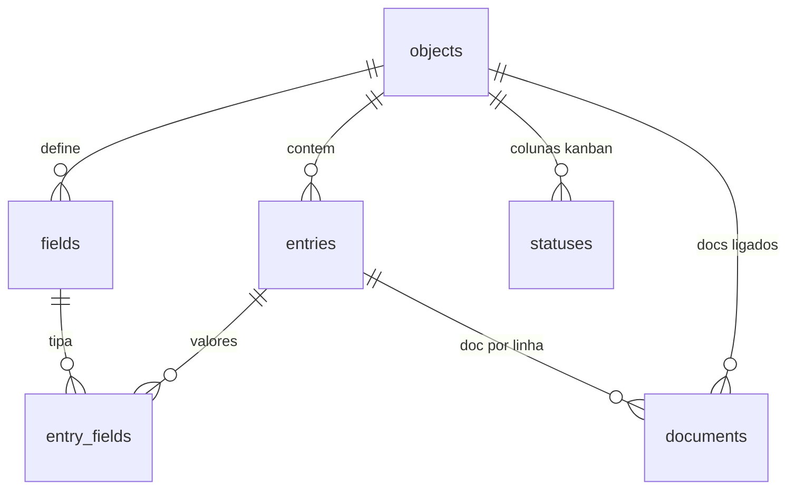

# 01 — Tabelas / CRM

**Arquivos-fonte no DenchClaw:**
- `assets/seed/schema.sql` — schema inicial
- `skills/crm/duckdb-operations/SKILL.md` (570 linhas) — schema + tipos + SQL
- `skills/crm/object-builder/SKILL.md` (401) — workflow de criação
- `skills/crm/views-filters/SKILL.md` (304) — views e filtros
- `apps/web/lib/workspace.ts` (1.818) — acesso ao DuckDB
- `apps/web/lib/object-filters.ts` — filtros/sort/views (compila p/ SQL *e* JS)
- `apps/web/app/api/workspace/objects/**` — 15 rotas de CRUD
- `apps/web/app/components/workspace/object-table.tsx` (69KB) — a tabela

---

## 1. Modelo de dados: EAV + PIVOT

Não existe uma tabela SQL por objeto de CRM. Tudo é **Entity-Attribute-Value** em 5 tabelas fixas.



### Schema completo

```sql
CREATE TABLE objects (
  id VARCHAR PRIMARY KEY DEFAULT (gen_random_uuid()::VARCHAR),
  name VARCHAR NOT NULL,               -- singular, lowercase, uma palavra
  description VARCHAR,
  default_view VARCHAR DEFAULT 'table',-- table|kanban|calendar|timeline|gallery|list
  parent_document_id VARCHAR,          -- objeto aninhado sob um documento
  sort_order INTEGER DEFAULT 0,
  source_app VARCHAR,                  -- quem criou (gmail, calendar, manual)
  immutable BOOLEAN DEFAULT false,     -- objetos de sistema, não deletáveis
  created_at TIMESTAMPTZ DEFAULT now(),
  updated_at TIMESTAMPTZ DEFAULT now(),
  UNIQUE(name)
);
-- ATENÇÃO: não existe coluna `icon`. Ícone vive só no .object.yaml.

CREATE TABLE fields (
  id VARCHAR PRIMARY KEY DEFAULT (gen_random_uuid()::VARCHAR),
  object_id VARCHAR NOT NULL REFERENCES objects(id),
  name VARCHAR NOT NULL,               -- legível: "Email Address", não "email"
  description VARCHAR,
  type VARCHAR NOT NULL,               -- ver tabela de tipos abaixo
  required BOOLEAN DEFAULT false,
  default_value VARCHAR,               -- p/ type=action guarda o JSON de config
  related_object_id VARCHAR REFERENCES objects(id),
  relationship_type VARCHAR,           -- many_to_one | many_to_many
  enum_values JSON,                    -- '["A","B"]'
  enum_colors JSON,                    -- '["#94a3b8","#3b82f6"]'
  enum_multiple BOOLEAN DEFAULT false,
  sort_order INTEGER DEFAULT 0,        -- ordem das colunas na tabela
  created_at TIMESTAMPTZ DEFAULT now(),
  updated_at TIMESTAMPTZ DEFAULT now(),
  UNIQUE(object_id, name)
);

CREATE TABLE entries (
  id VARCHAR PRIMARY KEY DEFAULT (gen_random_uuid()::VARCHAR),
  object_id VARCHAR NOT NULL REFERENCES objects(id),
  sort_order INTEGER DEFAULT 0,
  created_at TIMESTAMPTZ DEFAULT now(),
  updated_at TIMESTAMPTZ DEFAULT now()
);

CREATE TABLE entry_fields (
  id VARCHAR PRIMARY KEY DEFAULT (gen_random_uuid()::VARCHAR),
  entry_id VARCHAR NOT NULL REFERENCES entries(id),
  field_id VARCHAR NOT NULL REFERENCES fields(id),
  value VARCHAR,                       -- TUDO é string, inclusive número/data
  created_at TIMESTAMPTZ DEFAULT now(),
  updated_at TIMESTAMPTZ DEFAULT now(),
  UNIQUE(entry_id, field_id)
);

CREATE TABLE statuses (
  id VARCHAR PRIMARY KEY DEFAULT (gen_random_uuid()::VARCHAR),
  object_id VARCHAR NOT NULL REFERENCES objects(id),
  name VARCHAR NOT NULL,
  color VARCHAR DEFAULT '#94a3b8',
  sort_order INTEGER DEFAULT 0,
  is_default BOOLEAN DEFAULT false,
  UNIQUE(object_id, name)
);

CREATE TABLE documents (
  id VARCHAR PRIMARY KEY DEFAULT (gen_random_uuid()::VARCHAR),
  title VARCHAR DEFAULT 'Untitled',
  icon VARCHAR,
  cover_image VARCHAR,
  file_path VARCHAR NOT NULL UNIQUE,   -- markdown legível: "people/jane-smith-001.md"
  parent_id VARCHAR REFERENCES documents(id),
  parent_object_id VARCHAR REFERENCES objects(id),
  entry_id VARCHAR REFERENCES entries(id),  -- liga doc ↔ linha do CRM
  sort_order INTEGER DEFAULT 0,
  is_published BOOLEAN DEFAULT false
);

CREATE TABLE action_runs (   -- histórico de botões de ação executados
  id VARCHAR PRIMARY KEY,
  action_id VARCHAR NOT NULL, field_id VARCHAR NOT NULL,
  entry_id VARCHAR NOT NULL,  object_id VARCHAR NOT NULL,
  status VARCHAR NOT NULL DEFAULT 'pending',
  started_at TIMESTAMPTZ DEFAULT now(), completed_at TIMESTAMPTZ,
  result VARCHAR, error VARCHAR, stdout VARCHAR, exit_code INTEGER
);
```

### A PIVOT view — o truque que torna EAV utilizável

Depois de **toda** mutação de objeto ou campo, o agente regenera uma view:

```sql
CREATE OR REPLACE VIEW v_lead AS
PIVOT (
  SELECT e.id AS entry_id, e.created_at, e.updated_at,
         f.name AS field_name, ef.value
  FROM entries e
  JOIN entry_fields ef ON ef.entry_id = e.id
  JOIN fields f        ON f.id = ef.field_id
  WHERE e.object_id = (SELECT id FROM objects WHERE name = 'lead')
    AND f.type != 'action'          -- campos action nunca entram
) ON field_name IN (
  'Full Name','Email Address','Phone Number','Status','Score','Source','Notes'
) USING first(value);
```

Depois disso, consultas são normais:

```sql
SELECT * FROM v_lead WHERE "Status" = 'New' ORDER BY created_at DESC LIMIT 50;
SELECT "Status", COUNT(*) FROM v_lead GROUP BY "Status";
```

**Regras não-negociáveis:**
- A cláusula `IN (...)` é obrigatória e explícita. Sem ela o schema da view depende de quais dados existem naquele momento → colunas aparecem e somem.
- Convenção de nome: `v_{object_name}`.
- Nomes de campo com espaço **precisam** de aspas duplas em SQL: `"Full Name"`.
- Campos `action` são excluídos (não têm valores em `entry_fields`).

O backend também faz o pivot em JS (`pivotEavRows` em `app/api/workspace/objects/[name]/route.ts`), então a view é para o *agente* e para queries ad-hoc; a UI não depende dela.

---

## 2. Tipos de campo

```datatable
{
  "title": "Tipos de campo suportados",
  "columns": [
    { "key": "tipo", "label": "type", "type": "text" },
    { "key": "uso", "label": "Uso", "type": "text" },
    { "key": "storage", "label": "Como armazena em entry_fields.value", "type": "text" },
    { "key": "cast", "label": "Cast em query", "type": "text" },
    { "key": "api", "label": "Criável via API", "type": "boolean" }
  ],
  "rows": [
    { "tipo": "text", "uso": "Texto geral, nomes", "storage": "string crua", "cast": "—", "api": true },
    { "tipo": "email", "uso": "E-mails (validado)", "storage": "string crua", "cast": "—", "api": true },
    { "tipo": "phone", "uso": "Telefone (normalizado)", "storage": "string crua", "cast": "—", "api": true },
    { "tipo": "url", "uso": "Links, sites", "storage": "string crua", "cast": "—", "api": true },
    { "tipo": "number", "uso": "Preço, score", "storage": "string numérica", "cast": "::NUMERIC", "api": true },
    { "tipo": "boolean", "uso": "Flags", "storage": "\"true\" / \"false\"", "cast": "= 'true'", "api": true },
    { "tipo": "date", "uso": "Datas ISO 8601", "storage": "string ISO", "cast": "::DATE", "api": true },
    { "tipo": "richtext", "uso": "Campo Notes", "storage": "string crua", "cast": "—", "api": true },
    { "tipo": "file", "uso": "Anexo", "storage": "path ou URL", "cast": "—", "api": true },
    { "tipo": "tags", "uso": "Array livre de labels", "storage": "JSON array string", "cast": "—", "api": true },
    { "tipo": "enum", "uso": "Dropdown com cores", "storage": "valor selecionado", "cast": "—", "api": true },
    { "tipo": "user", "uso": "Membro do workspace", "storage": "ID do membro (usr_abc)", "cast": "—", "api": false },
    { "tipo": "relation", "uso": "FK p/ outro objeto", "storage": "entry_id ou JSON array", "cast": "—", "api": false },
    { "tipo": "action", "uso": "Botão que roda script", "storage": "nenhum (config em default_value)", "cast": "N/A", "api": true }
  ]
}
```

`user` e `relation` **só** podem ser criados via SQL direto — a rota `POST /api/workspace/objects/{name}/fields` recusa esses tipos. Detalhe importante ao portar: é uma limitação arbitrária, não uma necessidade.

### Colunas de sistema sempre presentes

Toda entry tem `created_at` e `updated_at` (em `entries`, não em `fields`). A skill instrui explicitamente: se o objeto não tem campo de data, **use esses** para calendar/timeline em vez de dizer "não há datas".

### Relações — a política "aggressive linking"

A skill CRM manda o agente criar campos `relation` proativamente, sem esperar o usuário pedir. Existe uma tabela de regras:

| Criando... | Se existe... | Criar relação |
|---|---|---|
| people / contact | company | "Company" → company (`many_to_one`) |
| deal / opportunity | people | "Primary Contact" → people |
| deal / opportunity | company | "Company" → company |
| task | people | "Assigned Contact" → people |
| task | project / deal | "Related To" → parent |
| invoice | company / deal | "Company" / "Deal" |
| qualquer filho | seu pai conceitual | relação ao pai |

Padrão SQL seguro (no-op se o alvo não existir):

```sql
INSERT INTO fields (object_id, name, type, related_object_id, relationship_type, sort_order)
SELECT (SELECT id FROM objects WHERE name='people'), 'Company', 'relation',
       (SELECT id FROM objects WHERE name='company'), 'many_to_one', 3
WHERE EXISTS (SELECT 1 FROM objects WHERE name='company')
ON CONFLICT (object_id, name) DO NOTHING;
```

Regra geral que vale copiar textualmente para a skill do Craft: *"Se você está criando o objeto B, e o objeto A já existe, pergunte: uma entrada em B logicamente pertenceria a / referenciaria / selecionaria uma entrada em A? Se sim, crie um campo relation. Nunca modele referência como string (`Company Name`) quando o objeto correspondente existe."*

---

## 3. A projeção no filesystem

Cada objeto tem um **diretório** no workspace com um `.object.yaml`:

```
workspace/
  workspace_context.yaml     # READ-ONLY: org, membros, integrações, protected_objects
  workspace.duckdb           # fonte da verdade estruturada
  WORKSPACE.md               # sumário de schema auto-gerado
  lead/
    .object.yaml             # metadata + views salvas + settings
    .actions/                # scripts dos botões de ação
      enrich.sh
    jane-smith-001.md        # documento ligado a uma entry
  company/
    .object.yaml
```

### `.object.yaml` — o contrato UI↔agente

```yaml
id: "uuid-do-objeto"
name: "lead"                    # DEVE bater com objects.name e com o nome do diretório
description: "Sales leads tracking"
icon: "user-plus"               # nome de ícone Lucide — vive SÓ aqui
default_view: "table"
entry_count: 42
active_view: "Active deals"     # qual view salva está ativa agora

fields:                         # espelho do schema, na ordem de sort_order
  - name: "Full Name"
    type: text
    required: true
  - name: "Status"
    type: enum
    values: ["New", "Contacted", "Qualified", "Converted"]
  - name: "Company"
    type: relation
    related_object: company
    relationship_type: many_to_one

view_settings:                  # como cada tipo de view renderiza
  kanbanField: "Status"
  calendarDateField: "Due Date"
  calendarEndDateField: "End Date"
  calendarMode: "month"         # day | week | month | year
  timelineStartField: "Start Date"
  timelineEndField: "End Date"
  timelineGroupField: "Status"
  timelineZoom: "week"          # day | week | month | quarter
  galleryTitleField: "Name"
  galleryCoverField: "Image"
  listTitleField: "Name"
  listSubtitleField: "Description"
  column_widths:                # persistido automaticamente ao arrastar
    Full Name: 250
    Status: 150

views:                          # views salvas — aparecem na barra de filtros
  - name: "Active deals"
    view_type: "table"
    filters:
      id: root
      conjunction: and
      rules:
        - id: f1
          field: "Status"
          operator: is_any_of
          value: ["Negotiating", "Proposal sent"]
        - id: f2
          field: "Amount"
          operator: gte
          value: 10000
    sort:
      - field: updated_at
        direction: desc
    # columns: [...]  ← OMITIR por padrão. Só define visibilidade, não ordem.
```

### ⚠️ TRIPLE ALIGNMENT

Estes três **têm** que ser idênticos:

1. `objects.name` no DuckDB
2. o nome do diretório no filesystem
3. o campo `name:` dentro do `.object.yaml`

Se um divergir, o objeto some da sidebar ou renderiza vazio. **Não há validação no código** — só repetição na skill. Ao renomear, a skill exige 5 passos atômicos: UPDATE no DuckDB → `mv` do diretório → editar YAML → `DROP VIEW v_old; CREATE VIEW v_new` → verificar.

> **Recomendação para o Craft:** implemente um validador em nível de save/watch que detecte divergência e ou corrija ou emita erro visível. Custa ~30 linhas e mata uma classe inteira de bug silencioso.

---

## 4. Filtros e views salvas

### Implementação Craft U5

O Craft não compila o filtro para SQL nem mantém uma segunda implementação no
renderer. `view-schema.ts` valida um contrato estrito `schemaVersion: 1` com
grupos booleanos aninhados, search, multi-sort, visibilidade e settings do
adapter. `query.ts` avalia esse contrato deterministicamente para os dois
caminhos: `workspace_objects.query-object` usado pelo agente e
`ObjectTableView` usado pelo Desktop. A ordem original é o desempate estável.

Views antigas aceitas pelo placeholder da Phase A continuam entrando pelo
frontier v1 e também são normalizadas ao reconstruir projeções gravadas antes
do U5. O payload e todas as novas views saem somente no formato versionado.

Relações continuam armazenando `entryId`. O Desktop carrega o payload atual do
objeto relacionado em paralelo com o objeto aberto, deriva o label atual no
render e revalida quando o alvo muda. Um rename altera o label sem regravar o
stable ID da célula.

Edição de célula não é otimista: o draft tipado permanece aberto durante a
mutation. Input inválido não chama `upsert-entries`; rejeição e erro de
transporte mantêm o draft com mensagem acionável. Mesmo uma resposta de sucesso
só fecha o editor quando o resolver SWR entrega um payload cuja revisão alcança
o commit e cujo valor canônico coincide.

`apps/web/lib/object-filters.ts` é a peça mais reaproveitável do repo. Define:

```ts
type FilterGroup = {
  id: string;
  conjunction: "and" | "or";
  rules: Array<FilterRule | FilterGroup>;   // aninhamento arbitrário
};

type FilterRule = {
  id: string;
  field: string;
  operator: FilterOperator;
  value?: unknown;
};

type SortRule   = { field: string; direction: "asc" | "desc" };
type ViewType   = "table" | "kanban" | "calendar" | "timeline" | "gallery" | "list";
```

**O detalhe que vale copiar:** o mesmo `FilterGroup` compila para dois destinos:

- `buildWhereClause(group, fieldMeta)` → cláusula SQL (filtro server-side, paginado)
- `entryMatchesFilter(entry, group)` → predicado JS (filtro client-side, instantâneo)

E serializa para dois formatos: **URL** (`serializeFilters`/`deserializeFilters`, deep-link) e **YAML** (`.object.yaml#views`). É isso que permite o agente "criar uma view filtrada" escrevendo YAML e a UI aplicar na hora.

### Operadores por tipo

| Tipo | Operadores |
|---|---|
| text / richtext / email | `contains`, `not_contains`, `equals`, `not_equals`, `starts_with`, `ends_with`, `is_empty`, `is_not_empty` |
| number | `eq`, `neq`, `gt`, `gte`, `lt`, `lte`, `between`, `is_empty`, `is_not_empty` |
| date | `on`, `before`, `after`, `date_between`, `relative_past`, `relative_next`, `is_empty`, `is_not_empty` |
| enum | `is`, `is_not`, `is_any_of`, `is_none_of`, `is_empty`, `is_not_empty` |
| boolean | `is_true`, `is_false`, `is_empty`, `is_not_empty` |
| relation / user | `has_any`, `has_none`, `has_all`, `is_empty`, `is_not_empty` |
| tags | `contains`, `not_contains`, `is_empty`, `is_not_empty` |

---

## 5. Superfície de API

Rotas sob `/api/workspace/objects/`:

```
GET    /objects                              lista objetos
GET    /objects/[name]                       ← PAYLOAD PRINCIPAL (ver abaixo)
POST   /objects/[name]/fields                cria campo (não aceita relation/user)
PATCH  /objects/[name]/fields/[fieldId]      renomeia/retipa
POST   /objects/[name]/fields/reorder        reordena colunas
POST   /objects/[name]/fields/[id]/enum-rename  renomeia valor de enum em massa
GET    /objects/[name]/entries               entries paginadas
POST   /objects/[name]/entries               cria entry
PATCH  /objects/[name]/entries/[id]          atualiza célula
DELETE /objects/[name]/entries/[id]
POST   /objects/[name]/entries/bulk-delete
GET    /objects/[name]/entries/options       opções p/ dropdown de relation
GET    /objects/[name]/entries/[id]/content  documento markdown ligado
PATCH  /objects/[name]/icon                  troca ícone (escreve no .object.yaml)
PATCH  /objects/[name]/display-field         qual campo é o "título" da linha
GET/PUT /objects/[name]/views                views salvas
POST   /objects/[name]/actions               dispara botão de ação
GET    /objects/[name]/actions/runs          histórico de execuções
POST   /objects/[name]/enrich                enriquecimento (Apollo/Exa)
```

### O payload de `GET /objects/[name]`

Uma chamada devolve tudo que a tela precisa:

```ts
type ObjectData = {
  object: { id, name, description?, icon?, default_view?, display_field? };
  fields: Array<{ id, name, type, enum_values?, enum_colors?, enum_multiple?,
                  related_object_id?, relationship_type?, related_object_name?, sort_order? }>;
  statuses: Array<{ id, name, color?, sort_order? }>;
  entries: Record<string, unknown>[];          // já pivotadas
  relationLabels?: Record<string, Record<string, string>>;      // fieldName → entryId → label
  relationFaviconUrls?: Record<string, Record<string, string>>; // idem, favicon do domínio
  reverseRelations?: ReverseRelation[];        // "quem aponta pra mim"
  effectiveDisplayField?: string;
  savedViews?: SavedView[];
  activeView?: string;
  viewSettings?: ViewTypeSettings;
  totalCount?: number; page?: number; pageSize?: number;
};
```

**Resolução de relações no servidor** (`resolveRelationLabels`): para cada campo `relation`, busca o objeto alvo, resolve seu display field, e mapeia `entryId → label`. Também extrai favicon via domínio quando o alvo tem campo `url`. Isso evita N+1 no cliente e é o que faz relações renderizarem como chip com ícone em vez de UUID.

**Resolução do display field** (prioridade): `objects.display_field` explícito → heurística (campo com "name"/"title" no nome) → primeiro campo `text` → primeiro campo → `"id"`.

### Robustez contra corrida DuckDB

O repo tem defesas espalhadas que valem copiar:

- `findObjectRecord` tenta 2x com 100ms de intervalo (evita 404 falso quando o probe pega o banco no meio de uma escrita).
- Se `fields.length === 0 && entries.length > 0`, espera 200ms e refaz (corrida clássica escrita/leitura).
- `ensureDisplayFieldColumn` roda `ALTER TABLE ... ADD COLUMN IF NOT EXISTS` uma vez por processo, memoizado num `Map<dbFile, Promise>`.
- **Descoberta hierárquica de DB:** subdiretórios podem ter seu próprio `workspace.duckdb`, autoritativo para objetos naquela subárvore. Bancos mais rasos ganham em caso de nome duplicado (`discoverDuckDBPaths`).

---

## 6. Replicação no Craft

### 6.1 Escolha do storage

DuckDB explica as escolhas upstream: single-file, SQL analítico e `PIVOT`
nativo. No Craft, porém, a decisão é **SQLite pelo adapter cross-runtime já
empacotado**. `objects/objects.sqlite` é a única autoridade; rows normalizadas
alimentam uma projeção de leitura revisionada, reconstruída pela aplicação
quando ausente ou stale. Não se adiciona `@duckdb/node-api` nesta roadmap.

### 6.2 Ajustes que eu faria

| Ponto | DenchClaw | Sugestão Craft |
|---|---|---|
| `value VARCHAR` p/ tudo | Simples, mas cast em toda query | Adicionar `value_num DOUBLE`, `value_date TIMESTAMPTZ` populados por trigger/app. Índices funcionam. |
| Triple alignment | Sem validação | Validador no watcher; auto-corrige YAML a partir do DB |
| `relation`/`user` só via SQL | Limitação arbitrária da API | Aceitar na API desde o início |
| Ícone só no YAML | Split-brain deliberado | Manter (é bom: ícone é apresentação, não dado) |
| PIVOT view regenerada à mão | Agente esquece | Trigger/hook: qualquer mutação em `fields` regenera a view |

### 6.3 Esqueleto de implementação

```
craft/
  lib/crm/
    schema.ts             # migrations SQLite idempotentes
    storage.ts            # adapter compartilhado + CRUD transacional
    projection.ts         # payload tabular revisionado e reconstruível
    service.ts            # mutations genéricas + evento pós-commit
    manifest.ts           # projeção YAML validada e reparável
    filters.ts            # PORTAR object-filters.ts quase 1:1 (é bom código)
  components/crm/
    object-view.tsx       # header + switcher + view ativa
    object-table.tsx      # edição inline por tipo
    object-kanban.tsx     # ver doc 06
    ...
```

**Ordem:** `schema.ts` → `storage.ts`/`projection.ts` → `service.ts` + data plane
genérico → preview tabular read-only → edição inline → filtros → views salvas.

### 6.4 A skill que ensina isso ao agente

Copie a estrutura de `skills/crm/`: uma skill-pai com fundamentos + filhas especializadas. O que **precisa** estar lá:

1. Contrato versionado da tool genérica; o agente nunca recebe SQL cru.
2. Tabela de tipos de campo com storage e cast.
3. O workflow de 3 passos: **(1) mutation validada e transação SQLite → (2)
   projeção no filesystem (`object.yaml`) → (3) evento/verificação**. O service,
   não o prompt do agente, garante essa sequência.
4. As regras de auto-linking de relações.
5. Os pitfalls de SQL: aspas duplas em nomes com espaço, `BEGIN TRANSACTION` (não `BEGIN`), aspas simples escapadas, `IN (...)` obrigatório no PIVOT.

No Craft, como skills são carregadas sob demanda (`[skill:slug]`) e não sempre-injetadas, você precisa de um dos dois:
- um mecanismo de "always inject" para as skills de CRM, **ou**
- injeção automática quando a sessão tem um workspace CRM ativo (detectar `workspace.duckdb` no working directory).

A segunda é mais barata em tokens e provavelmente melhor.
