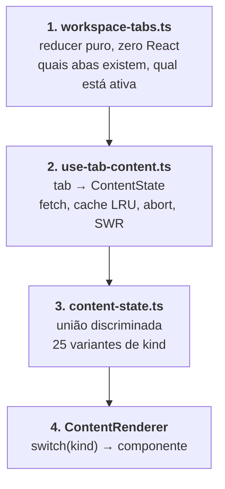
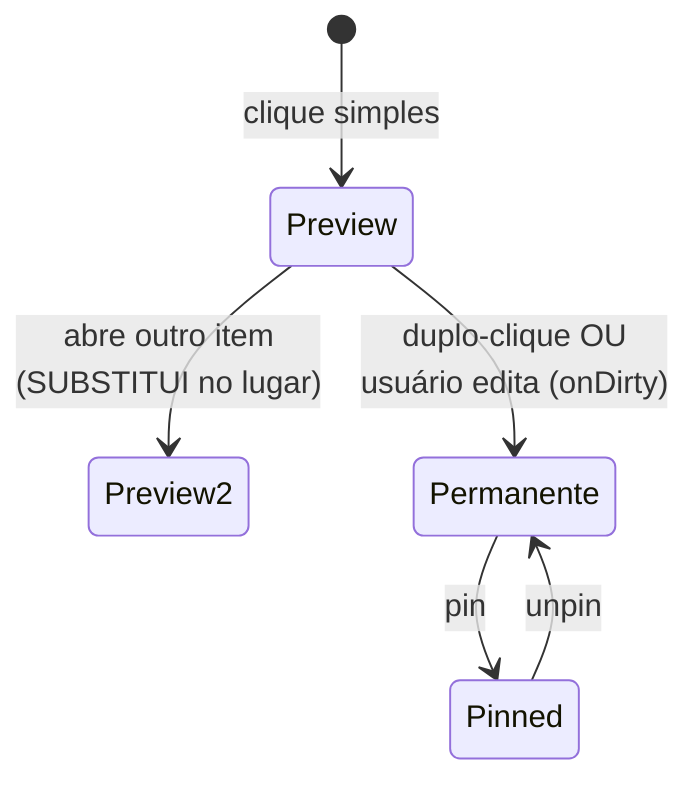
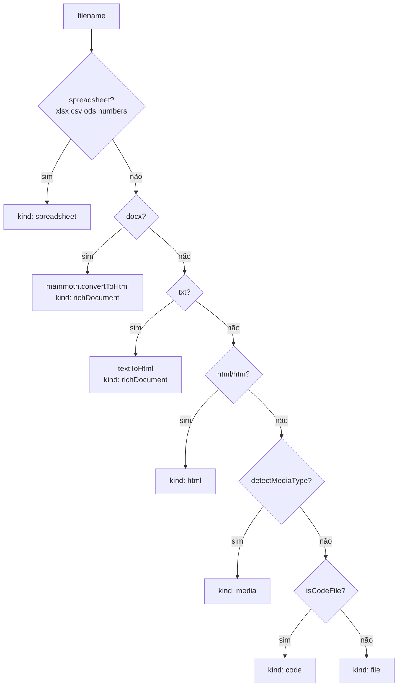
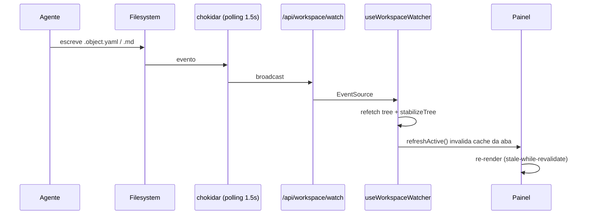

# 02 — Painel de Preview

**Arquivos-fonte no DenchClaw:**
- `apps/web/lib/workspace-tabs.ts` (1.219) — reducer puro de abas
- `apps/web/app/workspace/use-tab-content.ts` (525) — resolver + cache
- `apps/web/app/workspace/content-state.ts` (110) — união discriminada
- `apps/web/app/components/workspace/right-panel-content.tsx` (538) — layout
- `apps/web/app/workspace/workspace-content.tsx:2798-3125` — `ContentRenderer`
- `apps/web/app/hooks/use-workspace-watcher.ts` — SSE + reatividade

---

## 1. A arquitetura em 4 camadas

Esta é a parte mais bem projetada do repo. A separação é estrita e vale copiar tal e qual.



**Por que 4 camadas:** o comentário no topo de `workspace-tabs.ts` explica o histórico. A versão anterior tinha `activePath`, `content` e `activeContentTabId` como estados React separados, mais um efeito de limpeza destrutivo. Efeitos concorrentes se sobrescreviam e o painel mostrava conteúdo da aba errada. A refatoração colapsou tudo em reducer puro + hook único, e a janela de inconsistência deixou de existir por construção.

---

## 2. Camada 1 — modelo de abas

### O tipo

```ts
type ContentTab = {
  id: string;          // ESTÁVEL pela vida da aba
  kind: ContentTabKind;
  path: string;        // path do workspace, virtual (~cron) ou absoluto (browse)
  title: string;
  icon?: string;
  preview: boolean;    // aba efêmera (itálico), substituível
  pinned: boolean;     // sobrevive a close-others/close-all; implica !preview
  meta?: {
    entryId?: string;      // crm-person / crm-company
    profileTab?: string;   // subaba do perfil
    cronJobId?: string;
    browsePath?: string;
  };
};
```

### Geração de ID (a decisão-chave)

```ts
function contentTabIdFor(kind, path, meta): string {
  switch (kind) {
    case "crm-person":  return `crm-person:${meta?.entryId ?? path}`;
    case "crm-company": return `crm-company:${meta?.entryId ?? path}`;
    case "browse":      return `browse:${meta?.browsePath ?? path}`;
    default:            return path;   // o path É o id
  }
}
```

O ID é **determinístico** e derivado de `kind + path + meta`. Não existe `generateTabId()`. Isso é o que permite:
- substituição de aba preview em dois passos limpos (remove + insere) sem race
- deep-link por URL
- persistência em `localStorage` que sobrevive a reload

### Comportamento preview (igual VS Code)



A lógica de `openContent`:

1. Aba com esse ID já existe? → foca. Se `input.preview === false`, promove. Nenhuma aba nova.
2. É preview E existe uma aba preview no slot ativo? → **substitui atomicamente**. O novo `activeContentId` já é o novo ID no mesmo dispatch.
3. Senão → append + foca.

`findActivePreviewIndex` prefere a aba preview *ativa* (o slot que o usuário está olhando) antes de cair para "qualquer preview".

### Ações do reducer

```
openContent · closeContent · closeOtherContent · closeContentToRight · closeAllContent
activateContent · promoteContent · promoteContentByPath · togglePinContent
updateContentMeta · reorderContent · renameContent
applyUrl · replace
```

Invariantes garantidas por construção:
- `activeContentId` é `null` ou está em `contentTabs.map(t => t.id)`. Atualizado atomicamente com a lista.
- Ao fechar a aba ativa, o foco vai para a aba no mesmo índice, ou a última se estava no fim.
- Abas `pinned` são imunes a `closeContent`/`closeAll`.

### Persistência e URL

- `localStorage` com chave `dench:workspace-tabs:{workspaceId}` — hidratação valida shape e descarta ativo inexistente.
- `projectUrlState(state, shell)` projeta a aba ativa para a URL: `path`, ou `entry` + `profileTab` para perfis CRM, mais os params de object-view (`viewType`, `view`, `filters`, `search`, `sort`, `page`, `pageSize`, `cols`).
- `applyUrlToState(state, url, shell)` faz o inverso, e é **idempotente** — aplicar a URL atual não muda o estado.

---

## 3. Camada 2 — resolver de conteúdo

`useTabContent(tab, deps) → { content, refreshActive, dropFromCache, clearCache }`

### Kinds derivados vs. buscados

```ts
function kindIsDerived(kind) {
  return ["directory","browse","cron-dashboard","cron-job","skills",
          "integrations","cloud","crm-inbox","crm-calendar",
          "crm-person","crm-company"].includes(kind);
}
```

Kinds derivados **não fazem fetch** — recomputam a cada render a partir da árvore/cron ao vivo. Reagem sozinhos a mudanças upstream, sem invalidação manual. Kinds buscados passam pelo cache.

### Cache

- **LRU de 20 entradas**, chaveado por `tab.id`. Trocar de aba não refaz fetch.
- **Contador de geração por aba** (`generationRef: Map<string, number>`): cada fetch incrementa; respostas com geração antiga são descartadas no reducer (`if (existing.generation !== action.generation) return state`). Clicar mais rápido que a rede não gera race.
- **AbortController** por fetch; trocar de aba aborta o anterior.
- **Stale-while-revalidate**: na ação `loading`, se já existe conteúdo em cache, ele é **preservado**. O painel continua mostrando os dados antigos até o novo payload chegar.

> Esse último ponto é o detalhe de polimento mais importante. Sem ele, cada tick do SSE (a cada 1.5s enquanto o agente escreve) desmontava a view e mostrava spinner/tabela vazia. Copie isso.

### Resolução por extensão

`fetchFileContent` é uma cascata ordenada:



Paths virtuais com prefixo `~` são roteados antes, por `inferContentTabKindFromPath`:
`~cron` → cron-dashboard · `~cron/<id>` → cron-job · `~skills` → skills · `~integrations` · `~cloud` · `~crm/inbox` · `~crm/calendar`.

### Retries defensivos

```ts
// objeto: 404 ou 5xx → espera 150ms, tenta de novo
// se fields.length === 0 mas entries.length > 0 → espera 200ms, refaz
// code === "DUCKDB_NOT_INSTALLED" → kind "duckdb-missing" (tela de instalação)
```

---

## 4. Camada 3 — `ContentState`

```ts
type ContentState =
  | { kind: "none" }
  | { kind: "loading" }
  | { kind: "object";      data: ObjectData }
  | { kind: "document";    data: FileData; title: string }
  | { kind: "file";        data: FileData; filename: string }
  | { kind: "code";        data: FileData; filename: string; filePath: string }
  | { kind: "media";       url: string; mediaType: MediaType; filename: string; filePath: string }
  | { kind: "spreadsheet"; url: string; filename: string; filePath: string }
  | { kind: "html";        rawUrl: string; contentUrl: string; filename: string }
  | { kind: "database";    dbPath: string; filename: string }
  | { kind: "report";      reportPath: string; filename: string }
  | { kind: "directory";   node: TreeNode }
  | { kind: "richDocument"; html: string; filePath: string; mode: "docx" | "txt" }
  | { kind: "app";         appPath: string; manifest: DenchAppManifest; filename: string }
  | { kind: "cron-dashboard" } | { kind: "cron-job"; ... } | { kind: "cron-session"; ... }
  | { kind: "skill-store" } | { kind: "integrations" } | { kind: "cloud" }
  | { kind: "duckdb-missing" }
  | { kind: "crm-inbox" } | { kind: "crm-calendar" }
  | { kind: "crm-person";  entryId: string; profileTab?: string }
  | { kind: "crm-company"; entryId: string; profileTab?: string };
```

Cada variante carrega **exatamente** o que seu renderer precisa. Nada de `data: any`.

---

## 5. Camada 4 — os 25 renderers

```datatable
{
  "title": "Mapa completo kind → componente",
  "columns": [
    { "key": "kind", "label": "kind", "type": "text" },
    { "key": "trigger", "label": "Disparado por", "type": "text" },
    { "key": "comp", "label": "Componente", "type": "text" },
    { "key": "kb", "label": "Tamanho", "type": "text" },
    { "key": "edit", "label": "Editável", "type": "boolean" },
    { "key": "tech", "label": "Tecnologia", "type": "text" }
  ],
  "rows": [
    { "kind": "object", "trigger": "diretório com .object.yaml", "comp": "ObjectView", "kb": "~130KB total", "edit": true, "tech": "6 sub-views + filtros + paginação" },
    { "kind": "document", "trigger": ".md", "comp": "DocumentView", "kb": "8KB", "edit": true, "tech": "markdown + TipTap; parseia report-json e diff inline" },
    { "kind": "richDocument", "trigger": ".docx / .txt", "comp": "RichDocumentEditor", "kb": "32KB", "edit": true, "tech": "mammoth (docx→HTML) no browser + TipTap" },
    { "kind": "code", "trigger": ".ts .py .js etc", "comp": "MonacoCodeEditor", "kb": "14KB", "edit": true, "tech": "Monaco" },
    { "kind": "file", "trigger": ".yaml, texto genérico", "comp": "FileViewer", "kb": "5KB", "edit": false, "tech": "<pre> com numeração" },
    { "kind": "spreadsheet", "trigger": ".xlsx .csv .ods .numbers", "comp": "SpreadsheetEditor", "kb": "36KB", "edit": true, "tech": "grade tipo Excel, escreve binário de volta" },
    { "kind": "media", "trigger": "img/vídeo/áudio/pdf", "comp": "MediaViewer", "kb": "13KB", "edit": false, "tech": "img/video/audio/iframe" },
    { "kind": "html", "trigger": ".html .htm", "comp": "HtmlViewer", "kb": "9KB", "edit": false, "tech": "toggle iframe ↔ código (shiki)" },
    { "kind": "database", "trigger": ".duckdb .db .sqlite", "comp": "DatabaseViewer", "kb": "35KB", "edit": false, "tech": "browser de tabelas + query + sort" },
    { "kind": "report", "trigger": ".report.json", "comp": "ReportViewer", "kb": "—", "edit": false, "tech": "Recharts: painéis SQL + filtros" },
    { "kind": "app", "trigger": "pasta *.dench.app", "comp": "AppViewer", "kb": "34KB", "edit": false, "tech": "iframe sandbox + bridge postMessage" },
    { "kind": "directory", "trigger": "pasta comum", "comp": "DirectoryListing", "kb": "—", "edit": false, "tech": "grid de filhos" },
    { "kind": "crm-person", "trigger": "linha de people", "comp": "PersonProfile", "kb": "—", "edit": true, "tech": "perfil com subabas" },
    { "kind": "crm-company", "trigger": "linha de company", "comp": "CompanyProfile", "kb": "—", "edit": true, "tech": "idem + favicon do domínio" },
    { "kind": "crm-inbox", "trigger": "~crm/inbox", "comp": "InboxView", "kb": "~2.4K linhas", "edit": false, "tech": "ver doc 04" },
    { "kind": "crm-calendar", "trigger": "~crm/calendar", "comp": "CalendarView", "kb": "~960 linhas", "edit": false, "tech": "ver doc 05" },
    { "kind": "cron-dashboard", "trigger": "~cron", "comp": "CronDashboard", "kb": "—", "edit": false, "tech": "overview/calendário/timeline de jobs" },
    { "kind": "cron-job", "trigger": "~cron/<id>", "comp": "CronJobDetail", "kb": "—", "edit": false, "tech": "histórico de runs filtrável" },
    { "kind": "cron-session", "trigger": "run específico", "comp": "CronSessionView", "kb": "—", "edit": false, "tech": "transcript do agente" },
    { "kind": "skill-store", "trigger": "~skills", "comp": "SkillStorePanel", "kb": "—", "edit": false, "tech": "loja skills.sh" },
    { "kind": "integrations", "trigger": "~integrations", "comp": "IntegrationsPanel", "kb": "—", "edit": false, "tech": "ver doc 03" },
    { "kind": "cloud", "trigger": "~cloud", "comp": "CloudSettingsPanel", "kb": "—", "edit": false, "tech": "conexão + modelos" },
    { "kind": "duckdb-missing", "trigger": "erro DUCKDB_NOT_INSTALLED", "comp": "DuckDBMissing", "kb": "—", "edit": false, "tech": "instalação guiada" },
    { "kind": "loading", "trigger": "fetch em voo", "comp": "UnicodeSpinner", "kb": "1KB", "edit": false, "tech": "spinner braille" },
    { "kind": "none", "trigger": "nada aberto", "comp": "WelcomeView / EmptyState", "kb": "4KB", "edit": false, "tech": "placeholder" }
  ]
}
```

**Sobreposição:** quando `entryModal` está setado, `EntryDetailPanel` (39KB) toma **toda** a área de conteúdo. A aba continua existindo por baixo.

---

## 6. Layout do painel

```
┌─ FileTreeColumn (240px fixo, ⌘E) ─┬─ ContentTabStrip (h-10) ────────────┐
│  FileSearch (índice em memória)   │  [ícone] título [x] [ícone] ...  [⊟]│
│  breadcrumb de browse dir         ├─────────────────────────────────────┤
│  FileManagerTree (43KB)           │  ContentRenderer                    │
│  - drag&drop, context menu        │      OU                             │
│  - drop externo do Finder         │  EntryDetailPanel                   │
└───────────────────────────────────┴─────────────────────────────────────┘
```

- Painel inteiro colapsável: `⌘⇧B`. Coluna de arquivos: `⌘E`.
- Redimensionável por `ResizeHandle` com min/max calculados contra o container.
- No mobile vira drawer lateral (mesmo `RightPanelContent`, `onSetRightPanelCollapsed` diferente).
- Tab strip tem context menu: Close / Close others / Close to the right / Close all.
- Título truncado em 24 chars (`slice(0,22) + "…"`), itálico quando `preview`.

### Inversão de renderização

`RightPanelContent` **não conhece** `ObjectView`, `AppViewer` etc. Recebe três callbacks:

```ts
renderContent: (content: ContentState, tab: ContentTab | null) => ReactNode;
renderEntryDetail: (entry: EntryModalState) => ReactNode;
renderPlaceholder: () => ReactNode;
```

O comentário no arquivo é honesto sobre o motivo: foi para não ter que reestruturar o `ObjectView` e o "prop tornado" naquele PR. **É dívida técnica, não padrão a copiar.** No Craft, faça o `ContentRenderer` importar os componentes diretamente com `React.lazy`.

---

## 7. O loop de reatividade



Detalhes de produção que valem copiar:

- **Watcher singleton**: uma instância de chokidar compartilhada entre todas as conexões SSE. Troca de workspace fecha e recria.
- **`usePolling: true, interval: 1500`** deliberadamente — `fs.watch` nativo competia com o watcher do Next.js pelo limite de file descriptors do macOS. Em Electron isso provavelmente não se aplica; avalie usar nativo.
- **Ignores críticos**: `.duckdb.wal`, `.duckdb.tmp`, `node_modules`, `.git`, `.next`, e **`.openclaw/web-chat/`**. Esse último é essencial: o transcript do chat é escrito a cada token durante streaming, e sem o ignore a árvore inteira re-renderizava dezenas de vezes por segundo.
- **`stabilizeTree`**: carrega adiante o último `{type, defaultView}` bom conhecido de cada path. Um refetch que pega o DuckDB no meio de uma escrita pode voltar um objeto sem `default_view`, o que fazia o ícone do kanban piscar (kanban → table → kanban). Bug sutil, correção barata.
- **Versionamento de fetch** (`fetchVersionRef`): resposta antiga nunca sobrescreve dados novos.
- **Reconexão com backoff** + fallback para polling se SSE indisponível.

---

## 8. Replicação no Craft

### 8.1 O que o Craft já tem

Os blocos de preview (`html-preview`, `pdf-preview`, `image-preview`, `markdown-preview`, `datatable`, `spreadsheet`) já cobrem parte dos kinds — inclusive com `items[]` para abas. **A diferença estrutural** é que no Craft o preview é *emitido pelo agente no fluxo da resposta*, enquanto no DenchClaw é um painel persistente com estado próprio, navegável independente do chat.

### 8.2 O gap real

```datatable
{
  "columns": [
    { "key": "cap", "label": "Capacidade", "type": "text" },
    { "key": "dench", "label": "DenchClaw", "type": "text" },
    { "key": "craft", "label": "Craft hoje", "type": "text" },
    { "key": "acao", "label": "Ação", "type": "badge" }
  ],
  "rows": [
    { "cap": "Abas persistentes com preview/pin", "dench": "workspace-tabs.ts", "craft": "items[] por bloco", "acao": "PORTAR" },
    { "cap": "Cache LRU + SWR", "dench": "use-tab-content.ts", "craft": "—", "acao": "PORTAR" },
    { "cap": "Deep-link por URL", "dench": "projectUrlState", "craft": "—", "acao": "PORTAR" },
    { "cap": "Árvore de arquivos navegável", "dench": "file-manager-tree 43KB", "craft": "—", "acao": "CONSTRUIR" },
    { "cap": "Watcher SSE", "dench": "chokidar singleton", "craft": "—", "acao": "CONSTRUIR" },
    { "cap": "Markdown render", "dench": "DocumentView", "craft": "markdown-preview", "acao": "REUSAR" },
    { "cap": "PDF / imagem", "dench": "MediaViewer", "craft": "pdf/image-preview", "acao": "REUSAR" },
    { "cap": "HTML sandbox", "dench": "HtmlViewer (iframe)", "craft": "html-preview (JS off)", "acao": "REUSAR" },
    { "cap": "Tabela interativa", "dench": "object-table editável", "craft": "datatable read-only", "acao": "ESTENDER" },
    { "cap": "Planilha", "dench": "SpreadsheetEditor", "craft": "bloco spreadsheet", "acao": "ESTENDER" },
    { "cap": "Editor de código", "dench": "Monaco", "craft": "—", "acao": "CONSTRUIR" },
    { "cap": "Browser de DB", "dench": "DatabaseViewer", "craft": "—", "acao": "CONSTRUIR" },
    { "cap": "Dashboard de charts", "dench": "ReportViewer/Recharts", "craft": "mermaid xychart", "acao": "ESTENDER" }
  ]
}
```

### 8.3 Plano em 3 fases

**Fase A — esqueleto (o que dá 80% do valor)**

1. Portar `workspace-tabs.ts` praticamente 1:1. É código puro, sem dependências, testável isolado. Já vem com testes (`workspace-tabs.test.ts`).
2. Portar `content-state.ts` com os kinds que o Craft suporta hoje (`markdown`, `html`, `pdf`, `image`, `datatable`, `spreadsheet`, `code`, `directory`, `none`, `loading`).
3. Escrever `useTabContent` com o mesmo desenho: cache LRU, geração, abort, SWR. **Não simplifique o SWR** — é ele que evita o flicker.
4. `ContentRenderer` importando os componentes de preview existentes do Craft.

**Fase B — reatividade**

5. Watcher: `fs.watch` nativo do Electron (com fallback para polling) → IPC para o renderer em vez de SSE. Aplicar os mesmos ignores.
6. `stabilizeTree` + versionamento de fetch.

**Fase C — renderers ricos**

7. `object-table` editável (depende do doc 01 estar pronto).
8. Monaco para código.
9. DatabaseViewer.

### 8.4 Adaptação Electron

O Craft roda em Electron, o que muda três coisas para melhor:

| DenchClaw (web) | Craft (Electron) |
|---|---|
| SSE `/api/workspace/watch` | IPC `webContents.send` — mais barato e sem reconexão |
| chokidar com `usePolling` | `fs.watch` nativo (sem o problema de FD do Next.js dev) |
| `fetch('/api/workspace/file')` | `ipcRenderer.invoke('file:read')` — sem serialização HTTP |
| `localStorage` para abas | `electron-store` ou arquivo na sessão — sobrevive a clear de dados |

O modelo de 4 camadas não muda; só a camada 2 troca de transporte.

### 8.5 Armadilhas conhecidas

1. **Não faça IDs de aba aleatórios.** É o erro que o DenchClaw cometeu na v1 e teve que refatorar. ID derivado de `kind+path+meta`.
2. **Não desmonte a view no refresh.** SWR obrigatório, senão a UI pisca a cada escrita do agente.
3. **Não ignore o `.wal`/transcript nos watchers.** É a diferença entre "reativo" e "epilético".
4. **Cuidado com o god-component.** `workspace-content.tsx` tem 4.370 linhas porque a inversão de renderização foi feita por conveniência de PR. Comece com `ContentRenderer` importando direto.
