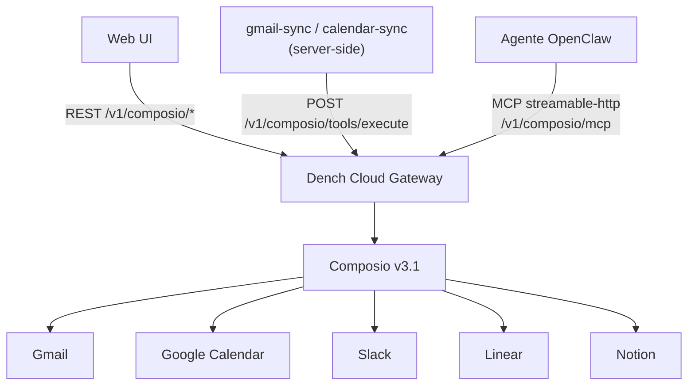
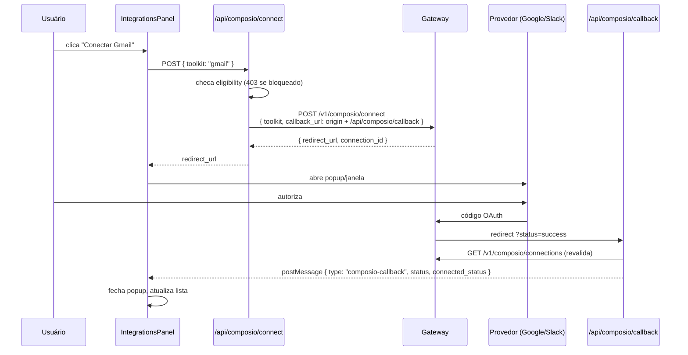

# 03 — Composio / Integrações

**Arquivos-fonte no DenchClaw:**
- `apps/web/lib/composio.ts` (692) — cliente do gateway, tipos, elegibilidade
- `apps/web/lib/composio-client.ts` (317) — normalização de conexões
- `apps/web/lib/composio-execute.ts` (404) — execução de tools com retry
- `apps/web/lib/composio-mcp-health.ts` (526) — registro e diagnóstico do MCP
- `apps/web/lib/composio-toolkit-brand.ts` (242) — branding/ícones
- `apps/web/lib/integrations.ts` (1.478) — camada de integrações unificada
- `apps/web/lib/mcp-servers.ts` (475) + `mcp-oauth.ts` — MCP genérico
- `apps/web/app/api/composio/**` — 6 rotas
- `src/cli/dench-cloud.ts` — config do servidor MCP

---

## 1. A arquitetura em uma frase

O DenchClaw **não fala com o Composio direto**. Ele fala com um gateway próprio (Dench Cloud) que faz proxy para o Composio. O gateway serve duas coisas ao mesmo tempo:

1. **API REST** (`/v1/composio/*`) — usada pela **UI** para listar toolkits, iniciar OAuth, listar conexões, executar tools programaticamente (o sync de Gmail/Calendar usa isso).
2. **Servidor MCP** (`/v1/composio/mcp`) — registrado no config do OpenClaw para que o **agente** ganhe as tools (`GMAIL_FETCH_EMAILS`, `SLACK_SEND_MESSAGE`, ...) diretamente.



Um único par `(gatewayUrl, apiKey)` alimenta os três caminhos.

---

## 2. Resolução de credenciais

```ts
// apps/web/lib/composio.ts
resolveComposioGatewayUrl(): string
  // ordem: denchCloudSettings.gatewayUrl
  //     → plugins.entries["dench-ai-gateway"].config.gatewayUrl
  //     → process.env.DENCH_GATEWAY_URL
  //     → DEFAULT_GATEWAY_URL

resolveComposioApiKey(): string | null
  // ordem: config.models.providers["dench-cloud"].apiKey
  //     → process.env.DENCH_CLOUD_API_KEY
  //     → process.env.DENCH_API_KEY
```

Tudo lido de `~/.openclaw-dench/openclaw.json`.

### O gate comercial

```ts
resolveComposioEligibility(): {
  eligible: boolean;
  lockReason: "missing_dench_key" | "dench_not_primary" | null;
  lockBadge: string | null;
}
```

Bloqueia integrações em dois casos:
- Sem API key → badge `"Get Dench Cloud API Key"`
- `agents.defaults.model.primary` não começa com `dench-cloud/` → badge `"Use Dench Cloud"`

> **Isso é monetização, não arquitetura.** No Craft, remova. O Composio tem API própria com chave própria.

---

## 3. Endpoints do gateway

Todos com `Authorization: Bearer <apiKey>` e `content-type: application/json`.

```
GET  /v1/composio/toolkits?search=&category=&cursor=&limit=
     → { items[], cursor, total, categories[] }
     Envelope tolerante: aceita `items` | `toolkits` | `data`,
     e cursor como `cursor` | `next_cursor` | `nextCursor`.

GET  /v1/composio/connections
     → { items: ComposioConnection[] }

POST /v1/composio/connect
     body: { toolkit, callback_url }
     → { redirect_url, connection_id, ... }

POST /v1/composio/disconnect
     body: { connection_id }

POST /v1/composio/tools/execute
     body: { tool_slug, connected_account_id, arguments }
     → resultado da tool

GET  /v1/composio/tools/search?q=
     → usado como fallback quando um slug hard-coded não existe mais

     /v1/composio/mcp   ← endpoint MCP (streamable-http)
```

---

## 4. Fluxo de OAuth



A rota de callback (`app/api/composio/callback/route.ts`) devolve uma página HTML que faz `window.opener.postMessage` — padrão clássico de popup OAuth. Ela **revalida** contra `/connections` em vez de confiar no `status` da query string.

---

## 5. Execução de tools (`composio-execute.ts`)

O wrapper do `POST /v1/composio/tools/execute`. É a peça mais madura do módulo, porque é o que sustenta o backfill de 100k mensagens do Gmail.

```ts
executeComposioTool<T>({
  toolSlug, connectedAccountId, arguments,
  signal?, maxRetries?, context?
}): Promise<{ data: T; retries: number; elapsedMs: number }>
```

Comportamentos:

| Situação | Tratamento |
|---|---|
| 429 / 502 / 503 / 504 / erro de rede | Backoff exponencial: 1s, 2s, 4s, 8s, 16s, 30s (máx 6 tentativas) |
| `AbortSignal` | Cancela request em voo **e** timer de retry pendente |
| Sem conexão | `ComposioToolNoConnectionError` — o caller pede re-OAuth em vez de fazer loop |
| Slug desconhecido | `resolveToolSlug()` cai para `/tools/search`. Trata renomeações tipo `GMAIL_LIST_MESSAGES` → `GMAIL_FETCH_EMAILS` |
| Cache de slug | Memoizado; `invalidateToolSlug()` limpa quando falha |

Hierarquia de erros:

```ts
class ComposioToolError extends Error {
  status: number; responseBody: string; toolSlug: string;
  retries: number; retriable: boolean;
}
class ComposioToolNoConnectionError extends ComposioToolError {}
```

> Esse módulo é diretamente portável. As decisões (backoff, resolução de slug com cache, erro tipado de "sem conexão") são todas aprendidas em produção.

---

## 6. Registro do MCP para o agente

Depois que uma conexão é criada, o DenchClaw escreve no `openclaw.json`:

```ts
// src/cli/dench-cloud.ts
function buildComposioMcpServerConfig(gatewayUrl, apiKey) {
  return {
    url: `${gatewayUrl}/v1/composio/mcp`,
    transport: "streamable-http",
    headers: { Authorization: `Bearer ${apiKey}` },
  };
}
```

Gravado em `config.mcp.servers.composio`. A partir daí o agente vê as tools nativamente.

### Health check (`composio-mcp-health.ts`)

Isso é o que evita a classe de bug "conectei mas o agente não vê":

1. **Comparação de snapshot** — lê `config.mcp.servers.composio` e compara `url` + `transport` + header `Authorization` com o esperado. Divergiu → reescreve.
2. **Probe ao vivo** — spawna uma sessão efêmera do agente (`agent:<id>:probe:composio-mcp-<uuid>`) e pergunta se ele **enxerga** as tools. O prompt é literal:

   > *"Set visible=true only if this session directly exposes the integration tools, meaning you can see either a server named `composio` or tool names like `GMAIL_FETCH_EMAILS`, `SLACK_SEND_MESSAGE`, `GITHUB_FIND_PULL_REQUESTS`, `NOTION_SEARCH`, `GOOGLE_CALENDAR_EVENTS_LIST`, or `LINEAR_LIST_ISSUES` in your available tools."*

3. **Reparo** — `/api/integrations/repair` reescreve a config e reinicia o gateway.

> Verificar a integração **perguntando ao agente** em vez de inspecionar config é uma ideia que vale roubar. É o único jeito de testar o caminho ponta-a-ponta.

---

## 7. Camada de integrações unificada

`lib/integrations.ts` (1.478 linhas) trata Composio como **um** provedor entre vários. Também suporta MCP direto (`mcp-servers.ts`, `mcp-oauth.ts`, `mcp-probe.ts`, `mcp-secrets.ts`).

Rotas:
```
GET  /api/integrations              lista unificada com status
POST /api/integrations/[id]/toggle  liga/desliga
POST /api/integrations/repair       reescreve config + reinicia gateway

GET/POST /api/settings/mcp                servidores MCP manuais
POST     /api/settings/mcp/connect/start  OAuth de MCP genérico
GET      /api/settings/mcp/connect/callback
POST     /api/settings/mcp/connect/token
POST     /api/settings/mcp/probe          testa conectividade
```

`composio-toolkit-brand.ts` mapeia slug → nome, cor e logo (assets em `public/integrations/`, `public/logos/`).

---

## 8. Replicação no Craft

### 8.1 A boa notícia

**O Craft já está bem servido aqui.** A superfície documentada inclui:
- sources MCP (stdio + remoto) com `config.json` + `guide.md`
- `source_oauth_trigger`, `source_google_oauth_trigger`, `source_microsoft_oauth_trigger`, `source_slack_oauth_trigger`
- `source_credential_prompt`, `source_test`
- `local-mcp: enabled` no workspace

Isso cobre o que o `mcp-servers.ts` + `mcp-oauth.ts` do DenchClaw fazem. O gap é o **catálogo** e a **execução programática server-side**.

### 8.2 Duas rotas possíveis

**Rota A — Composio direto (recomendada)**

Corte o intermediário. O Composio tem API pública e servidor MCP hospedado.

```
Craft → api.composio.dev (chave própria do usuário)
      → MCP: https://mcp.composio.dev/... registrado como source
```

Vantagens: sem gate comercial, sem gateway próprio para manter, catálogo de ~300 apps de graça.
Custo: o usuário precisa de conta Composio.

**Rota B — sources nativos por app**

Para os 5-10 apps que mais importam (Gmail, Calendar, Slack, Notion, Linear), criar sources Craft dedicados com OAuth próprio. Mais trabalho, melhor UX, sem dependência de terceiro.

**Sugestão:** B para o núcleo (Gmail e Calendar são necessários para os docs 04 e 05 de qualquer forma), A como long-tail.

### 8.3 O que portar independente da rota

```datatable
{
  "columns": [
    { "key": "m", "label": "Módulo", "type": "text" },
    { "key": "p", "label": "Portar?", "type": "badge" },
    { "key": "r", "label": "Razão", "type": "text" }
  ],
  "rows": [
    { "m": "composio-execute.ts (retry/backoff/slug)", "p": "SIM — quase 1:1", "r": "Lógica de resiliência aprendida em produção; independente do provedor" },
    { "m": "Health check por probe do agente", "p": "SIM — adaptar", "r": "Única forma de testar ponta-a-ponta se o agente vê as tools" },
    { "m": "Snapshot-compare da config MCP", "p": "SIM", "r": "Detecta config corrompida/desatualizada automaticamente" },
    { "m": "Envelope tolerante (items|toolkits|data)", "p": "SIM", "r": "APIs de catálogo mudam formato; barato de defender" },
    { "m": "Fluxo OAuth por popup + postMessage", "p": "PARCIAL", "r": "Em Electron, use BrowserWindow + IPC — mais limpo que postMessage" },
    { "m": "resolveComposioEligibility (gate)", "p": "NÃO", "r": "Monetização do Dench, não arquitetura" },
    { "m": "Gateway próprio", "p": "NÃO", "r": "Camada extra sem valor se você não vende créditos" },
    { "m": "toolkit-brand (logos/cores)", "p": "SIM — trivial", "r": "UX: integração sem logo parece quebrada" }
  ]
}
```

### 8.4 Adaptação Electron do OAuth

O padrão popup + `window.opener.postMessage` existe por ser web. Em Electron:

```ts
// main process
const authWin = new BrowserWindow({ width: 500, height: 700, parent: mainWin, modal: true });
authWin.loadURL(redirectUrl);
authWin.webContents.on('will-redirect', (_e, url) => {
  if (url.startsWith(CALLBACK_PREFIX)) {
    const status = new URL(url).searchParams.get('status');
    authWin.close();
    mainWin.webContents.send('oauth:complete', { toolkit, status });
  }
});
```

Mais confiável: não depende de bloqueador de popup nem de same-origin.

### 8.5 Checklist de implementação

- [ ] Decidir rota A / B / híbrida
- [ ] Cliente de catálogo com envelope tolerante + paginação por cursor
- [ ] Portar `composio-execute.ts` (retry, abort, resolução de slug, erros tipados)
- [ ] Fluxo OAuth via `BrowserWindow` + IPC
- [ ] Registro automático de source MCP após conexão bem-sucedida
- [ ] Health check: snapshot-compare + probe do agente
- [ ] UI: grid de toolkits com logo, busca, categoria, badge de status
- [ ] Botão "Reparar" que reescreve config e reinicia
