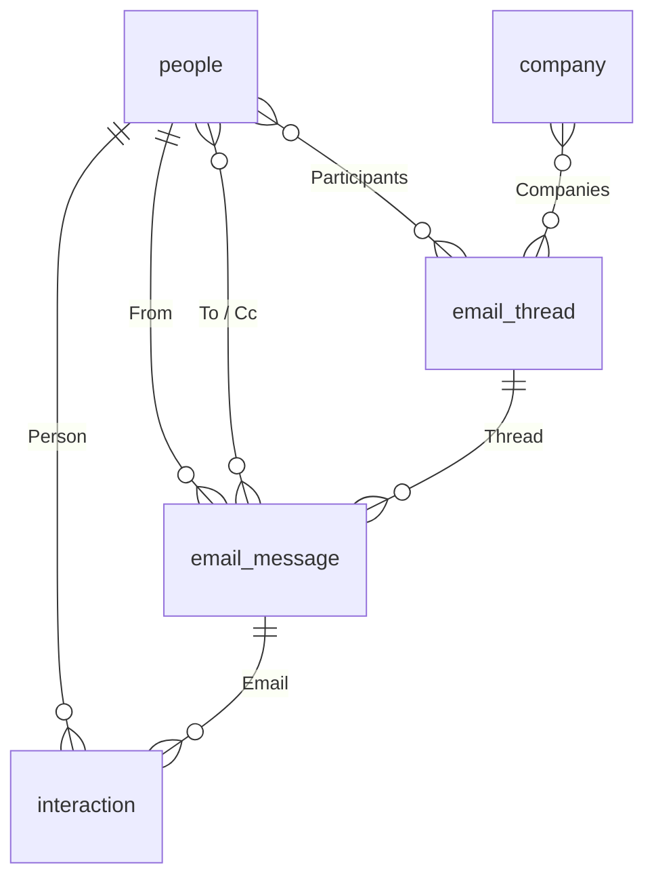
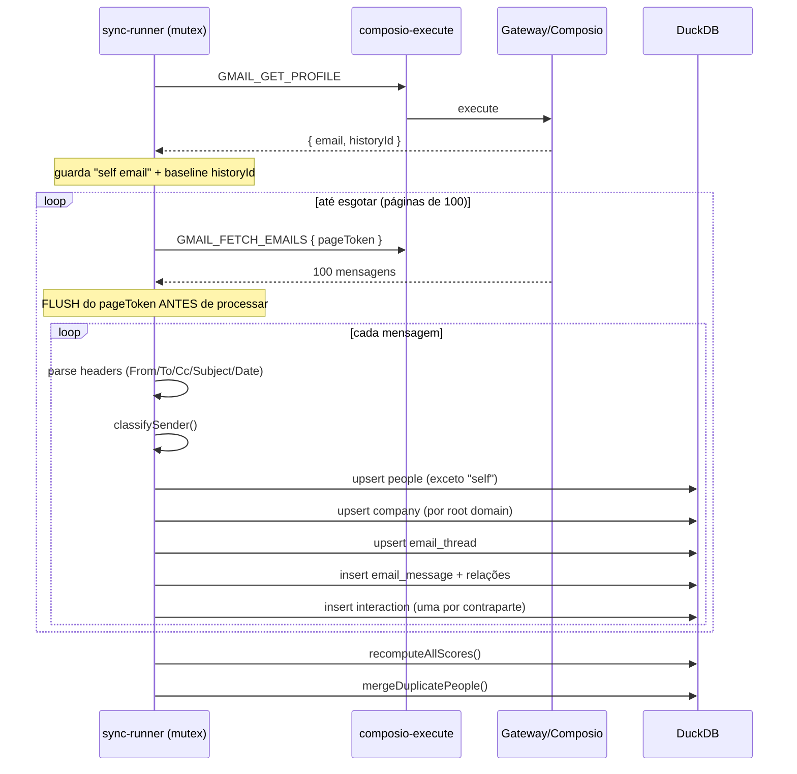

# 04 — Inbox / E-mail

**Arquivos-fonte no DenchClaw:**
- `apps/web/lib/gmail-sync.ts` (1.459) — backfill + incremental
- `apps/web/lib/sync-runner.ts` (696) — orquestrador, mutex, progresso
- `apps/web/lib/email-classifier.ts` (392) — classifica remetente
- `apps/web/lib/email-domain.ts` + `personal-email-blocklist.ts` — parsing
- `apps/web/lib/strength-score.ts` — score de relacionamento
- `apps/web/lib/people-merge.ts` — dedup de contatos
- `apps/web/lib/gmail-body-hydrate.ts` — carrega corpo sob demanda
- `apps/web/lib/gmail-photo-sync.ts` — fotos de perfil
- `apps/web/app/api/crm/inbox/**` — API de threads
- `apps/web/app/components/crm/inbox/**` (17 arquivos, ~2.4k linhas) — UI

---

## 1. O modelo de dados

O inbox **não tem tabelas próprias**. São objetos CRM normais (doc 01), com `immutable: true` para não serem deletados.



### `email_thread` (icon `messages-square`, view `table`)

| Campo | Tipo | Nota |
|---|---|---|
| Subject | text | required |
| Last Message At | date | ordenação do inbox |
| Message Count | number | |
| Participants | relation → people | `many_to_many` |
| Companies | relation → company | `many_to_many` |
| Gmail Thread ID | text | required, chave de dedup |

### `email_message` (icon `mail`, view `table`)

| Campo | Tipo | Nota |
|---|---|---|
| Subject | text | |
| Sent At | date | |
| From | relation → people | `many_to_one` |
| To | relation → people | `many_to_many` |
| Cc | relation → people | `many_to_many` |
| Thread | relation → email_thread | `many_to_one` |
| Body Preview | text | snippet — sempre carregado |
| Body | richtext | **hidratado sob demanda** |
| Has Attachments | boolean | |
| Gmail Message ID | text | required, chave de dedup |
| Sender Type | enum | Person / Marketing / Transactional / Notification / Mailing List / Automated |

Cores do enum: `#22c55e` (Person), `#ef4444` (Marketing), `#3b82f6` (Transactional), `#f59e0b` (Notification), `#8b5cf6` (Mailing List), `#94a3b8` (Automated).

### `interaction` (icon `activity`, view `timeline`)

Tabela de fatos que alimenta o ranking. Uma linha **por contraparte não-própria** de cada e-mail ou reunião.

| Campo | Tipo |
|---|---|
| Type | enum `["Email","Meeting"]` |
| Occurred At | date, required |
| Person / Company | relation `many_to_one` |
| Email / Event | relation `many_to_one` |
| Direction | enum `["Sent","Received","Internal"]` |
| Score Contribution | number |

### Campos adicionados a `people`

`Source` (enum Manual/Gmail/Calendar), `Strength Score` (number), `Last Interaction At` (date), `Job Title`, entre outros.

> Os IDs dos objetos são **fixos e estáveis** (`seed_obj_*`, `seed_fld_*`) em `lib/seed-object-ids.ts`. É o que torna as migrações idempotentes — rodar de novo não duplica nada. Copie esse padrão.

---

## 2. Pipeline de sync



### Invariantes que valem copiar textualmente

1. **Idempotência total.** Rodar de novo no mesmo workspace é no-op. Unicidade em: `Gmail Message ID` + `Gmail Thread ID` + e-mail lowercased + root domain.
2. **Crash não pula a página em progresso.** `gmail.backfillPageToken` identifica
   a página atual, é gravado **antes** de processá-la e só avança depois do lote.
   Um restart repete a mesma página; upserts idempotentes impedem duplicação.
3. **"Self" nunca vira contato.** A caixa autenticada + aliases manuais são excluídos do upsert de people. Sem isso o usuário aparece como contato dele mesmo.
4. **Retomável.** `sync-cursors.json#gmail.backfillPageToken` é o token da página
   em progresso a repetir, não o token da próxima página.
5. **Teste obrigatório.** Interromper durante o processamento, reiniciar com o
   mesmo token e provar que a página é reexecutada sem mensagens puladas ou
   duplicadas.

### Incremental

Depois do backfill, o loop **não é in-process**. O plugin `dench-ai-gateway` roda dentro do daemon do OpenClaw e faz `POST /api/sync/poll-tick` a cada ~5 min. Isso foi feito de propósito: o plugin sobrevive a restart do Next.js, então o cron continua vivo através de `denchclaw update`.

```
startBackfill()        → dispara backfill inicial (idempotente, no-op se já rodando)
subscribeProgress(cb)  → eventos SSE de progresso
tickPoller()           → um ciclo incremental; mutex-gated
```

Tudo é **singleton de processo** — exatamente um backfill ou poll por vez, não importa quantos clientes SSE estejam conectados.

---

## 3. Classificador de remetente

`email-classifier.ts` decide se um remetente é humano ou máquina. É o que faz o inbox ser usável.

Sinais usados:
- Padrões de local-part: `noreply`, `no-reply`, `notifications`, `support`, `billing`, `hello@`, `info@`
- Domínios de ESP conhecidos (`esp-domains.ts`): Mailchimp, SendGrid, Postmark, etc.
- Headers: `List-Unsubscribe`, `Precedence: bulk`, `Auto-Submitted`
- Blocklist de domínios pessoais (`personal-email-blocklist.ts`) — gmail.com, outlook.com... não viram `company`

Resultado vira `Sender Type` na mensagem, e o filtro padrão do inbox é `sender=person`.

> **Isso é o diferencial de UX do inbox deles.** Sem o classificador, o inbox é uma lista de newsletters. Não deixe para depois.

---

## 4. A API do inbox

`GET /api/crm/inbox?q=&sender=person|all|automated&personId=&limit=&offset=`

O SQL é interessante — evita agregar o mailbox inteiro a cada request:

```sql
WITH base AS (            -- threads filtradas por sender/search
  SELECT ...
),
candidate_threads AS (    -- janela de N threads candidatas
  SELECT entry_id FROM base
  ORDER BY last_message_at DESC
  LIMIT {windowSize}
),
messages AS (             -- só as mensagens dessas threads
  SELECT ... WHERE m.thread_value IN (SELECT entry_id FROM candidate_threads)
)
SELECT ... LIMIT {limit} OFFSET {offset};
```

O comentário no código explica: sem o pré-filtro, cada request agregava sobre a caixa inteira (100k+ mensagens em inboxes reais). O `windowSize` limita o custo, e o `LIMIT` final aplica depois.

`GET /api/crm/inbox/[threadId]` → thread com todas as mensagens. O `Body` (richtext completo) é hidratado aqui, não no listing — `gmail-body-hydrate.ts`.

### Tipos compartilhados

```ts
// components/crm/inbox/types.ts — "keep in sync with the routes"
type Thread = {
  id, subject, last_message_at, message_count, gmail_thread_id,
  participants: Participant[], participant_ids: string[],
  snippet, primary_sender_type, primary_sender_id,
  primary_sender_name, primary_sender_email
};
type Message = {
  id, subject, sent_at, preview, body, has_attachments,
  gmail_message_id, sender_type,
  from_person_id, to_person_ids: string[], cc_person_ids: string[]
};
type SenderFilter = "person" | "all" | "automated";
```

---

## 5. A UI

17 componentes em `components/crm/inbox/`:

```
inbox-view.tsx (308)          orquestrador: estado, fetch, seleção
├─ inbox-toolbar.tsx (121)    busca + filtro de sender + refresh
├─ inbox-layout.tsx (144)     split lista | conversa
├─ thread-list.tsx (124)
│  └─ thread-list-row.tsx (254)  avatar, assunto, snippet, data relativa, badge
├─ conversation-pane.tsx (102)
│  ├─ conversation-header.tsx (208)  assunto, participantes, ações
│  ├─ thread-messages.tsx (155)
│  │  └─ message-card.tsx (218)      colapsável
│  │     ├─ message-body.tsx (318)   sanitiza + renderiza HTML
│  │     └─ attachment-strip.tsx (44)
│  └─ quick-reply.tsx (143)
├─ participant-chips.tsx (103)
├─ profile-thread-list.tsx (290)   threads dentro do perfil de pessoa
├─ use-inbox-hotkeys.ts            atalhos
└─ keyboard-shortcuts-help.tsx (113)
```

### Atalhos de teclado (estilo Gmail/Superhuman)

| Tecla | Ação |
|---|---|
| `j` / `↓` | próxima thread |
| `k` / `↑` | thread anterior |
| `o` / `Enter` | abrir |
| `Esc` | fechar / sair da busca |
| `/` | focar busca |
| `x` | selecionar |
| `s` | star |
| `e` | arquivar |
| `?` | ajuda de atalhos |

Implementação em `use-inbox-hotkeys.ts` com guarda para não capturar quando o foco está num input.

### `message-body.tsx` — a parte delicada

318 linhas para renderizar HTML de e-mail com segurança: sanitização, neutralização de links, contenção de CSS (e-mail HTML é notoriamente hostil a layout de host), colapso de quoted text.

---

## 6. Replicação no Craft

### 6.1 Pré-requisitos

Precisa do doc 01 (modelo de objetos) e do doc 03 (conexão Gmail) prontos. O inbox é uma **view especializada** sobre objetos CRM, não um subsistema.

### 6.2 Fatiamento sugerido

**Fatia 1 — dados (sem UI)**
- [ ] Migração idempotente com IDs estáveis: `email_thread`, `email_message`, `interaction` + campos novos em `people`
- [ ] `email-domain.ts`: parse de endereço, normalização de chave, extração de root domain
- [ ] `personal-email-blocklist.ts` + `esp-domains.ts`
- [ ] `email-classifier.ts`

**Fatia 2 — sync**
- [ ] Executor de tool com retry (portado do doc 03)
- [ ] `gmail-sync.ts`: `GMAIL_GET_PROFILE` → paginação → upsert
- [ ] Cursores em `sync-cursors.json`, gravados **antes** de processar
- [ ] Runner com mutex + eventos de progresso
- [ ] Tick incremental — no Craft, use **automations** (`CronCreate`) em vez de um plugin de gateway

**Fatia 3 — leitura**
- [ ] `GET /inbox` com a CTE de janela
- [ ] `GET /inbox/[threadId]` com hidratação de corpo

**Fatia 4 — UI**
- [ ] Layout split + lista virtualizada
- [ ] Card de mensagem com HTML sanitizado
- [ ] Hotkeys
- [ ] Quick reply (`GMAIL_SEND_EMAIL` via tool)

### 6.3 Onde o Craft pode fazer melhor

| DenchClaw | Oportunidade no Craft |
|---|---|
| Poll a cada 5 min via plugin de gateway | Automation nativa; ou Gmail push (Pub/Sub) para tempo real |
| `Body` como `richtext` em `entry_fields` | Corpos grandes incham o EAV. Considere arquivo em disco + path no campo |
| Sanitização própria em `message-body.tsx` | O Craft já tem `html-preview` com iframe sandbox e JS bloqueado — reuso direto |
| Classificador só por heurística | `call_llm` com Haiku para os casos ambíguos (barato, roda em batch) |
| Sem threading real | Gmail dá `threadId`; considere também `References`/`In-Reply-To` para outros provedores |

### 6.4 Armadilhas

1. **Não carregue `Body` no listing.** Só `preview`. 500 threads × corpo HTML completo = payload de dezenas de MB.
2. **Grave o cursor antes de processar.** É a diferença entre perder 100 mensagens e perder 8 horas de backfill.
3. **Exclua a própria caixa dos contatos** desde o primeiro commit — corrigir depois exige migração de dados.
4. **Dedup por chave normalizada** (email lowercased, domínio raiz). `people-merge.ts` existe porque isso *sempre* vaza; tenha a ferramenta de merge desde cedo.
5. **Rate limit é real.** O Gmail via Composio devolve 429 no meio de backfill grande. Sem o backoff exponencial o sync trava.
