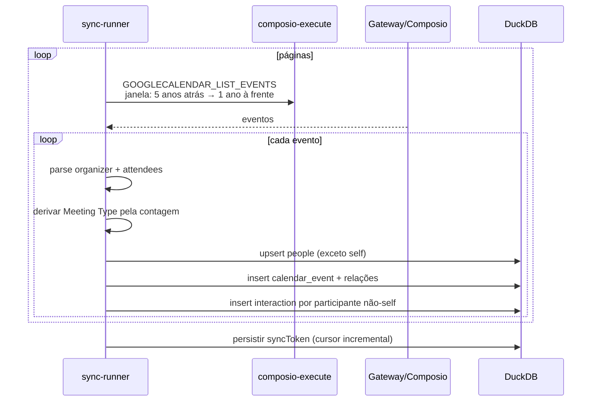
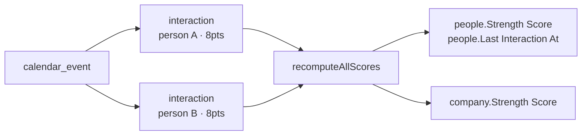

# 05 — Calendário

**Arquivos-fonte no DenchClaw:**
- `apps/web/lib/calendar-sync.ts` (847) — backfill + incremental
- `apps/web/lib/strength-score.ts` — pesos de score por tipo de interação
- `apps/web/app/api/crm/calendar/route.ts` + `[id]/route.ts`
- `apps/web/app/components/crm/calendar-view.tsx` (243)
- `apps/web/app/components/crm/calendar-grid-view.tsx` (718)
- `apps/web/app/components/crm/event-list-item.tsx`, `event-popover.tsx`
- `apps/web/app/components/workspace/object-calendar.tsx` (26KB) — view de calendário genérica de objetos

---

## 1. Duas coisas diferentes com o mesmo nome

Vale separar desde já, porque são subsistemas independentes:

| | **CRM Calendar** | **Object Calendar view** |
|---|---|---|
| O que é | Eventos sincronizados do Google Calendar | Qualquer objeto renderizado como calendário |
| Path | `~crm/calendar` | `people`, `task`, ... com `default_view: calendar` |
| Kind | `crm-calendar` | `object` |
| Componente | `calendar-view.tsx` + `calendar-grid-view.tsx` | `object-calendar.tsx` |
| Dados | objeto `calendar_event` (immutable) | entries do objeto + `view_settings.calendarDateField` |

Ambos existem. O primeiro é uma feature de CRM; o segundo é um tipo de view genérico (ver doc 06).

---

## 2. O objeto `calendar_event`

`icon: "calendar"`, `defaultView: "calendar"`, `immutable: true`, `sortOrder: 12`.

| Campo | Tipo | Nota |
|---|---|---|
| Title | text | required |
| Start At | date | required |
| End At | date | |
| Organizer | relation → people | `many_to_one` |
| Attendees | relation → people | `many_to_many` |
| Companies | relation → company | `many_to_many` |
| Meeting Type | enum | `["One on One","Small Group","Large Group"]` — cores `#22c55e`, `#3b82f6`, `#94a3b8` |
| Google Event ID | text | required, chave de dedup |

`Meeting Type` é **derivado** na hora do sync a partir da contagem de participantes, não vem do Google. É o que alimenta o peso do score.

---

## 3. Pipeline de sync

Mesma forma do Gmail (doc 04), o que é bom sinal — o padrão é reutilizável.



Detalhes:

- **Janela padrão:** 5 anos para trás, 1 ano para frente. Configurável.
- **Cursor:** `syncToken` do Google, guardado em `sync-cursors.json`. O tick incremental usa isso.
- **Filtro de self:** usa o e-mail da conta Gmail autenticada. O código admite em comentário que é imperfeito (o Calendar tem endpoint de perfil próprio) mas funciona para o caso comum de mesma conta Google nos dois.

---

## 4. Scoring de interação

`strength-score.ts` atribui peso por tipo de contato. Os pesos relativos (documentados em `calendar-sync.ts`):

```
Reunião 1:1        = 8× o peso de um e-mail
Reunião pequena    = 3×
Reunião grande     = 0.5×
E-mail             = 1× (modulado por direção e recência)
```

A lógica: uma reunião 1:1 de 30 min é um sinal de relacionamento muito mais forte que 8 e-mails; uma all-hands com 200 pessoas é quase ruído.

Cada evento gera **uma linha de `interaction` por participante não-self**, com `Score Contribution` preenchido. Depois do backfill, `recomputeAllScores()` agrega tudo e escreve `Strength Score` + `Last Interaction At` em `people` e `company`.



> Esse é o motor do "CRM que se preenche sozinho". Sem ele, `people` é uma lista alfabética; com ele, é um ranking de relacionamento. A `connection-strength-chip.tsx` renderiza isso como badge na UI.

---

## 5. A UI

### `calendar-view.tsx` (243 linhas)
Casca: navegação de período, seleção de modo, fetch, callbacks `onOpenPerson` / `onOpenCompany`.

### `calendar-grid-view.tsx` (718 linhas)
O grid propriamente dito. Cobre:
- Modos day / week / month / year
- Posicionamento de eventos por horário
- Empilhamento de eventos sobrepostos
- Eventos multi-dia atravessando células
- Faixa de "hoje" e horário atual
- Click → `event-popover.tsx` com detalhes e participantes clicáveis (abrem o perfil no painel)

### `object-calendar.tsx` (26KB)
A view genérica. Lê de `view_settings`:

```yaml
view_settings:
  calendarDateField: "Due Date"       # obrigatório
  calendarEndDateField: "End Date"    # opcional, eventos multi-dia
  calendarMode: "month"               # day | week | month | year
```

Se o objeto não tem campo de data, a skill instrui explicitamente a usar `created_at` / `updated_at` (colunas de sistema sempre presentes) em vez de dizer "não há datas".

---

## 6. API

```
GET /api/crm/calendar?from=&to=&mode=     eventos numa janela
GET /api/crm/calendar/[id]                 detalhe do evento + participantes resolvidos
```

Mesma técnica do inbox: filtra a janela em SQL antes de resolver relações, para não agregar o histórico inteiro.

---

## 7. Replicação no Craft

### 7.1 Pré-requisitos
Doc 01 (objetos) + doc 03 (conexão Google Calendar). Se o doc 04 (inbox) já estiver feito, a maior parte da infra de sync é compartilhada — o `sync-runner` já orquestra os dois.

### 7.2 Fatiamento

**Fatia 1 — dados**
- [ ] Objeto `calendar_event` com IDs estáveis
- [ ] Objeto `interaction` (compartilhado com o inbox)
- [ ] `strength-score.ts` com os pesos

**Fatia 2 — sync**
- [ ] `calendar-sync.ts` reaproveitando o executor de tool do doc 03
- [ ] Cursor `syncToken` + tick incremental via automation
- [ ] `recomputeAllScores()` após backfill

**Fatia 3 — view genérica (prioridade maior)**
- [ ] `object-calendar` lendo `view_settings.calendarDateField`
- [ ] Modos day/week/month/year
- [ ] Fallback para `created_at` quando não há campo de data

**Fatia 4 — CRM calendar**
- [ ] Grid dedicado com participantes
- [ ] Popover com navegação para perfis

> **Sugestão de ordem:** faça a Fatia 3 antes da 2. A view genérica de calendário serve qualquer objeto (tasks com deadline, deals com data de fechamento) e não depende de OAuth. Entrega valor sem bloquear em integração.

### 7.3 Onde o Craft pode fazer melhor

| DenchClaw | Oportunidade |
|---|---|
| Self-detection pelo e-mail do Gmail | Usar o endpoint de perfil do Calendar — o código já reconhece isso como dívida |
| Sem recorrência | `RRULE` do iCal. O Craft já tem `ical-tool` no CLI — dá para expandir recorrências server-side |
| Sem timezone por evento | Google devolve TZ; guarde e renderize no fuso do usuário |
| Sem escrita (read-only) | Criar/editar evento via `GOOGLECALENDAR_CREATE_EVENT` fecha o loop |
| Grid próprio de 718 linhas | Avaliar biblioteca antes de escrever; grid de calendário é mais caro do que parece |

### 7.4 Armadilhas

1. **Multi-dia e sobreposição são o custo real** do grid. Um calendário que só renderiza eventos de 1h numa célula é fácil; o resto é 80% do trabalho.
2. **Reuniões grandes explodem `interaction`.** Uma all-hands de 200 pessoas gera 200 linhas. Considere um teto (ex.: pular eventos com >50 participantes para efeito de score) — o DenchClaw resolve com peso 0.5×, mas ainda escreve todas as linhas.
3. **`syncToken` expira.** O Google invalida tokens antigos com `410 Gone`. Trate caindo para full resync em vez de travar.
4. **Eventos cancelados** vêm no incremental com `status: cancelled` — precisam deletar a entry, não ignorar.
