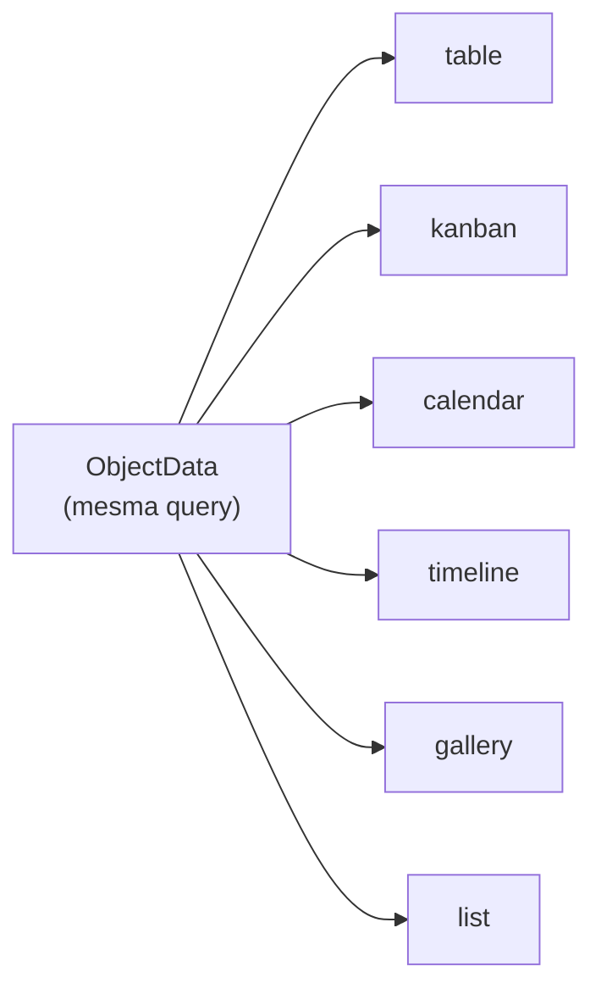
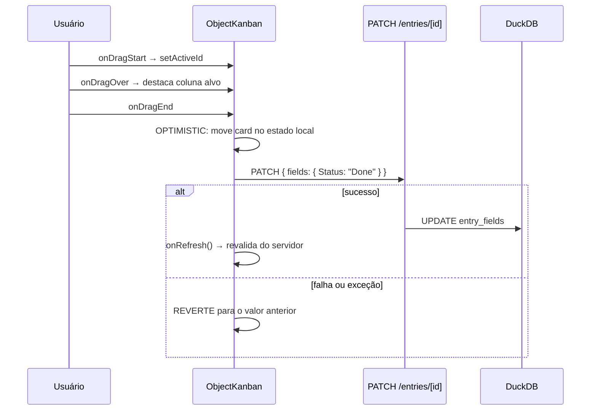
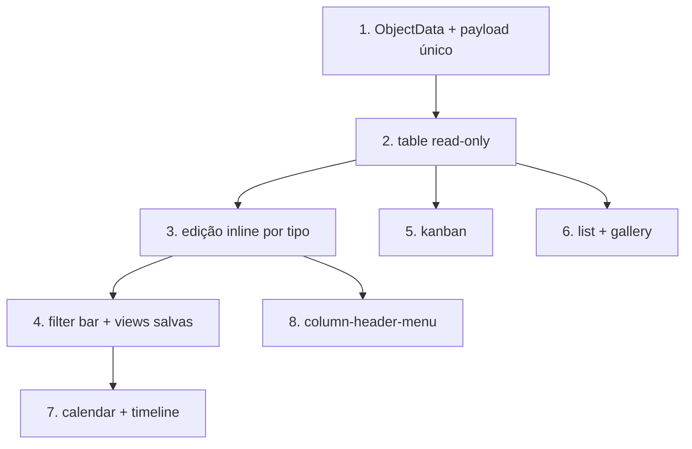

# 06 — Tasks / Kanban e os 6 tipos de view

**Arquivos-fonte no DenchClaw:**
- `apps/web/app/components/workspace/object-kanban.tsx` (812) — kanban dnd
- `apps/web/app/components/workspace/object-table.tsx` (68.994 bytes) — tabela
- `apps/web/app/components/workspace/object-calendar.tsx` (26KB)
- `apps/web/app/components/workspace/object-timeline.tsx` (18KB)
- `apps/web/app/components/workspace/object-gallery.tsx` (8KB)
- `apps/web/app/components/workspace/object-list.tsx` (8KB)
- `apps/web/app/components/workspace/view-type-switcher.tsx` (6KB)
- `apps/web/app/components/workspace/object-filter-bar.tsx` (31KB)
- `apps/web/app/components/workspace/view-settings-popover.tsx` (16KB)
- `apps/web/app/components/workspace/column-header-menu.tsx` (41KB)
- `skills/crm/views-filters/SKILL.md`

---

## 1. O ponto central

**Não existe um objeto "task" especial.** Uma board de tasks é qualquer objeto CRM com:

```yaml
default_view: "kanban"
view_settings:
  kanbanField: "Status"
```

Todos os 6 tipos de view consomem o mesmo `ObjectData` (doc 01). Trocar de view é trocar de componente, não de query. Isso é o que faz o sistema escalar sem código novo por caso de uso.



---

## 2. Os 6 tipos e suas configurações

```datatable
{
  "title": "Tipos de view e settings obrigatórios",
  "columns": [
    { "key": "v", "label": "view_type", "type": "text" },
    { "key": "para", "label": "Melhor para", "type": "text" },
    { "key": "cfg", "label": "view_settings necessários", "type": "text" },
    { "key": "comp", "label": "Componente", "type": "text" }
  ],
  "rows": [
    { "v": "table", "para": "Edição tipo planilha", "cfg": "nenhum (padrão); opcional column_widths", "comp": "object-table.tsx (69KB)" },
    { "v": "kanban", "para": "Boards de task / pipeline de deals", "cfg": "kanbanField (campo enum)", "comp": "object-kanban.tsx (812 linhas)" },
    { "v": "calendar", "para": "Eventos, deadlines", "cfg": "calendarDateField; opc. calendarEndDateField, calendarMode", "comp": "object-calendar.tsx (26KB)" },
    { "v": "timeline", "para": "Roadmap, Gantt", "cfg": "timelineStartField; opc. timelineEndField, timelineGroupField, timelineZoom", "comp": "object-timeline.tsx (18KB)" },
    { "v": "gallery", "para": "Conteúdo visual", "cfg": "galleryTitleField; opc. galleryCoverField", "comp": "object-gallery.tsx (8KB)" },
    { "v": "list", "para": "Leitura densa", "cfg": "listTitleField; opc. listSubtitleField", "comp": "object-list.tsx (8KB)" }
  ]
}
```

Bloco completo de `view_settings` no `.object.yaml`:

```yaml
view_settings:
  kanbanField: "Status"
  calendarDateField: "Due Date"
  calendarEndDateField: "End Date"
  calendarMode: "month"          # day | week | month | year
  timelineStartField: "Start Date"
  timelineEndField: "End Date"
  timelineGroupField: "Status"
  timelineZoom: "week"           # day | week | month | quarter
  galleryTitleField: "Name"
  galleryCoverField: "Image"
  listTitleField: "Name"
  listSubtitleField: "Description"
  column_widths:                 # persistido automaticamente ao arrastar
    Full Name: 250
    Status: 150
```

### Resolução do tipo de view (precedência)

`resolveViewType()` em `lib/object-filters.ts`:

```
param de URL (?viewType=)  →  view salva ativa  →  objects.default_view  →  "table"
```

`autoDetectViewField()` faz fallback inteligente quando o setting está faltando: procura o primeiro campo `enum` para kanban, o primeiro `date` para calendar, e cai para `created_at` quando não há nenhum.

---

## 3. O kanban em detalhe

### Agrupamento

O `groupField` é o campo apontado por `kanbanField`, e precisa ser `enum`. As colunas saem de `enum_values` (com cores de `enum_colors`). Entries sem valor vão para uma coluna `_ungrouped`.

Se não existe campo enum, a view mostra um empty state explícito: *"No enum field found for kanban grouping in {objeto}"* — não quebra.

> **Nota sobre `statuses`:** a tabela `statuses` existe no schema e vem no payload, mas o kanban implementado agrupa por campo **enum**, não por ela. É uma sobreposição de modelos no repo. Ao replicar, escolha um: enum é mais simples e já funciona.

### Drag and drop

`@dnd-kit/core` com `PointerSensor` e `closestCorners`.



Pontos de implementação:

- IDs de coluna são prefixados: `column:{nome}`. `handleDragEnd` só age se `over.id` começa com `column:` — evita drops inválidos.
- Early return se `currentValue === targetColumn` (drop na mesma coluna não gera request).
- `DragOverlay` renderiza o card flutuante; o card original fica com `opacity: 0.4` e `scale(1.02)`.
- O card ignora o `onClick` de abrir enquanto `isDragging` — senão todo drag abriria a entry.
- **Estado local otimista** (`localEntries`) separado do prop `entries`. Reverte em erro *e* em exceção de rede.

### Conteúdo do card

- Título via heurística: primeiro campo cujo nome contém "name" ou "title", senão o primeiro campo.
- Demais campos formatados por `formatWorkspaceFieldValue` (respeita tipo).
- `tags` viram chips (`parseTagsValue`).
- `relation` mostra label resolvido (do `relationLabels` do payload) + favicon quando disponível.
- `url` mostra favicon via `UrlFavicon` / `getFirstEntryUrlPreview`.
- Campos `action` renderizam como `ActionButton` — botão que roda script server-side.
- `groupField` é excluído dos campos do card (redundante com a coluna).

---

## 4. Barra de filtros e views salvas

`object-filter-bar.tsx` (31KB) é a barra que aparece acima de qualquer view:

- Seletor de view salva (lido de `.object.yaml#views`, ativo por `active_view`)
- Construtor de filtros com grupos aninhados AND/OR
- Sort multi-campo
- Busca
- Seletor de colunas visíveis
- Switcher de tipo de view

Tudo projetado para a URL (`?viewType=&view=&filters=&search=&sort=&page=&pageSize=&cols=`) — deep-link e back/forward funcionam.

### O comportamento que vale copiar

A skill instrui: **quando o usuário pede para filtrar/estreitar/segmentar, crie ou atualize uma view salva e defina `active_view`, mesmo que ele não tenha pedido "crie uma view"** — a menos que seja claramente uma pergunta pontual.

O efeito na UX é forte: o usuário diz "mostra só os deals acima de 100k em negociação", o agente escreve YAML, o watcher dispara, e a tela muda. Sem nenhuma tool de UI.

### Regras de coluna (sutis, mas importantes)

- `views[].columns` controla **visibilidade**, não ordem. Omitir por padrão.
- Reordenar colunas = mudar `fields.sort_order` no DuckDB + regenerar o `.object.yaml`.
- `column_widths` é persistido automaticamente quando o usuário arrasta a borda.

---

## 5. `column-header-menu.tsx` (41KB)

O menu de cabeçalho de coluna sozinho é maior que a maioria dos componentes. Cobre: renomear campo, mudar tipo, editar valores de enum (com rename em massa via `/fields/[id]/enum-rename`), ordenar asc/desc, filtrar por essa coluna, esconder, inserir coluna antes/depois, deletar, ajustar largura.

Se for orçar a réplica: **essa é a peça mais cara da tabela**, mais que o grid em si.

---

## 6. Replicação no Craft

### 6.1 Ordem sugerida



**Faça o kanban cedo.** São 812 linhas e é a view com maior impacto percebido — vira demo imediatamente. A tabela editável completa é 10× o trabalho.

### 6.2 Estimativa relativa de esforço

```datatable
{
  "columns": [
    { "key": "c", "label": "Componente", "type": "text" },
    { "key": "l", "label": "Linhas no original", "type": "text" },
    { "key": "e", "label": "Esforço relativo", "type": "badge" },
    { "key": "n", "label": "Nota", "type": "text" }
  ],
  "rows": [
    { "c": "object-list", "l": "~200", "e": "XS", "n": "Lista simples com título + subtítulo" },
    { "c": "object-gallery", "l": "~220", "e": "XS", "n": "Grid de cards com cover" },
    { "c": "view-type-switcher", "l": "~180", "e": "XS", "n": "Dropdown com 6 ícones" },
    { "c": "object-kanban", "l": "812", "e": "M", "n": "dnd-kit + otimismo + revert" },
    { "c": "object-timeline", "l": "~500", "e": "M", "n": "Barras posicionadas + zoom" },
    { "c": "object-calendar", "l": "~700", "e": "L", "n": "Multi-dia e sobreposição são o custo" },
    { "c": "object-filter-bar", "l": "~900", "e": "L", "n": "Grupos aninhados AND/OR" },
    { "c": "column-header-menu", "l": "~1200", "e": "XL", "n": "Toda a edição de schema pela UI" },
    { "c": "object-table", "l": "~2000", "e": "XL", "n": "Edição inline por tipo + resize + seleção em massa" }
  ]
}
```

### 6.3 O que o Craft já tem

O bloco `datatable` cobre o caso read-only com sort e filtro. O caminho mais curto:

1. Estender `datatable` para aceitar `editable: true` + callback de mutação
2. Adicionar `viewType` ao mesmo bloco → o renderer escolhe table/kanban/gallery com os mesmos dados
3. Adicionar `viewSettings` ao schema do bloco

Assim o agente emite um único bloco e o usuário troca de view na UI, sem round-trip.

```jsonc
// esboço de extensão do bloco datatable do Craft
{
  "src": "/path/to/entries.json",
  "title": "Tasks",
  "viewType": "kanban",              // NOVO
  "viewSettings": {                  // NOVO
    "kanbanField": "Status"
  },
  "editable": true,                  // NOVO
  "onMutate": "crm://task/entries",  // NOVO — endpoint de escrita
  "columns": [
    { "key": "Title",  "label": "Title",  "type": "text" },
    { "key": "Status", "label": "Status", "type": "badge",
      "enumValues": ["Todo","Doing","Done"],
      "enumColors": ["#94a3b8","#3b82f6","#22c55e"] }
  ]
}
```

### 6.4 Armadilhas

1. **Otimismo sem revert é pior que sem otimismo.** O DenchClaw reverte em falha de resposta **e** em exceção de rede. Ambos os caminhos.
2. **Não use o mesmo estado para prop e local.** `localEntries` derivado de `entries` com sincronização controlada; senão o refresh do servidor desfaz o drag no meio da animação.
3. **`onRefresh()` depois do sucesso**, não antes. E o SWR do doc 02 evita o flicker do refetch.
4. **Empty state quando falta config.** Sem campo enum → mensagem clara, não tela em branco. Vale para todas as 6 views.
5. **Cores do enum são dado, não tema.** `enum_colors` vive no schema. Se você tematizar as cores, o kanban perde a identidade visual que o usuário configurou.
