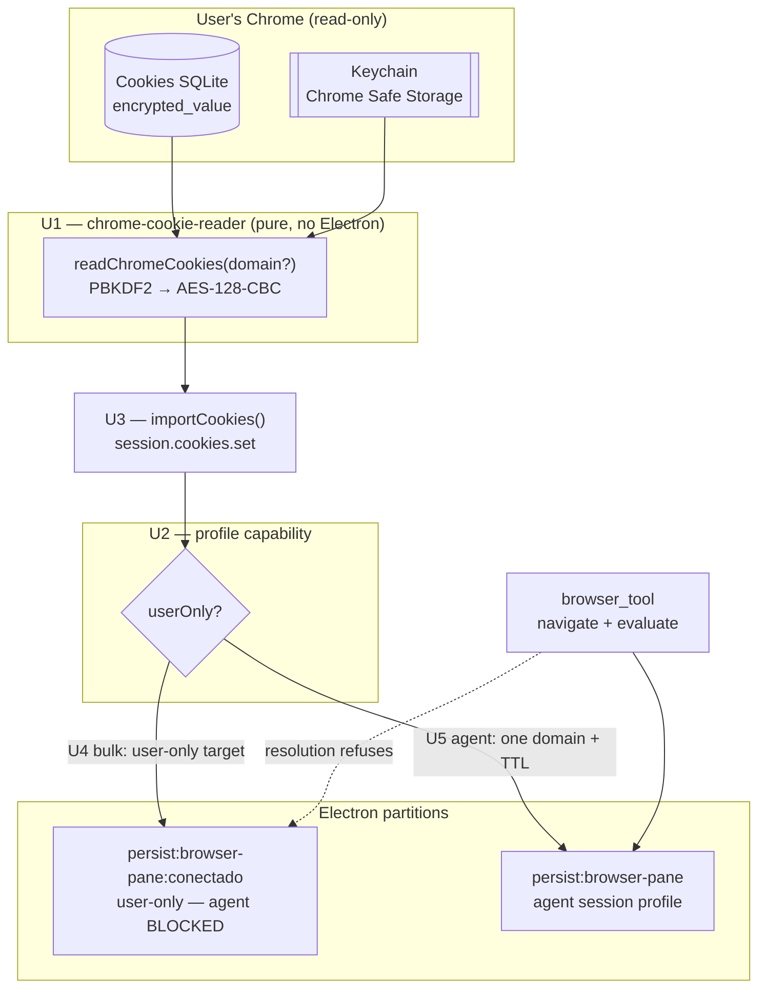

# feat: Import Chrome cookies into browser-pane profiles

## Summary

Import cookies from the user's local Chrome/Chromium into the app's embedded browser, so the
in-app browser opens already authenticated on sites the user is logged into. Two delivery
surfaces, deliberately split by **who** the cookies are for:

1. **Bulk import into a user-only profile** — a settings/profile-picker button ("Import from
   Chrome") that populates a browser profile the agent can never drive.
2. **Ephemeral per-domain import for the agent** — a discrete `import_cookies(domain)` tool that
   imports one domain into the agent's session profile for the duration of a task, then clears it.

The split exists because the app's embedded browser is agent-controllable (`browser_tool` exposes
`navigate` **and** `evaluate`). Loading a user's full cookie jar into that partition would turn a
documented prompt-injection surface into full web-identity exfiltration. The user-only profile
capability introduced in U2 is the security boundary that makes the rest of this feature safe.

**Scope note:** this is same-machine import (read local Chrome → write local partition). It is
explicitly *not* the cross-machine, continuously-synced model of `mvanhorn/agentcookie`, which
solves a different problem (laptop → headless agent Mac over Tailscale).

---

## Problem Frame

The embedded browser starts every session logged out. Anything behind a login is either
unreachable or requires the user to re-authenticate inside the app — including sites where they
have an active Chrome session two inches away. Manual re-login is friction for the user and a hard
stop for the agent (CAPTCHA/MFA cannot be automated).

Chrome already holds valid session cookies for these sites on the same machine. On macOS they are
readable by the user's own processes: the `Cookies` SQLite DB is per-profile, and the AES key lives
in the login Keychain under `Chrome Safe Storage`. Nothing prevents the app from importing them —
the open questions are *which cookies*, *into which partition*, and *who can drive that partition*.

### Why the naive version is unsafe

`persist:browser-pane` is the partition the agent drives. `browser_tool` can `navigate` to any
http/https URL and `evaluate` arbitrary JavaScript against the loaded page
(`packages/shared/src/agent/browser-tool-runtime.ts:1594`). A prior repo audit
(2026-07-14) traced the exfiltration chain on this exact surface; PR #3 closed the `file://` scheme
hole but the agent-drives-the-page property remains by design.

Injecting the user's Google/bank/email cookies there means a single malicious or injected page can
instruct the agent to read `document.cookie` or issue authenticated `fetch` calls, and the result
lands in a tool result the agent will happily summarize. `httpOnly` mitigates only the direct
`document.cookie` read — an authenticated navigate plus DOM scrape defeats it, and many auth
cookies are not `httpOnly` to begin with.

This plan therefore treats "which profile receives the cookies" as the primary design decision, not
an implementation detail.

---

## Requirements

| ID | Requirement |
|----|-------------|
| R1 | The user can import cookies from local Chrome/Chromium into a browser profile via an explicit UI action. |
| R2 | Imported cookies land in the Chromium-managed cookie store of the target partition, so the embedded browser is authenticated for those sites. |
| R3 | A browser profile can be marked **user-only**; the agent's browser tooling must never resolve to a user-only profile. |
| R4 | Bulk import (R1) targets a user-only profile by default and refuses to target an agent-reachable profile without explicit per-domain scoping. |
| R5 | The agent can request cookies for a **single named domain** into its own session profile via `import_cookies(domain)`. |
| R6 | Agent-imported cookies are ephemeral: cleared at task/session end, and never accumulate across tasks. |
| R7 | Domains carrying device-bound sessions (DBSC) or on a high-sensitivity denylist are refused for agent import, with a clear reason. |
| R8 | No decrypted cookie value is ever logged, persisted to app JSON, or returned in a tool result. |
| R9 | Cookie decryption failures degrade gracefully (report count skipped) rather than aborting the whole import. |

---

## Key Technical Decisions

### KTD1 — Read Chrome's cookie DB directly; do not add a cookie library

`better-sqlite3` is already a dependency (`apps/electron/package.json`). The macOS decryption path
is ~40 lines of `node:crypto`: read the `Chrome Safe Storage` password from the login Keychain,
derive with PBKDF2-SHA1 (`salt="saltysalt"`, 1003 iterations, 16-byte key), then AES-128-CBC with a
16-byte space IV. Adding a third-party cookie-extraction dependency to a security-sensitive path
means auditing a supply chain for code we can read in one screen. It also conflicts with the active
bundle-size work (`optimize-app-bundle-size`).

**Betting against:** cross-platform coverage. Windows (DPAPI + App-Bound v20) and Linux
(libsecret) need genuinely different code. This plan is macOS-only (R-scope below); the reader
module's interface is platform-agnostic so a Windows backend can slot in later.

### KTD2 — The user-only profile flag is a capability, enforced at profile resolution

Today `browser-profile-resolver.ts` maps profileId → partition string, and the agent's tooling
never passes a profileId at all (`SessionManager.ts` `resolveSessionBrowserInstance` resolves the
session's own instance). There is no notion of a profile the agent cannot reach — grep for
`protected|userOnly|agentAccessible` returns nothing.

Enforcement belongs in `resolveProfileId` / instance creation, not at the call site: any future
tool that gains a profileId parameter inherits the guard for free. A user-only profile that the
agent can reach through *some* other path is worse than no flag at all, because it advertises
safety it does not have.

**Betting against:** a future legitimate need for the agent to use a user-only profile. If that
arrives it should be an explicit, user-confirmed elevation, not a default.

### KTD3 — Agent import is per-domain, ephemeral, and denylisted

`import_cookies(domain)` takes exactly one domain, imports only cookies whose `host_key` matches
that domain (and its dot-prefixed form), and registers the imported cookie names for cleanup at
session end. A denylist (Google account domains, known DBSC hosts, and a configurable list of
financial/email hosts) refuses the import with a reason rather than silently succeeding.

**Betting against:** convenience. The agent will occasionally be refused a domain it "needs". That
is the intended failure mode — the alternative is the exfiltration amplifier described in the
problem frame.

### KTD4 — Cookies stay in the partition store; they never enter `CredentialManager`

Imported cookies are written via `session.fromPartition(...).cookies.set(...)` and live in
Chromium's per-partition cookie store, encrypted at rest by the OS at that layer. They are not
routed through `CredentialManager` / `SecureStorageBackend`, whose current default key derivation
is the known weakness that `harden-credential-storage` (F4.2) is addressing. Adding raw Chrome
session material to that store would inherit a weakness the app is actively trying to shed.

Corollary: the reader holds decrypted values in memory only, for the duration of one import call.

### KTD5 — `import_cookies` is a discrete tool, not a `browser_tool` subcommand

`browser_tool` is a broad, frequently-invoked surface with `safeMode: 'allow'`. Cookie import needs
`safeMode: 'block'` and its own permission story. Folding it into `browser_tool` would either
loosen that tool's posture or create a confusing per-subcommand exception.

---

## High-Level Technical Design



Two things this diagram encodes: the reader never knows about partitions (keeps it unit-testable
without Electron), and every write path passes the capability check before touching a store.

---

## Implementation Units

### U1. Chrome cookie reader (decrypt, macOS)

**Goal:** a pure module that returns decrypted cookies from local Chrome, filterable by domain,
with no Electron dependency.

**Requirements:** R2, R8, R9

**Dependencies:** none

**Files:**
- `packages/shared/src/browser-cookies/chrome-cookie-reader.ts` (create)
- `packages/shared/src/browser-cookies/chrome-cookie-reader.test.ts` (create)
- `packages/shared/src/browser-cookies/types.ts` (create)

**Approach:**
Locate Chrome profile dirs under `~/Library/Application Support/Google/Chrome/<Profile>/Cookies`
(also accept Chromium/Brave/Edge paths via a small table). Copy the DB to a temp file before
opening — Chrome holds a lock and the live DB may be mid-write. Read with `better-sqlite3`
(already a dep):

```
SELECT host_key, name, encrypted_value, path, expires_utc, is_secure, is_httponly, samesite
FROM cookies [WHERE host_key = ? OR host_key = ?]
```

Key: read the `Chrome Safe Storage` generic password from the login Keychain (`security
find-generic-password -w -s "Chrome Safe Storage" -a "Chrome"`), derive via
`crypto.pbkdf2Sync(pw, 'saltysalt', 1003, 16, 'sha1')`, decrypt `encrypted_value` with
`aes-128-cbc` and a 16-byte `0x20` IV after stripping the 3-byte `v10` prefix.

Two decode traps that must be handled explicitly, because both produce silently-wrong values:
- **Domain-hash prefix:** recent Chrome builds prepend a 32-byte SHA-256 of the host to the
  plaintext. Detect and strip it rather than returning corrupted cookie values.
- **Timestamp epoch:** `expires_utc` is microseconds since 1601-01-01. Convert with
  `expires_utc / 1_000_000 - 11_644_473_600` to get Unix seconds. Treat `0` as session cookie.

Per-row decryption failures increment a `skipped` counter (R9); they never throw out of the loop.

**Patterns to follow:** the `CredentialKeyProtector` seam in
`packages/shared/src/credentials/backends/secure-storage.ts` — inject the Keychain read and the DB
path as constructor seams so tests never touch the real Keychain or a real Chrome profile.

**Test scenarios** (`chrome-cookie-reader.test.ts`, `bun:test`):
- Given a fixture SQLite DB with a `v10`-prefixed value encrypted under a known key, the reader
  returns the plaintext value.
- Given a value whose plaintext carries the 32-byte domain-hash prefix, the returned value has the
  prefix stripped (assert exact expected string, not just "no throw").
- Given `expires_utc = 13350000000000000`, the returned `expirationDate` is the correct Unix
  seconds; given `0`, the cookie is marked session-scoped.
- Given a domain filter `example.com`, both `example.com` and `.example.com` rows are returned and
  `other.com` is not.
- Given one row with a corrupt/undecryptable value among three valid rows, the reader returns 3
  cookies and reports `skipped: 1` — it does not throw.
- Given the Keychain read fails, the reader throws a typed error naming the cause (not a raw
  `security` stderr dump).
- Given a non-darwin platform, the reader throws an explicit unsupported-platform error.

**Verification:** unit suite passes against fixtures with no real Chrome profile and no Keychain
access.

**must_haves:**
- truths: "a caller can obtain decrypted cookie name/value pairs for a named domain from the local
  Chrome profile"; "a single corrupt row does not fail the import"; "no decrypted value reaches a
  log line".
- artifacts: `packages/shared/src/browser-cookies/chrome-cookie-reader.ts` (exports
  `readChromeCookies(opts)` returning `{cookies, skipped}`).
- key_links: `grep "pbkdf2" packages/shared/src/browser-cookies/chrome-cookie-reader.ts`;
  `grep -r "browser-cookies" packages/shared/src/browser-cookies/chrome-cookie-reader.test.ts`

---

### U2. User-only profile capability

**Goal:** a browser profile can be flagged user-only, and agent-driven browser resolution can never
land on it.

**Requirements:** R3

**Dependencies:** none (parallel with U1)

**Files:**
- `apps/electron/src/main/browser-profile-resolver.ts` (modify)
- `apps/electron/src/main/browser-pane-manager.ts` (modify — `resolveProfileId`, `createInstance`)
- `packages/shared/src/protocol/channels.ts` (modify — profile shape carries the flag)
- `apps/electron/src/main/__tests__/browser-profile-capability.test.ts` (create)

**Approach:**
Add `userOnly?: boolean` to the stored profile record. `createInstance` already resolves a
profileId; give it an explicit caller intent (`ownerType` is already threaded through — reuse it
rather than inventing a parallel concept). When the caller is agent-owned and the resolved profile
is `userOnly`, refuse: do not silently fall back to the default profile, because a silent fallback
would make an agent tool appear to succeed against the wrong jar.

The guard lives at resolution time so that any future code path that accepts a profileId inherits
it (KTD2).

**Execution note:** implement the refusal test-first — this is the security boundary the rest of
the feature leans on.

**Test scenarios:**
- An agent-owned instance request naming a `userOnly` profile is refused with a typed error; no
  instance is created.
- An agent-owned request with no profileId resolves to the default profile as before (no
  regression).
- A user-owned request naming a `userOnly` profile succeeds.
- `getProfilePartition` returns a distinct partition string for the user-only profile, and that
  string never equals `persist:browser-pane`.
- Deleting a user-only profile clears its partition storage (existing `deleteProfile` path still
  works with the flag present).

**must_haves:**
- truths: "an agent-driven browser call cannot obtain a session for a user-only profile"; "the
  refusal is an error, never a silent fallback to the default profile".
- artifacts: `userOnly` field on the profile record; refusal branch in `resolveProfileId`.
- key_links: `grep -n "userOnly" apps/electron/src/main/browser-pane-manager.ts`;
  `grep -n "userOnly" apps/electron/src/main/browser-profile-resolver.ts`

---

### U3. Cookie injection into a partition

**Goal:** a `BrowserPaneManager` method that takes decrypted cookies and writes them into the
correct partition's cookie store, honoring the U2 capability check.

**Requirements:** R2, R4, R8, R9

**Dependencies:** U1, U2

**Files:**
- `apps/electron/src/main/browser-pane-manager.ts` (modify — add `importCookies`)
- `apps/electron/src/main/__tests__/browser-pane-cookie-import.test.ts` (create)

**Approach:**
`importCookies({ profileId, domain, callerIntent })` resolves the partition via
`getProfilePartition(resolveProfileId(profileId))` — `session.fromPartition` is idempotent, so this
yields the same `Session` the pane uses. Map each reader cookie to Electron's
`cookies.set({ url, name, value, domain, path, secure, httpOnly, expirationDate, sameSite })`.

Mapping details worth getting right the first time: build `url` as
`http${secure ? 's' : ''}://${host_key.replace(/^\./, '')}${path}` (Electron requires a URL and
derives origin from it), preserve the leading dot in `domain` for domain cookies, and map Chrome's
integer `samesite` (`-1` unspecified, `0` none, `1` lax, `2` strict) to Electron's string enum.

Return `{ imported, skipped }` counts only — never the cookie values (R8).

**Test scenarios:**
- Given 3 reader cookies, `cookies.set` is called 3 times with correctly-mapped fields (assert the
  `url` and `sameSite` mapping explicitly, including a `.dotted.domain` case).
- A secure cookie maps to an `https://` url; a non-secure one to `http://`.
- `samesite = -1/0/1/2` map to `unspecified/no_restriction/lax/strict`.
- One `cookies.set` rejection among three does not abort the others; result reports `skipped: 1`.
- An agent-intent call against a `userOnly` profile is refused before any `cookies.set` runs
  (assert zero calls — this is the U2 boundary holding at the injection layer).
- The returned result object contains no cookie values (assert on serialized output).

**must_haves:**
- truths: "cookies written through this method appear in the target partition's store"; "an
  agent-intent import into a user-only profile writes nothing".
- artifacts: `importCookies` method on `BrowserPaneManager`.
- key_links: `grep -n "cookies.set" apps/electron/src/main/browser-pane-manager.ts`

---

### U4. Bulk import UI ("Import from Chrome")

**Goal:** the user can create/choose a user-only profile and populate it from Chrome in one action.

**Requirements:** R1, R4

**Dependencies:** U2, U3

**Files:**
- `packages/shared/src/protocol/channels.ts` (modify — `IMPORT_COOKIES` channel)
- `apps/electron/src/main/handlers/browser.ts` (modify — `server.handle`)
- `apps/electron/src/shared/types.ts` (modify — add `browserPane.importCookies` leaf to `RPC_CONTRACT`; derives `ElectronAPI` + `CHANNEL_MAP`)
- `apps/electron/src/renderer/components/browser/BrowserProfilePicker.tsx` (modify — button)
- `packages/shared/src/i18n/locales/en.json` + `pt-BR.json` (modify — strings)

**Approach:**
Follow the existing three-file RPC recipe already used by `browserPane.createProfile` /
`deleteProfile`; the renderer calls `window.electronAPI.browserPane.importCookies(...)` exactly as
`useBrowserProfiles.ts` does today. Put the button in `BrowserProfilePicker` next to the existing
create/delete actions rather than adding a settings subpage — the profile picker is where profile
identity already lives, and a new subpage would fragment it.

The action must surface a plain-language confirmation naming what is about to happen (which Chrome
profile is read, which app profile receives it, that the agent cannot drive that profile), then
report `imported/skipped` counts. No cookie names or values in the UI.

**Test expectation:** RPC wiring covered by the U3 unit tests plus a channel-registration assertion;
no new renderer test harness for a button. If `BrowserProfilePicker` already has a test file, add
the "button invokes importCookies with the selected profileId" case there.

**must_haves:**
- truths: "user clicks Import from Chrome and the chosen user-only profile becomes authenticated for
  their Chrome sites"; "the UI states plainly that the agent cannot drive that profile".
- artifacts: `IMPORT_COOKIES` channel; button in `BrowserProfilePicker.tsx`.
- key_links: `grep -n "IMPORT_COOKIES" packages/shared/src/protocol/channels.ts`;
  `grep -n "importCookies" apps/electron/src/shared/types.ts`

---

### U5. Agent tool `import_cookies(domain)` — ephemeral, denylisted

**Goal:** the agent can authenticate its own session browser for one named domain, without
accumulating credentials.

**Requirements:** R5, R6, R7, R8

**Dependencies:** U2, U3

**Files:**
- `packages/session-tools-core/src/tool-defs.ts` (modify — schema, description, `defineTool`)
- `packages/shared/src/agent/browser-tools.ts` (modify — `BrowserPaneFns.importCookies` + tool)
- `packages/server-core/src/sessions/SessionManager.ts` (modify — implement the fn, register
  cleanup)
- `packages/session-tools-core/src/tool-defs.test.ts` (modify/create — denylist + schema)

**Approach:**
Register as `executionMode: 'backend'`, `safeMode: 'block'` (KTD5) with
`z.object({ domain: z.string() })`. The `BrowserPaneFns.importCookies` implementation resolves the
session's own instance (never a profileId from the model — the agent must not be able to name a
target profile) and calls `bpm.importCookies({ domain, callerIntent: 'agent' })`.

Denylist (R7) is checked before the reader runs: Google account hosts (`accounts.google.com`,
`google.com`, `mail.google.com`), plus a configurable high-sensitivity list. Refuse with a message
that names the reason and suggests the user-only profile instead — a refusal the agent can act on
beats a silent empty import. Google is also where DBSC actually bites: those cookies are
device-bound and would not authenticate even if copied, so refusing is honest rather than
restrictive.

Ephemerality (R6): record imported `(domain, cookie names)` on the session and clear them from the
partition on session end / instance destroy, reusing the existing teardown path.

**Test scenarios:**
- `import_cookies` with a valid domain calls the reader with that domain and returns
  `imported`/`skipped` counts with no cookie values in the tool result (assert on the serialized
  `ToolResult` text).
- A denylisted domain (`accounts.google.com`) is refused before the reader is invoked (assert the
  reader mock has zero calls) and the message names the reason.
- The tool is registered with `safeMode: 'block'` and `executionMode: 'backend'` (assert on the
  definition — this is the posture guarantee).
- Schema rejects a non-string / empty domain.
- On session teardown, previously imported cookies for that session are removed from the partition
  (assert `cookies.remove` calls match what was imported).
- The model cannot target another profile: the fn signature accepts no profileId (type-level +
  assert the call into `bpm.importCookies` always passes the session's own profile).

**must_haves:**
- truths: "the agent can authenticate its browser for one requested domain"; "cookies imported by
  the agent do not survive the session"; "a denylisted domain is refused with a reason and nothing
  is read".
- artifacts: `import_cookies` entry in `SESSION_TOOL_DEFS`; `importCookies` in `BrowserPaneFns`.
- key_links: `grep -n "import_cookies" packages/session-tools-core/src/tool-defs.ts`;
  `grep -n "safeMode: 'block'" packages/session-tools-core/src/tool-defs.ts`

---

## Scope Boundaries

**In scope:** macOS; Chrome/Chromium-family source browsers (Chrome, Brave, Edge, Arc — same DB
format and Keychain pattern); the two delivery surfaces above; the user-only profile capability.

**Out of scope (deliberate):**
- Windows (DPAPI + App-Bound Encryption v20) and Linux (libsecret). The reader interface is
  platform-agnostic so a backend can be added without reshaping callers.
- Safari — needs Full Disk Access (a TCC grant the user must give the app) plus `binarycookies`
  parsing. Real work, separate decision.
- Firefox — trivial to add (`cookies.sqlite` is unencrypted) but not requested; deferred rather
  than smuggled in.
- Continuous sync / watching Chrome's DB for changes. Import is a point-in-time action.
- Cross-machine sync (the `agentcookie` model).

### Deferred to follow-up work
- Automatic just-in-time import on navigation (import when the pane hits a logged-out site the user
  has cookies for). Depends on this feature's cookie plumbing; adds a request-interception surface
  that deserves its own review.
- Per-domain allowlist UI for the user-only profile (import *everything* vs. curated set).

---

## Risks & Dependencies

| Risk | Impact | Mitigation |
|------|--------|-----------|
| U2's capability check is incomplete — some path reaches a user-only profile | High: the flag advertises safety it lacks | Enforce at resolution (KTD2), not call sites; test asserts refusal, not fallback. Auditor must verify no second resolution path exists. |
| DBSC (device-bound cookies) — imported Google/Workspace cookies do not authenticate | Medium: user confusion | Denylist Google account hosts for agent import (R7); document in the UI that some sites require signing in inside the app. |
| Keychain prompt on first read surprises the user | Low | Expected macOS behavior; the UI confirmation (U4) should say a Keychain prompt will appear. |
| Chrome changes its encryption scheme (as on Windows with App-Bound) | Medium: reader breaks | Reader reports a typed error; failures are visible, not silent. Version-prefix handling (`v10`) is explicit. |
| Ephemeral cleanup (R6) misses cookies if the session crashes | Medium | Clear the agent partition's cookies for tracked domains on startup as well as teardown. |

**Dependency:** none blocking. Coexists with `harden-credential-storage` (which is at 19/21 and
untouched by this plan — KTD4 keeps cookies out of `CredentialManager` deliberately).

---

## Sources & Research

- Repo exploration (2026-07-24): session-tool registration contract in
  `packages/session-tools-core/src/tool-defs.ts`; partition construction in
  `apps/electron/src/main/browser-profile-resolver.ts`; agent browser wiring in
  `packages/server-core/src/sessions/SessionManager.ts`; RPC recipe in
  `apps/electron/src/main/handlers/browser.ts` + `apps/electron/src/shared/types.ts` (`RPC_CONTRACT`).
- Verified absence: no `.cookies.` usage anywhere in the repo (greenfield); no
  `userOnly`/`agentAccessible` profile concept exists today.
- Brain: `[[patterns/agent-browser-partition-isolation]]` (auth cookies in an agent-driven partition
  = exfiltration vector) and `[[sessions/2026-07-14-craft-auditoria]]` (the chain traced on this
  repo's browser-pane; PR #3 closed `file://` only). These shaped KTD2/KTD3 and the whole U2 unit.
- `mvanhorn/agentcookie` — reviewed and deliberately **not** ported: it solves cross-machine sync
  (Go daemon, Tailscale, source/sink LaunchAgents). Its useful ideas here are the domain policy
  filter and DBSC detection, both reimplemented natively rather than vendored.
- Chrome macOS decryption specifics (Safe Storage / PBKDF2 / `v10` / domain-hash prefix) confirmed
  against current public documentation, July 2026. App-Bound Encryption v20 is Windows-only.
