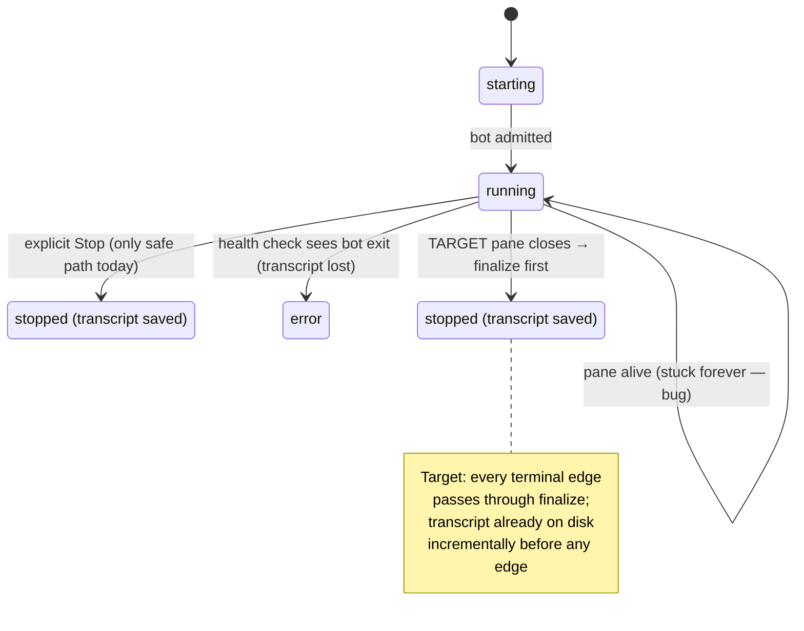
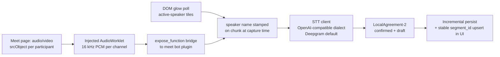

# feat: Meetings reliability + real per-participant audio (Vexa-informed)

## Summary

Three-phase program to make the meetings feature trustworthy and then upgrade its capture quality, porting proven techniques from Vexa (Apache-2.0, `github.com/Vexa-ai/vexa`). Phase 1 fixes the known transcript-loss bug and the test-suite pollution of `~/.craft-agent`. Phase 2 hardens bot join/exit robustness. Phase 3 replaces caption-scraping with real per-participant audio capture + pluggable STT + stable live transcripts. Each phase is independently shippable and closes with a real-meeting validation gate.

---

## Problem Frame

The Hermes capture mode has never recorded a real meeting successfully. Audit (2026-07-28) found:

1. **Transcript loss by design gap.** The only path that saves a transcript is the explicit Stop button. If the browser pane closes first, `refreshLiveStatuses()` calls the plugin's `stop` directly without fetching the transcript; if the pane stays open, the meeting stays `running` forever (health check can only move it to `error`). Nothing is persisted incrementally during the call.
2. **Test pollution.** The meetings test suite writes real metadata under `~/.craft-agent/workspaces/` (569 leaked `craft-meetings-*` folders cleaned on 2026-07-28; they return on every test run). Root cause is `getWorkspaceMeetingsPath()` anchoring at `homedir()` with the temp-dir basename as slug fallback.
3. **Capture quality ceiling.** Hermes mode scrapes Google Meet captions: no raw audio, no real diarization, breaks if captions are off or the lobby renders in another locale.

Vexa solves all three classes in production; its capture modules (`core/meetings/modules/*`) are dependency-free browser JS/TS and portable.

---

## Requirements

- **R1** — A transcript is never lost by a non-explicit termination path (pane closed, app quit, bot crash, health-check error). Whatever was captured up to that moment is on disk.
- **R2** — A meeting cannot stay `running` after the call has ended; every terminal path lands on `stopped` (with transcript) or `error` (with reason), automatically.
- **R3** — The test suite writes zero files outside its own isolated directory; `~/.craft-agent` stays clean after a full test run.
- **R4** — Bot join is deterministic across locales and failure modes are distinguishable (`denial` / `lobby_timeout` / `join_failure` / `removed`) and surfaced to the UI.
- **R5** — (Phase 3) Transcript is built from real per-participant audio with per-channel speaker attribution; captions become fallback, not the source.
- **R6** — (Phase 3) STT is pluggable via the OpenAI-compatible `/v1/audio/transcriptions` dialect (Deepgram stays default); live transcript renders stably (confirmed/draft, no flicker).
- **R7** — Each phase closes with a real Google Meet call observed end-to-end (recording → transcript → summary) before it is reported done.

## Assumptions

Recorded here because scope questions were dispatched headless (user dismissed the scope dialog; recommendation adopted):

- Full three-phase program is planned now; execution may stop after any phase.
- Deepgram remains the default STT; local faster-whisper is an enabled option, not a migration.
- Caption scraping is kept as fallback in Phase 3, not deleted.
- A dedicated Google account for the bot (`bot-auth.json` via `apps/electron/scripts/create-meet-bot-auth.py`) is provisioned manually by the user at Phase 1 validation time.

---

## Key Technical Decisions

- **KTD1 — Incremental durability as an invariant.** Every capture artifact (transcript lines, recording chunks) is persisted the moment it is produced; explicit stop/finalize only *seals*. Pattern: Vexa `services/bot/src/recording.ts` (serialized queue, `close()` emits an empty final only if the real final never arrived). This is the root-cause fix for R1 — not another guard on one more termination path.
- **KTD2 — Audio becomes primary, captions become fallback (Phase 3).** No breaking change to `captureMode`; the `hermes` mode gains an audio pipeline and keeps caption scraping as degraded mode.
- **KTD3 — STT plugability via dialect, not SDK.** `transcription-service.ts` gains the OpenAI-compatible multipart `/v1/audio/transcriptions` client shape (Vexa `modules/whisper/src/transcription-client.ts`). Deepgram's existing native path is untouched.
- **KTD4 — Vexa code enters as vendored, attributed port.** The browser-side capture JS (~230 lines) is ported into our repo with Apache-2.0 attribution (license header + THIRD_PARTY notice), not added as a dependency. Vexa's infra (gateway/Redis/Postgres/MinIO/K8s) is explicitly not adopted.
- **KTD5 — Test isolation fixed at the root.** `CONFIG_DIR` becomes overridable via env var consumed in `packages/shared/src/workspaces/storage.ts`; the three meeting test files set it to a tmpdir. Per-test `metadataDirs.push` patching is rejected (three files already reproduce the same leak).
- **KTD6 — Phase gates are real-usage gates.** `openspec` phases map 1:1 to plan phases; the phase auditor + a real observed meeting (R7) gate each phase transition.

---

## High-Level Technical Design

### Meeting lifecycle — current failure paths vs target

### Phase 3 audio pipeline (target)

---

## Phase 1 — Reliability (fixes R1, R2, R3)

### U1. Single mandatory finalization path for Hermes capture

**Goal:** Every terminal transition (`refreshLiveStatuses`, health check, explicit stop, delete-while-running) routes through `finalizeHermesCapture()`; no code path calls the plugin's `stop` without first fetching the transcript.

**Requirements:** R1, R2
**Dependencies:** none
**Files:** `apps/electron/src/main/meetings/meeting-service.ts`, `apps/electron/src/main/meetings/meeting-service.test.ts`

**Approach:** Extract the terminal-transition logic into one internal method that (1) fetches transcript from the plugin, (2) persists, (3) stops the bot, (4) sets terminal status with a `reason` field. `refreshLiveStatuses` (pane gone) and the health check (bot exited) call it instead of their current shortcuts. Health-check-detected bot exit becomes `stopped` + reason when a transcript was fetched, `error` only when fetch fails. Add an ended-detection edge: a meeting whose pane is alive but whose bot reports `exited`/`leaveReason` must also finalize (fixes stuck-`running`).

**Patterns to follow:** existing `finalizeHermesCapture()` ordering comment (transcript before stop); Vexa `services/bot/src/orchestrator.ts` converging end-signals into one `signalEnd(reason)`.

**Test scenarios:**
- Pane closed while `running` → transcript fetched and persisted, status `stopped`, reason `pane_closed`.
- Bot process dies mid-call (plugin `status` returns exited) → finalize runs, status reflects transcript availability (`stopped` if lines exist, `error` if fetch fails), never silent.
- Explicit stop → unchanged behavior (regression guard).
- Two terminal signals racing (pane close + health check tick) → finalize runs exactly once (idempotency guard).
- Delete meeting while `running` → bot stopped, no orphan `.active.json` pointer left.

**Verification:** no call site invokes the plugin `stop` command without a preceding transcript fetch; the stuck-`running` scenario from the audit is reproducible before and gone after.

**must_haves:**
- truths: "closing the browser pane of a live meeting still yields a saved transcript"; "a meeting whose call ended cannot remain `running` in the list"
- artifacts: `meeting-service.ts` single finalization method (all terminal paths call it)
- key_links: `grep -n "finalizeHermesCapture" apps/electron/src/main/meetings/meeting-service.ts` shows it invoked from refresh, health-check and stop paths; `! grep -n "runHermesMeetPlugin('stop')" apps/electron/src/main/meetings/meeting-service.ts | grep -v finalize` (no bare stop outside finalize)

### U2. Incremental transcript persistence during the call

**Goal:** Transcript content reaches disk continuously while the meeting runs, so any crash (SIGKILL, OOM, Electron quit) loses at most the last polling interval.

**Requirements:** R1
**Dependencies:** U1
**Files:** `apps/electron/src/main/meetings/meeting-service.ts`, `apps/electron/src/main/meetings/meeting-service.test.ts`

**Approach:** Reuse the existing 30s health-check interval (or a dedicated shorter one) to call the plugin `transcript` command periodically during `running`, persisting via the existing `persistTranscript` path with a serialized write queue (KTD1). Finalize (U1) becomes a seal: fetch the tail, mark `ready`. Skip-if-unchanged to avoid rewriting identical content.

**Patterns to follow:** Vexa `services/bot/src/recording.ts` — enqueue-on-produce, per-chunk failure is logged-and-skipped, close is fallback.

**Test scenarios:**
- During `running`, after a poll tick with new lines → `transcripts/<id>.json` on disk contains them (before any stop).
- Simulated hard kill (service torn down without finalize) → transcript file holds all lines up to last tick.
- Poll tick with no new lines → no write (mtime unchanged).
- Transcript fetch fails on one tick → logged, next tick recovers, no crash.

**Verification:** kill -9 the Electron main process mid-meeting in a manual run; reopen; transcript file contains pre-kill content.

**must_haves:**
- truths: "a hard crash mid-meeting preserves the transcript captured so far"
- artifacts: periodic transcript poll wired into the running-state interval
- key_links: `grep -n "transcript" apps/electron/src/main/meetings/meeting-service.ts | grep -i "interval\|poll\|tick"` (poll path exists)

### U3. Bounded graceful shutdown (app quit / pane teardown)

**Goal:** App quit or pane teardown while a meeting runs triggers finalize with a hard deadline — shutdown is never hung by a stuck teardown, and never skips the seal.

**Requirements:** R1, R2
**Dependencies:** U1
**Files:** `apps/electron/src/main/meetings/meeting-service.ts`, `apps/electron/src/main/index.ts` (or wherever `before-quit` is wired), `apps/electron/src/main/meetings/meeting-service.test.ts`

**Approach:** On `before-quit`/window close with a live meeting: fire finalize, race it against a watchdog timer (Vexa uses 20s, `unref`'d so it never keeps a clean exit alive). If the deadline passes, force-continue quit — incremental persistence (U2) already bounded the loss.

**Patterns to follow:** Vexa `services/bot/src/signals.ts` (`unref`'d watchdog surviving release), `orchestrator.ts` `Promise.race` on platform leave.

**Test scenarios:**
- Quit with live meeting, finalize completes fast → transcript sealed, app exits.
- Quit with plugin hanging on `stop` → app exits at deadline, transcript file still has all polled content.
- Quit with no live meeting → no delay added (watchdog not armed).

**Verification:** manual: quit the app mid-meeting; relaunch; meeting is `stopped` with transcript, quit took < deadline.

**must_haves:**
- truths: "quitting the app mid-meeting neither hangs the quit nor loses the transcript"
- artifacts: quit hook with bounded finalize
- key_links: `grep -rn "before-quit" apps/electron/src/main | grep -i meeting`

### U4. Test isolation for meetings storage (kills the workspace leak)

**Goal:** Full test run leaves zero `craft-meetings-*` (or any) folders under the real `~/.craft-agent`.

**Requirements:** R3
**Dependencies:** none (parallel-safe with U1-U3)
**Files:** `packages/shared/src/workspaces/storage.ts`, `apps/electron/src/main/meetings/meeting-service.test.ts`, `apps/electron/src/main/meetings/recording-service.test.ts`, plus the third test file reproducing the leak (locate via grep for `mkdtemp.*craft-meetings`)

**Approach:** Make the config root resolvable from an env var (e.g. `CRAFT_AGENT_CONFIG_DIR`) read at call time in `storage.ts` (KTD5 — root cause, not per-test patching). Test setup points it at a per-run tmpdir; teardown removes one directory. Keep `extractWorkspaceSlugFromPath` behavior unchanged for the app.

**Test scenarios:**
- With env var set, `getWorkspaceMeetingsPath()` resolves under the override (unit test).
- Without it, resolves under `homedir()` (regression guard for the app path).
- Meta-check: after the meetings suite runs, the real `~/.craft-agent/workspaces` gained no entries (assert in a suite-level afterAll using a snapshot taken in beforeAll).

**Verification:** run the full meetings suite twice; `ls ~/.craft-agent/workspaces | grep craft-meetings | wc -l` is 0.

**must_haves:**
- truths: "running the test suite does not pollute the real user config dir"
- artifacts: env-overridable config root in `storage.ts`; all three test files using it
- key_links: `grep -n "CRAFT_AGENT_CONFIG_DIR" packages/shared/src/workspaces/storage.ts`

---

## Phase 2 — Join/exit robustness (fixes R4)

### U5. Deterministic bot join: locale pinning + safe browser args

**Goal:** The bot always sees an English-locale Meet UI (selectors correct by construction) and never launches with args Google's anti-bot flags.

**Requirements:** R4
**Dependencies:** Phase 1 complete (validated bot flow to test against)
**Files:** `apps/electron/resources/vendor/hermes/hermes-agent/plugins/google_meet/meet_bot.py` (launch args section), plugin patch under `apps/electron/scripts/hermes-patches/` if the vendor dir is generated

**Approach:** Pin `--lang=en-US`, `--accept-lang=en-US,en` and Playwright context `locale`. Ensure `--autoplay-policy=no-user-gesture-required` is present (prereq for Phase 3 audio). Audit existing args against Vexa's deny-list: remove `--disable-web-security` / `--ignore-certificate-errors` class flags if present (they trigger "You can't join this meeting").

**Patterns to follow:** Vexa `modules/join/src/browser-args.ts` (both the include-list and the explicit do-not-use comment).

**Test scenarios:**
- Launch args snapshot test: generated arg list contains the locale pins and none of the deny-listed flags.
- Test expectation for live-join behavior: covered by the phase validation gate (R7), not unit-testable.

**Verification:** live join from a machine with pt-BR system locale succeeds; lobby renders in English.

**must_haves:**
- truths: "bot join does not depend on the host machine's locale"
- artifacts: pinned locale args in the bot launch path
- key_links: `grep -rn "accept-lang" apps/electron/resources/vendor/hermes/hermes-agent/plugins/google_meet/ apps/electron/scripts/hermes-patches/`

### U6. Typed admission/removal outcomes surfaced to the record and UI

**Goal:** Join failures are distinguishable — `denial` (permanent), `lobby_timeout` (retryable), `join_failure` (bug/infra), plus mid-call `removed` — and land on `MeetingRecord` + the meetings list UI instead of a generic error.

**Requirements:** R4
**Dependencies:** U1 (reason field on terminal states)
**Files:** `apps/electron/resources/vendor/hermes/hermes-agent/plugins/google_meet/meet_bot.py` (or patch), `apps/electron/src/main/meetings/meeting-service.ts`, `packages/shared/src/protocol/dto.ts`, `apps/electron/src/renderer/components/app-shell/MeetingsListPanel.tsx`, `apps/electron/src/main/meetings/meeting-service.test.ts`

**Approach:** Plugin `status`/`start` responses carry a typed outcome string; `meeting-service` maps it onto the U1 `reason` field; DTO gains the enum; list panel shows reason on error/stopped badges tooltip. Check rejection indicators before waiting-room indicators (Vexa: the Meet DOM keeps lobby text after a host rejects). Keep the removal monitor's *shape* (start/cleanup fn) but curate our own indicator list — Vexa's own is flagged false-positive-prone.

**Patterns to follow:** Vexa `modules/join/src/googlemeet/admission.ts` ordering; `AdmissionOutcome` union type shape.

**Test scenarios:**
- Plugin reports denial → record `error`, reason `denial`, UI badge shows it.
- Lobby timeout → reason `lobby_timeout`, distinct from denial.
- Bot removed mid-call → finalize (U1) runs, status `stopped`, reason `removed`, transcript preserved.
- Unknown outcome string → generic `error`, no crash (forward-compat guard).

**Verification:** live: request join, have host reject → UI shows denial within one refresh; transcripts unaffected.

**must_haves:**
- truths: "the user can tell from the UI whether the host rejected the bot vs the join simply timed out"
- artifacts: typed outcome on DTO + mapping in service + badge in panel
- key_links: `grep -n "lobby_timeout" packages/shared/src/protocol/dto.ts apps/electron/src/main/meetings/meeting-service.ts`

### U7. Call-end detection without human intervention

**Goal:** A meeting whose call ended (bot alone, meeting closed, max duration hit) finalizes on its own even if the user never touches the UI.

**Requirements:** R2, R4
**Dependencies:** U1
**Files:** `apps/electron/resources/vendor/hermes/hermes-agent/plugins/google_meet/meet_bot.py` (or patch), `apps/electron/src/main/meetings/meeting-service.ts`, `apps/electron/src/main/meetings/meeting-service.test.ts`

**Approach:** Two bounded signals now: (1) `maxActiveMs` cap per meeting (config default, e.g. 4h) enforced service-side; (2) bot-side leave when the meeting UI reports the call ended / everyone left (plugin already exposes `leaveReason` — extend detection minimally). Make `refreshLiveStatuses`-class reconciliation run on a timer while any meeting is `running`, not only when the UI asks (the audit found it lazy — list()/status() only). Phase 3 upgrades signal (2) to audio-derived aloneness (Vexa: frame arrival *is* the signal; don't re-judge with a different threshold).

**Test scenarios:**
- Meeting exceeds max duration → finalized, reason `max_duration`.
- Bot reports left/ended while pane open → finalized without UI interaction (timer reconciliation).
- Reconciliation timer stops when no meeting is `running` (no idle churn).

**Verification:** live: leave the bot alone in a test call, end the call from the other side → meeting reaches `stopped` with transcript, no clicks.

**must_haves:**
- truths: "an unattended meeting reaches a terminal state by itself"
- artifacts: service-side duration cap + periodic reconciliation while running
- key_links: `grep -n "maxActive\|max_duration" apps/electron/src/main/meetings/meeting-service.ts`

---

## Phase 3 — Real audio capture (fixes R5, R6)

### U8. Per-participant audio capture in the Meet page

**Goal:** The bot captures 16 kHz PCM per participant from the Meet page's per-participant media elements; chunks reach the plugin process tagged by channel.

**Requirements:** R5
**Dependencies:** U5 (autoplay arg), Phase 2 validated
**Files:** new browser-side capture bundle under the google_meet plugin (e.g. `apps/electron/resources/vendor/hermes/hermes-agent/plugins/google_meet/capture/gmeet-capture.js` — vendored port, Apache-2.0 attribution per KTD4), `meet_bot.py` (inject via `add_init_script`, bridge via `expose_function`), `THIRD_PARTY_LICENSES.md`

**Approach:** Port Vexa's `modules/gmeet-capture/` (~230 lines): scan `audio`/`video` elements with live `MediaStream.srcObject`, one `AudioContext({sampleRate:16000})` + AudioWorklet per element (never ScriptProcessor — it duplicates/drops buffers on main-thread load and the distorted PCM is faithfully mistranscribed), explicit `ctx.resume()`, 15s rescan for late joiners, dedup by stream id, cleanup on track `ended`. Bridge PCM as plain arrays through an exposed function; reassemble typed arrays plugin-side. Captions scraping stays wired as fallback when zero media elements are found (KTD2).

**Test scenarios:**
- Fixture page with two fake MediaStream audio elements → two channels of PCM arrive, distinct channel ids.
- Element removed (participant leaves) → channel closes cleanly, no further chunks.
- Late-join fixture (element appears after start) → picked up within one rescan interval.
- AudioContext suspended on start (autoplay policy) → resume path recovers, PCM flows (assert non-zero samples).
- Zero media elements → capture reports caption-fallback mode, no crash.

**Verification:** live two-person call: PCM chunk counters per channel increase while each side speaks; transcript produced from audio (captions off).

**must_haves:**
- truths: "a meeting with captions disabled still yields a transcript"; "two speakers produce two distinct audio channels"
- artifacts: vendored capture bundle + injection + bridge in `meet_bot.py`; attribution entries
- key_links: `grep -rn "AudioWorklet" apps/electron/resources/vendor/hermes/hermes-agent/plugins/google_meet/capture/`; `grep -n "vexa" THIRD_PARTY_LICENSES.md`

### U9. Speaker attribution stamped at capture time

**Goal:** Each audio chunk carries a speaker name derived from the Meet UI's active-speaker signal, honest by construction (exactly-one-lit or unknown — never guessed).

**Requirements:** R5
**Dependencies:** U8
**Files:** capture bundle (glow poll module), `meet_bot.py` bridge, plugin transcript assembly

**Approach:** Port Vexa's glow poll (250ms, participant-tile selectors + known speaking classes, name from tile, self-detection structural via `data-self-name` only) and `pickBoundName` (exactly one lit tile → that name; zero or 2+ → undefined). Stamp the name on the chunk at capture, not on the transcript afterwards. Self-name is sticky and purges accumulated evidence when set (Meet transiently drops the marker). Do NOT port the auto-learn-CSS-class heuristic (Vexa removed it: it learned wrong classes and collapsed all channels into one name). The energy↔glow channel binder is deferred (see Scope Boundaries) until simple naming demonstrably fails on overlapped speech.

**Test scenarios:**
- One lit tile during a chunk → chunk stamped with that name.
- Two lit tiles (overlap) → chunk stamped unknown (assert no guess).
- Self tile lit → excluded from remote naming (structural self-detection test).
- Speaking-class selectors missing entirely (Meet DOM changed) → capture continues, all chunks unknown, a diagnostic counter increments (graceful degradation).

**Verification:** live call where each participant speaks in turn → transcript lines attributed to the right names; overlapped speech shows unknown, not a wrong name.

**must_haves:**
- truths: "transcript lines carry the actual speaker's name when speech doesn't overlap, and never a wrong name when it does"
- artifacts: glow-poll module + per-chunk stamp
- key_links: `grep -rn "data-self-name" apps/electron/resources/vendor/hermes/hermes-agent/plugins/google_meet/capture/`

### U10. Pluggable STT via OpenAI-compatible dialect

**Goal:** Audio chunks are transcribed through a client speaking multipart `/v1/audio/transcriptions` (`verbose_json`, word timestamps), making Deepgram/Groq/OpenAI/local faster-whisper interchangeable by URL; Deepgram's current native path remains default and untouched.

**Requirements:** R6
**Dependencies:** U8
**Files:** `apps/electron/src/main/meetings/transcription-service.ts` (new dialect client alongside Deepgram), transcription config DTO + settings surface in `apps/electron/src/renderer/pages/MeetingsPage.tsx`, tests alongside

**Approach:** Float32 PCM → WAV in-memory → multipart POST; config gains provider kind + base URL + key. Client-side silence gates before submission (peak gate at capture ~0.005, RMS gate at submission ~0.0025 — silence produces hallucinations). Server-side VAD params passed through when the endpoint supports them. No new SDK dependency (KTD3).

**Test scenarios:**
- WAV encoding round-trip: known PCM fixture → valid WAV header, correct sample count.
- Silent buffer (below RMS gate) → no request issued.
- Endpoint URL without the `/v1/audio/transcriptions` suffix → suffix appended once (idempotent).
- Non-2xx from endpoint → retried per existing service policy, then surfaced as transcription error without killing the meeting.
- Deepgram default path regression: existing craft-mode transcription tests still pass untouched.

**Verification:** same recorded meeting transcribed once via Deepgram, once via a local faster-whisper container → both produce plausible transcripts through the same pipeline.

**must_haves:**
- truths: "switching STT provider is a config change, not a code change"
- artifacts: dialect client in `transcription-service.ts` + provider config
- key_links: `grep -n "audio/transcriptions" apps/electron/src/main/meetings/transcription-service.ts`

### U11. Stable live transcript: LocalAgreement-2 + segment upsert

**Goal:** The meeting detail view shows a live transcript that grows stably — confirmed text never mutates, the draft tail updates in place without flicker.

**Requirements:** R6
**Dependencies:** U10
**Files:** new pure module for agreement logic (e.g. `apps/electron/src/main/meetings/local-agreement.ts` + test), `apps/electron/src/main/meetings/meeting-service.ts` (wire into transcript assembly), `apps/electron/src/renderer/pages/MeetingsPage.tsx` (upsert by segment id)

**Approach:** Port Vexa's LocalAgreement-2 (~80 pure lines): sliding window with a confirmed-samples pointer, resubmit only unconfirmed audio every ~2s, confirm the longest common **word** prefix between consecutive submissions (Whisper re-segments as the buffer grows — positional segment comparison fails), emit only whole segments inside the confirmed prefix. Draft = the whole forming window, published once per submission under a stable `segment_id` so the UI upserts (two drafts per id caused visible flicker in Vexa). `lastConfirmedText` feeds back as the Whisper prompt. Idle 15s → forced final submission; 30s hard cap → force flush. Two hallucination filters at egress (logprob/compression-ratio gate + repetition-loop detection).

**Test scenarios:**
- Two consecutive submissions sharing a 5-word prefix, differing tail → 5 words confirmed, tail stays draft.
- Whisper re-segmentation fixture (same words, different segment boundaries) → confirmation still advances (word-level, not positional).
- Draft re-publication under same segment_id → single UI row updated (upsert), not appended.
- Idle timeout with pending audio → final submission fired, window sealed.
- Known hallucination fixture (repeated phrase loop) → filtered, not persisted.

**Verification:** live: watch the transcript panel during a real call — confirmed text never rewrites; the tail updates smoothly.

**must_haves:**
- truths: "live transcript text the user already read never changes under them"
- artifacts: pure agreement module + segment-id upsert in the page
- key_links: `grep -n "longestCommonWordPrefix\|localAgreement" apps/electron/src/main/meetings/`

---

## Scope Boundaries

**In scope:** everything under U1-U11; vendored attribution; the real-meeting validation gates.

**Out of scope (true non-goals):**
- Vexa's service architecture: gateway, Redis, Postgres, MinIO, Kubernetes, multi-tenant identity — single-user desktop app.
- Zoom / Teams / Jitsi support (Vexa's multi-platform layer). Meet only.
- Humanized X11 input (xdotool/mocap) — a real user's desktop doesn't need anti-datacenter-bot evasion.
- Recording video upload/storage changes (craft mode's `.webm` handling stays as is, aside from U3's shutdown seal).

**Deferred to Follow-Up Work:**
- Energy↔glow channel binder for overlapped speech (Vexa `gmeet-channel-binder.ts`) — adopt only if U9's exactly-one-lit naming proves insufficient in real use.
- Audio-derived aloneness upgrade for U7 (needs U8's frames; revisit after Phase 3).
- Local faster-whisper deployment recipe (Dokploy service) — U10 makes it possible; provisioning is an ops task, not this plan.
- Meeting knowledge-base/agent features (Vexa's agent domain) — separate product conversation.

---

## Risks & Dependencies

- **Vendored Hermes plugin editability.** `meet_bot.py` lives under `resources/vendor/hermes/` pinned by `hermes-version.txt`; direct edits may be overwritten by `electron:bundle:hermes`. Mitigation: apply changes via `apps/electron/scripts/hermes-patches/` (existing mechanism) and rebuild; confirm patch flow in U5 before deeper U8/U9 work. (Repo gotcha: always `electron:bundle:hermes` before `electron:dist*`.)
- **Meet DOM drift.** Speaking-class selectors and tile structure change without notice. Mitigations: U9's graceful-degradation counter; selector lists as flat consts with a validity test (Vexa caught silently-skipped invalid selectors this way).
- **Bot account risk.** Automated participants may trip Google anti-abuse on the dedicated account. Mitigation: safe-args deny-list (U5), dedicated throwaway account, low volume (single-user).
- **`add-browser-cookie-import` change (0/22, active)** touches browser internals; coordinate merge order if it lands mid-program.
- **Real-meeting validation requires a second participant** — plan validation sessions accordingly (two devices or a colleague).

---

## Sources & Research

- Repo audit of the meetings subsystem + lifecycle gap (this session, 2026-07-28): stuck-`running` reproduction, transcript-loss path, test-leak root cause (569 folders).
- Vexa source analysis (clone at commit of 2026-07-28): capture (`core/meetings/modules/gmeet-capture/`, `mixed-capture-core/webrtc-audio-hook.ts`), STT (`modules/whisper/transcription-client.ts`, `services/transcription/`), agreement (`modules/buffer/local-agreement.ts`, `gmeet-pipeline/speaker-streams.ts`), lifecycle (`services/bot/src/{recording,aloneness,signals,orchestrator}.ts`), join (`modules/join/src/googlemeet/`, `browser-args.ts`). License: Apache-2.0.
- Institutional: `brain-source/projects/craft-agents-oss.md` (gotchas: hermes pinning, TS7 lint debt, test EPERM under sandbox).
