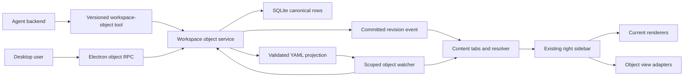
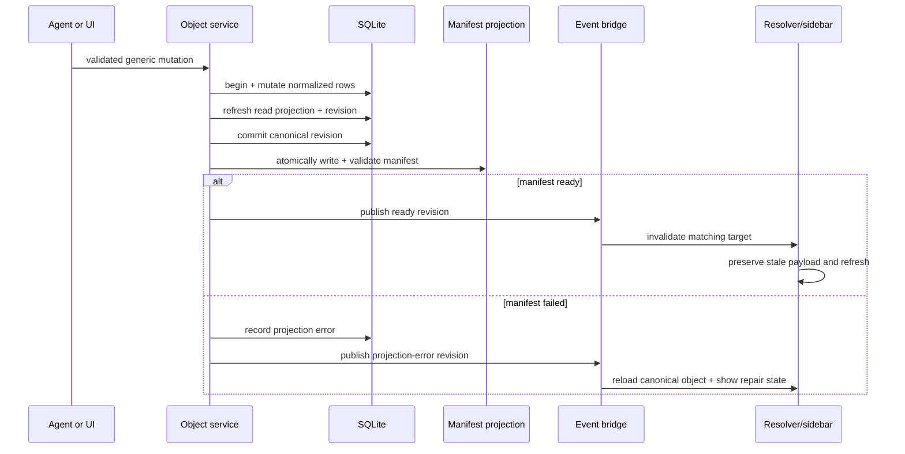

# feat: Structured workspace objects inspired by DenchClaw

## Summary

Add one local-first structured-object contract that agents and the Craft Desktop can mutate and render together. The roadmap lands through four audited phases: object storage and persistent preview first, editable views second, integration discovery third, and Gmail/Calendar workflows last.

## Problem Frame

Craft already has file previews, a persistent right sidebar, source OAuth, configuration watchers, task storage, session Kanban, and rich markdown renderers. These capabilities do not share a durable object model, so an agent cannot create a CRM-like object once and have every view react to the same validated state.

DenchClaw demonstrates the desired feedback loop, but its implementation cannot be copied mechanically. Upstream inspection at `DenchHQ/DenchClaw@f14eb4c239002d7b28673c60955b689b9d69db22` found a nominal LRU that does not evict payloads, incomplete refresh cancellation, and projection identity rules that are weaker than the documentation claims. This plan preserves the useful loop while making storage, invalidation, identity, and teardown explicit Craft contracts.

## Scope Boundaries

### Included roadmap

- A workspace-scoped SQLite object store with typed fields, relations, views, action history, migrations, and efficient read projections.
- A generic validated agent data plane and compact contextual guidance, without renderer-specific tools.
- Human-readable filesystem projections that can be repaired or rejected without hiding canonical objects.
- Persistent content tabs, a bounded stale-while-revalidate resolver, workspace events, and integration with the existing right sidebar and preview renderers.
- Editable tables and saved views, followed by Kanban, calendar, timeline, gallery, and list adapters over the same payload.
- Existing Craft source/OAuth reuse, a long-tail Composio catalog, Gmail inbox materialization, Google Calendar sync, and relationship aggregation.
- The seven DenchClaw reference documents under `docs/denchclaw/`, corrected to separate upstream evidence from Craft decisions.

### First executable phase

- Phase A covers U1-U4 only: storage, generic mutations and projection, tabs/resolver, and Electron sidebar reactivity using existing renderers.
- Phase A is complete only after an agent-created object is observed end to end in the real Electron runtime.

### Deferred beyond Phase A

- Inline table editing, saved filters, and specialized object views.
- Composio discovery and all Gmail/Calendar synchronization.
- Full parity for WebUI, viewer, remote workspace server, and mobile surfaces.

### Outside this roadmap

- Dench Cloud, provider-model coupling, the `.dench.app` runtime, or its permission bridge.
- A new tool for every renderer, raw SQL as the public agent contract, or unvalidated direct database access.
- A second file/object panel competing with the existing right sidebar.
- Copying DenchClaw's monolithic content switch or all of its render branches at once.
- Always injecting the complete object manual into sessions that do not use structured workspaces.

## Requirements

### Object domain and persistence

- R1. A structured workspace supports objects, typed fields, entries, values, relations, statuses, linked documents, and action history without a physical schema per use case.
- R2. Reads use an efficient tabular projection and fall back to normalized rows when that projection is missing or stale.
- R3. Each object has one canonical identity; directory and manifest representations are derived, validated, idempotent, and repairable.
- R4. Projection divergence never hides a canonical object and produces either a safe repair or an actionable error.
- R5. Initialization, migrations, seeds, and system-object identifiers are idempotent.
- R6. Agent mutations are validated and transactional before any UI success event is published.

### Preview and reactivity

- R7. Structured content extends the current right sidebar while retaining its file tree, specialized viewers, shortcuts, and external-open fallback.
- R8. Content tabs have deterministic IDs, preview/permanent/pinned modes, scoped restoration, and an always-valid active selection.
- R9. Content resolution uses a strict discriminated union, real bounded eviction, stale-while-revalidate, request generations, and cancellation for initial loads and refreshes.
- R10. Filesystem refresh preserves the previous payload until replacement succeeds and stale responses cannot overwrite newer state.
- R11. Object watchers debounce noisy events, ignore database sidecars, tear down explicitly, and isolate workspace and client lifecycles.
- R12. Phase A reuses existing Craft renderers and keeps type-specific rendering outside a single monolithic component.

### Views and editing

- R13. Table, Kanban, calendar, timeline, gallery, and list consume one object payload and never change the canonical source when users switch views.
- R14. Saved views preserve nested filters, search, ordering, column visibility, and view-specific settings in shareable restorable state.
- R15. Table editing validates each field type, resolves relations, persists before success, and revalidates without flicker.
- R16. Kanban groups by a configured field, explains invalid configuration, and rolls back optimistic mutations on response or transport failure.

### Integrations, inbox, and calendar

- R17. Integrations reuse Craft sources, OAuth, and credential storage; tokens stay out of portable config, renderer payloads, and logs.
- R18. A connection is ready only after source testing and an end-to-end session probe confirm the expected tools.
- R19. Gmail sync is idempotent, resumable, rate-limit aware, excludes the authenticated user as a contact, and checkpoints before each page.
- R20. Inbox lists metadata previews and hydrates full HTML on demand inside the existing sandboxed rendering boundary.
- R21. Calendar sync preserves timezones, handles cancellation, and recovers expired incremental tokens with an idempotent full resync.
- R22. The generic object calendar ships before a specialized synchronized-calendar surface.
- R23. Email and meeting interactions aggregate by counterpart without materializing the authenticated user as a relationship profile.

### Agent guidance and evidence

- R24. Compatible backends receive compact structured-object guidance only while such a workspace is active.
- R25. `docs/denchclaw/` records confirmed upstream behavior, known defects, and Craft-specific decisions separately.

## Acceptance Examples

- AE1. Given an agent commits a valid object mutation and its manifest is absent, when the transaction completes, then the runtime recreates the projection and the sidebar shows the object without a restart. Covers F1 and R3-R6.
- AE2. Given a projected identity diverges from canonical state, when the watcher detects it, then the runtime safely repairs the projection or reports an actionable conflict while keeping the object visible. Covers F1 and R4.
- AE3. Given the resolver has reached its payload limit, when another content target opens, then the least-recent inactive payload is removed and the active tab keeps its prior payload while revalidating. Covers F2 and R8-R10.
- AE4. Given a refresh is in flight, when the user changes tabs or the workspace changes, then that request is cancelled or invalidated and its result cannot update the new target. Covers F2 and R9.
- AE5. Given the last client leaves a workspace or switches workspaces, when teardown completes, then watcher handles and debounce timers are released and no old-workspace event reaches the client. Covers F2 and R11.
- AE6. Given a Kanban card moves columns, when persistence rejects or transport fails, then the card returns to its original column and the error remains visible. Covers F4 and R16.
- AE7. Given a collection lacks a compatible group field, when Kanban opens, then the view identifies the missing configuration instead of rendering an unexplained empty board. Covers F4 and R16.
- AE8. Given OAuth completes, when the source is tested, then secrets remain in secure storage and a session probe confirms the expected tools without exposing credentials. Covers F3 and R17-R18.
- AE9. Given Gmail backfill stops after a checkpointed page, when it resumes, then prior messages do not duplicate and only the in-progress page can require replay. Covers F3 and R19-R20.
- AE10. Given Google rejects an expired incremental token, when the next sync cycle runs, then it schedules an idempotent full resync instead of becoming permanently stuck. Covers F3 and R21.

## Key Technical Decisions

- KTD1. Reuse the existing cross-runtime SQLite adapter as the canonical store. `packages/shared/src/memory/sqlite-driver.ts` already selects Bun SQLite, Node SQLite, or `better-sqlite3` across Craft runtimes; adding DuckDB would introduce another native packaging surface, and the official Node Neo support matrix does not cover Windows.
- KTD2. Store canonical data in `objects/objects.sqlite` and derive readable manifests under `objects/<object-slug>/object.yaml`. SQLite WAL and sidecar files are runtime-owned and ignored by watchers; manifests contain stable IDs and display metadata but never become a second authority.
- KTD3. Model values as normalized typed rows plus application-maintained read projections. A schema-versioned projection table serves common grid/view reads; the repository can reconstruct a payload from normalized rows when projection metadata is stale, avoiding a DuckDB-specific `PIVOT` dependency.
- KTD4. Expose one generic structured-object data plane through the versioned session-tool frontier. Operations are action-based schema, entry, view, and query mutations validated with Zod and executed in transactions; agents never receive raw SQL or renderer verbs.
- KTD5. Treat SQLite commit and filesystem projection as a recoverable two-step protocol. Commit canonical rows and the read projection first, then atomically write and validate the manifest; publish a post-commit event marked `ready` or `projection-error` so the UI always reloads canonical visibility and can expose repair state. Each event carries workspace ID, object ID, revision, and change kind so IPC/RPC clients can discard duplicate or out-of-scope events.
- KTD6. Use deterministic content target IDs and one replaceable preview tab per scope. File targets include normalized path and owning session/workspace; object targets include canonical object and view IDs. Permanent and pinned tabs survive preview replacement.
- KTD7. Bound the resolver to 20 payloads initially, with true payload deletion on eviction. In-flight loads have an AbortController and monotonically increasing generation; both first load and refresh share the same lifecycle guard.
- KTD8. Keep renderer dispatch modular. A content registry maps discriminated target payloads to the current image, text, markdown, JSON, Excalidraw, PDF, audio, and tabular renderers; later object views register adapters without expanding one god-component switch.
- KTD9. Reuse sources/OAuth for provider credentials and treat Composio as a discoverable long-tail source type. Native Gmail and Google Calendar synchronization remains first-party domain code because checkpointing and relationship semantics are Craft invariants.
- KTD10. Gate phases on observable behavior. Phase A requires a real Electron agent-to-object-to-sidebar loop; later phases require editing rollback, provider probes, and resumable sync evidence before the next phase starts.

## High-Level Technical Design

The domain service is renderer-independent and owns transactions, revisioning, projections, and fallback reads. Electron and the session tool use the same service rather than duplicating mutation rules. The renderer only receives safe typed payloads and revision events.

### Canonical write lifecycle

## Implementation Units

### Phase A — Structured foundation and persistent preview

#### U1. Authoritative object domain and SQLite repository

**Goal:** Create the renderer-independent object model, migration chain, canonical repository, and reconstructable read projection.

**Requirements:** R1, R2, R5

**Dependencies:** none

**Files:** `packages/shared/src/workspace-objects/types.ts`, `packages/shared/src/workspace-objects/schema.ts`, `packages/shared/src/workspace-objects/storage.ts`, `packages/shared/src/workspace-objects/projection.ts`, `packages/shared/src/workspace-objects/index.ts`, `packages/shared/src/workspace-objects/__tests__/storage.test.ts`, `packages/shared/src/workspace-objects/__tests__/projection.test.ts`, `packages/shared/src/workspaces/storage.ts`

**Approach:** Add a dedicated shared domain using `openSQLite()` with WAL, foreign keys, a version table, and ordered idempotent migrations. Normalize object definitions, fields, entries, typed values, relations, saved views, action history, and revision metadata. Start with validators for text, number, boolean, date, datetime, select, status, relation, and file values; keep constraints extensible without adding a table per type. Maintain a denormalized object payload with its source revision and reconstruct it from normalized rows when absent or stale.

**Patterns to follow:** `packages/shared/src/memory/schema.ts` for versioned initialization; `packages/shared/src/memory/memory-store.ts` for runtime-neutral SQLite; `packages/shared/src/tasks/schema.ts` for strict Zod contracts; `packages/shared/src/views/storage.ts` for validated workspace persistence.

**Test scenarios:**

- Happy: initialize an empty workspace twice, create an object with every Phase A field type, and read the same stable IDs and typed values from the projection.
- Edge: delete or mark the read projection stale, then query the object and receive a reconstructed payload whose revision matches normalized rows.
- Error: reject an invalid relation target, invalid select option, duplicate stable ID, and unsupported migration version without partial writes.
- Integration: open and close the repository using each available adapter contract in isolated temporary workspaces and leave no handle alive.

**Verification:** A fresh and an already-initialized workspace produce the same system records; projection loss degrades read performance rather than data correctness.

#### U2. Transactional agent data plane and filesystem projection

**Goal:** Let every compatible agent create and mutate structured objects through one safe tool while the runtime maintains readable manifests and contextual instructions.

**Requirements:** R3-R6, R24, R25

**Dependencies:** U1

**Files:** `packages/shared/src/workspace-objects/service.ts`, `packages/shared/src/workspace-objects/manifest.ts`, `packages/shared/src/workspace-objects/events.ts`, `packages/shared/src/workspace-objects/__tests__/service.test.ts`, `packages/shared/src/workspace-objects/__tests__/manifest.test.ts`, `packages/session-tools-core/src/tool-defs.ts`, `packages/session-tools-core/src/handlers/workspace-objects.ts`, `packages/session-tools-core/src/handlers/workspace-objects.test.ts`, `packages/session-tools-core/src/context.ts`, `packages/session-tools-core/src/index.ts`, `packages/session-mcp-server/src/index.ts`, `docs/denchclaw/`

**Approach:** Add a frontier-versioned structured-object tool with action variants for schema, entry, view, and query operations. Validate inputs before opening a transaction, commit canonical rows and the read projection, then atomically write and validate the derived manifest. Publish one post-commit revision event whose status is `ready` or `projection-error`; either status reloads canonical visibility, while the latter exposes repair state. A manifest deletion triggers repair; a stable-ID mismatch produces a conflict and preserves canonical visibility. Inject a compact usage contract only when the workspace object store exists. Import the seven reference documents and annotate confirmed upstream behavior, refuted claims, and Craft divergences against the pinned upstream commit.

**Patterns to follow:** `packages/session-tools-core/src/tool-defs.ts` for Zod schemas and frontier metadata; `packages/session-tools-core/src/handlers/transform-data.ts` for filesystem-scoped handlers; `packages/shared/src/utils/files.ts` for atomic writes; `packages/shared/src/sources/storage.ts` for validated directory projections.

**Test scenarios:**

- Happy: the session tool creates an object and entries, returns the committed revision, and writes a manifest whose stable identity matches SQLite.
- Edge: removing a manifest and requesting the object repairs it idempotently without changing the object revision.
- Error: a manifest with another canonical ID is not imported or overwritten silently; the tool reports the conflicting path and the canonical object remains queryable.
- Error: a multi-entry mutation with one invalid value rolls back all entries, the manifest, and the event.
- Error: a manifest write failure after canonical commit returns the committed revision with `projection-error`, keeps the object visible, and succeeds on idempotent repair.
- Integration: the same mutation through the shared handler and session MCP returns the same response envelope and never exposes database paths or SQL.

**Verification:** An agent can create and verify a CRM-shaped object without a table/Kanban-specific tool, and the resulting documentation identifies every intentional difference from DenchClaw.

#### U3. Deterministic content tabs and bounded resolver

**Goal:** Add a pure tab state machine and content resolver that safely caches and revalidates files and objects.

**Requirements:** R8-R10

**Dependencies:** U1

**Files:** `apps/electron/src/renderer/components/app-shell/content-tabs-state.ts`, `apps/electron/src/renderer/components/app-shell/content-resolver.ts`, `apps/electron/src/renderer/components/app-shell/__tests__/content-tabs-state.test.ts`, `apps/electron/src/renderer/components/app-shell/__tests__/content-resolver.test.ts`, `apps/electron/src/renderer/lib/local-storage.ts`

**Approach:** Implement the tab reducer as pure transitions with deterministic target IDs, one replaceable preview tab, explicit promotion/pinning, repaired active selection, and workspace-scoped serialization. Represent resolved content as a strict union for current file types plus an object payload. Keep at most 20 payloads, evict actual payload entries by recency, and share a generation/abort lifecycle between initial load and refresh. Revalidation retains the prior success payload until a newer generation succeeds; errors remain visible without clearing useful stale content.

**Patterns to follow:** `apps/electron/src/renderer/components/app-shell/right-sidebar-preview-state.ts` for pure selection functions; `apps/electron/src/renderer/lib/local-storage.ts` for scoped persistence; existing overlay classification in `packages/ui/src/components/overlay/PreviewOverlay.tsx`.

**Test scenarios:**

- Happy: repeated preview opens replace one preview tab, while promotion and pinning preserve their tabs across subsequent previews and restoration.
- Edge: restoring tabs with a missing active target selects the nearest valid tab or an empty state deterministically.
- Edge: opening the twenty-first payload evicts the least-recent inactive payload, not only its ordering key.
- Error: an older refresh resolves after a newer request and is ignored; an aborted initial load and an aborted refresh cannot mutate state.
- Integration: file and object targets share tab behavior while retaining distinct loaders and safe scope validation.

**Verification:** Reducer and resolver tests reproduce the upstream cache and cancellation defects before implementation and prove both are absent afterward.

#### U4. Electron object bridge, watcher, and right-sidebar integration

**Goal:** Connect committed object revisions and safe manifest changes to persistent right-sidebar tabs rendered by existing Craft viewers.

**Requirements:** R7, R11, R12

**Dependencies:** U2, U3; the completed behavior in `openspec/changes/harden-right-sidebar-inline-preview/` remains the baseline and is not reimplemented.

**Files:** `packages/server-core/src/handlers/rpc/workspace-objects.ts`, `packages/server-core/src/handlers/rpc/index.ts`, `packages/server-core/src/workspace-objects/workspace-object-watcher.ts`, `packages/server-core/src/workspace-objects/workspace-object-watcher.test.ts`, `packages/shared/src/workspace-objects/`, `apps/electron/src/shared/types.ts`, `apps/electron/src/preload/bootstrap.ts`, `apps/electron/src/renderer/components/app-shell/AppShell.tsx`, `apps/electron/src/renderer/components/app-shell/content-tabs-state.ts`, `apps/electron/src/renderer/components/app-shell/content-resolver.ts`, `apps/electron/src/renderer/components/app-shell/content-preview-host.tsx`, `apps/electron/src/renderer/components/right-sidebar/session-files-section.tsx`, `apps/electron/src/renderer/components/right-sidebar/workspace-objects-section.tsx`, `apps/electron/src/renderer/components/right-sidebar/workspace-object-preview-panel.tsx`

**Approach:** Keep canonical storage, manifests and event envelopes in shared, but
place filesystem watching and client reference counting in server-core. Add
handlers for listing, resolving and mutating object targets plus a subscription
bridge. Scope one debounced watcher registry per workspace, ignore SQLite
database/WAL/SHM/journal and temporary atomic-write files, reference-count
clients, and stop handles/timers at zero clients. Extend `AppShell` so the
existing file tree and structured objects open the same tab strip and modular
preview host. Current file loaders and unsupported external-open behavior remain
intact; object payloads initially route to existing preview primitives.

**Patterns to follow:** `packages/server-core/src/handlers/rpc/sessions.ts` and session watcher tests for client-scoped subscriptions; `apps/electron/src/renderer/components/right-sidebar/session-files-watch.ts` for reconnect restoration; `SessionFilesSection.tsx` for the current file tree; `packages/ui/src/components/markdown/MarkdownDatatableBlock.tsx` for Phase A tabular rendering.

**Test scenarios:**

- Happy: a committed object event invalidates only its matching target, preserves stale content during reload, and renders the new revision in the current sidebar.
- Edge: switching sessions in one workspace does not leak session-file tabs, while workspace object tabs remain correctly scoped and restorable.
- Edge: switching workspaces clears or restores the correct scoped tabs and rejects events from the previous workspace.
- Error: watcher creation or reload failure shows a recoverable state and later reconnect restores the subscription and content.
- Integration: the last client unsubscribe closes watcher handles and timers; reconnect creates exactly one watcher and reloads once.
- Real runtime: a running agent creates and updates an object; the Electron sidebar reflects both revisions without restart, flicker, or UI-specific tool calls.

**Verification:** Phase A ends with a packaged or equivalent Electron runtime recording that exercises creation, preview replacement, pinning, refresh, workspace switch, and watcher teardown.

### Phase B — Editable and specialized object views

#### U5. Saved views and typed editable table

**Goal:** Turn the Phase A object payload into a full table editor with durable query/view state.

**Requirements:** R13-R15

**Dependencies:** Phase A complete and audited

**Files:** `packages/shared/src/workspace-objects/view-schema.ts`, `packages/shared/src/workspace-objects/query.ts`, `packages/shared/src/workspace-objects/__tests__/query.test.ts`, `apps/electron/src/renderer/components/workspace-objects/ObjectTableView.tsx`, `apps/electron/src/renderer/components/workspace-objects/ObjectFieldEditor.tsx`, `apps/electron/src/renderer/components/workspace-objects/__tests__/object-table-state.test.ts`, `packages/ui/src/components/markdown/MarkdownDatatableBlock.tsx`

**Approach:** Define a versioned saved-view contract for nested filters, search, multi-sort, column visibility, and adapter settings. Evaluate queries in the shared domain so agents and UI receive the same rows. Adapt the current data table into typed editors that submit mutations through U2, retain the old payload while revalidating, and expose relation labels without replacing stored IDs.

**Test scenarios:**

- Happy: save, restore, and share a nested-filtered view; edit each supported field type and observe the committed value after revalidation.
- Edge: a relation target renamed after view creation renders the new label while preserving its stable ID.
- Error: invalid typed input keeps the editor open with an actionable message and publishes no success event.
- Integration: an agent-created saved view and a UI-created saved view produce the same canonical query result.

**Verification:** Table edits survive app restart and workspace reopening, and all success UI states correspond to committed revisions.

#### U6. View adapter registry and six object views

**Goal:** Render one collection through table, Kanban, calendar, timeline, gallery, and list adapters with safe mutations.

**Requirements:** R13, R14, R16, R22

**Dependencies:** U5

**Files:** `apps/electron/src/renderer/components/workspace-objects/object-view-registry.ts`, `apps/electron/src/renderer/components/workspace-objects/ObjectViewHost.tsx`, `apps/electron/src/renderer/components/workspace-objects/KanbanObjectView.tsx`, `apps/electron/src/renderer/components/workspace-objects/CalendarObjectView.tsx`, `apps/electron/src/renderer/components/workspace-objects/TimelineObjectView.tsx`, `apps/electron/src/renderer/components/workspace-objects/GalleryObjectView.tsx`, `apps/electron/src/renderer/components/workspace-objects/ListObjectView.tsx`, `apps/electron/src/renderer/components/workspace-objects/__tests__/object-view-registry.test.ts`, `apps/electron/src/renderer/components/app-shell/kanban/KanbanBoard.tsx`

**Approach:** Register view adapters against the same query payload and validated settings rather than branching storage. Reuse current Kanban interaction primitives without reusing its session/task domain assumptions. Calendar ships as a generic date-field adapter. Every adapter explains missing configuration; Kanban moves optimistically only while retaining the original mutation for full rollback on response and transport failure.

**Test scenarios:**

- Happy: one saved collection switches through all six views without data migration or identity changes.
- Edge: each adapter presents a configuration action when required field types are unavailable.
- Error: rejected and thrown Kanban mutations both restore the original column and surface the failure.
- Integration: a table edit changes the same payload observed by Kanban and calendar after one committed revision.

**Verification:** The six adapters pass one shared identity/query contract and no adapter writes its own persistence format.

### Phase C — Integration discovery and connection health

#### U7. Composio-backed source discovery with secure connection probes

**Goal:** Add long-tail integration discovery while keeping Craft source/OAuth and credential boundaries authoritative.

**Requirements:** R17, R18

**Dependencies:** Phase B complete and `openspec/changes/harden-credential-storage/` finished or explicitly reconciled

**Files:** `packages/shared/src/sources/composio-catalog.ts`, `packages/shared/src/sources/composio-source.ts`, `packages/shared/src/sources/__tests__/composio-catalog.test.ts`, `packages/session-tools-core/src/handlers/source-test.ts`, `packages/session-tools-core/src/handlers/source-test.test.ts`, `apps/electron/src/renderer/components/app-shell/SourcesListPanel.tsx`, `apps/electron/src/renderer/pages/SourceInfoPage.tsx`, `openspec/specs/workspace-and-sources/spec.md`

**Approach:** Treat Composio as catalog and delegated connector metadata behind the existing source contract. Persist only portable provider metadata; credentials remain in Craft secure storage. Connection success requires both the existing source test and a backend session probe that lists or calls a harmless expected tool. Native Gmail and Calendar sources bypass Composio for synchronization semantics.

**Test scenarios:**

- Happy: discover a toolkit, complete OAuth, pass source test and session probe, then expose its tools to a compatible backend.
- Edge: catalog pagination, search, and stale metadata do not duplicate local source records.
- Error: OAuth success followed by failed tool probe leaves the connection visibly unhealthy and does not log credentials.
- Integration: Claude, Codex, and Hermes-compatible source injection observe the same healthy-tool set where supported.

**Verification:** A real non-Google toolkit connects end to end and redacted logs plus renderer payloads contain no secret material.

### Phase D — Inbox, calendar, and relationship workflows

#### U8. Resumable Gmail inbox materialization

**Goal:** Materialize Gmail messages and counterpart profiles into structured objects with safe preview hydration.

**Requirements:** R19, R20, R23

**Dependencies:** U7 and the Phase A object service

**Files:** `packages/shared/src/workspace-objects/sync/gmail-sync.ts`, `packages/shared/src/workspace-objects/sync/checkpoints.ts`, `packages/shared/src/workspace-objects/relationships.ts`, `packages/shared/src/workspace-objects/sync/__tests__/gmail-sync.test.ts`, `packages/session-tools-core/src/handlers/source-test.ts`, `apps/electron/src/renderer/components/workspace-objects/InboxObjectView.tsx`, `packages/ui/src/lib/html-preview-sanitizer.ts`

**Approach:** Synchronize pages through a checkpointed idempotency key, classify automated senders separately, and materialize lightweight message previews plus counterpart interactions. Store checkpoints before processing each page so at most one page replays. Exclude all authenticated-user addresses from counterpart creation. Hydrate message bodies only on selection and render sanitized HTML through the current preview boundary.

**Test scenarios:**

- Happy: initial sync materializes unique messages, counterpart profiles, and interactions; selecting one message hydrates its full body.
- Edge: process interruption after a checkpoint and before page completion replays without duplicate messages or interactions.
- Edge: aliases belonging to the authenticated account never become profiles.
- Error: provider rate limits pause with retry metadata and resume without resetting the cursor.
- Integration: inbox list and relationship profile read the same canonical objects and full HTML never enters list payloads.

**Verification:** A bounded real mailbox sync can be stopped and resumed with stable counts and sandboxed body rendering.

#### U9. Incremental Google Calendar sync and relationship aggregation

**Goal:** Materialize calendar events into the generic calendar and combine email/meeting interactions into counterpart profiles.

**Requirements:** R21-R23

**Dependencies:** U6, U7, U8

**Files:** `packages/shared/src/workspace-objects/sync/calendar-sync.ts`, `packages/shared/src/workspace-objects/sync/__tests__/calendar-sync.test.ts`, `packages/shared/src/workspace-objects/relationships.ts`, `packages/shared/src/workspace-objects/__tests__/relationships.test.ts`, `apps/electron/src/renderer/components/workspace-objects/CalendarObjectView.tsx`, `apps/electron/src/renderer/components/workspace-objects/RelationshipProfileView.tsx`

**Approach:** Preserve provider event IDs, original timezone, cancellation state, recurring-instance identity, and sync tokens. On token expiry, mark a full resync checkpoint and reconcile idempotently rather than clearing visible data. Feed email, calendar, and existing meeting interactions into one counterpart aggregator keyed by normalized external identity while retaining source provenance.

**Test scenarios:**

- Happy: initial and incremental sync update the generic calendar without duplicate events and preserve event timezone.
- Edge: cancellation and recurring-instance updates modify the correct canonical entries.
- Error: an expired sync token schedules a full reconciliation and retains visible data until replacement succeeds.
- Integration: an email and meeting with the same counterpart appear on one profile, while the authenticated user remains excluded.

**Verification:** A real calendar initial sync, incremental update, cancellation, and forced token-expiry recovery all converge to provider state.

## Requirements Coverage

| Requirement | Units |
| --- | --- |
| R1-R2, R5 | U1 |
| R3-R4, R6, R24-R25 | U2 |
| R8-R10 | U3 |
| R7, R11-R12 | U4 |
| R13-R15 | U5 |
| R13-R14, R16, R22 | U6 |
| R17-R18 | U7 |
| R19-R20, R23 | U8 |
| R21-R23 | U9 |

All origin requirements R1-R25 and flows F1-F4 have at least one implementation unit. AE1-AE5 gate Phase A, AE6-AE7 gate Phase B, AE8 gates Phase C, and AE9-AE10 gate Phase D.

## System-Wide Impact

- **Persistence:** Every structured workspace gains a versioned SQLite database and derived manifests. Migration failure is fail-closed for writes but existing file/session workflows remain available.
- **Agent frontier:** The versioned session-tool surface gains a generic capability. Backends that cannot host the tool must not receive guidance claiming that it exists.
- **Events and lifecycle:** Workspace object events cross shared domain, server-core, preload/RPC, and renderer boundaries. Revision and workspace scoping prevent stale cross-session updates; reference-counted teardown prevents watcher leaks.
- **Security:** The object tool enforces workspace path isolation, input validation, transaction boundaries, and bounded query results. Provider secrets remain in credential storage and HTML remains sanitized.
- **Performance:** The canonical store uses indexed normalized rows and maintained read projections. The renderer cache has a hard payload bound; list payloads exclude hydrated email bodies.
- **Packaging:** Phase A adds no native dependency and uses the already-packaged SQLite adapters. Later integration dependencies must pass existing Electron packaging and bundle-size gates.
- **Compatibility:** Existing session file previews, external-open fallbacks, sources, and task Kanban remain supported. WebUI/remote routes must return an explicit unsupported state until their parity phase rather than silently falling back to unsafe local paths.
- **Internationalization:** New visible labels, empty states, errors, and view names use the existing i18n catalogs; persisted canonical type identifiers remain locale-neutral.

## Risks and Dependencies

- **Active change overlap:** `harden-right-sidebar-inline-preview` is the UI baseline and must remain behaviorally intact. Phase A should reconcile against its final archived spec rather than duplicating it.
- **Credential work overlap:** U7-U9 depend on the final secure-credential contract from `harden-credential-storage`; integration phases do not start while that boundary is unsettled.
- **Projection split-brain:** Readable manifests can look authoritative to users. Stable IDs, a canonical revision marker, atomic writes, and conflict visibility mitigate accidental import or silent overwrite.
- **Native SQLite variance:** Bun, Node, and `better-sqlite3` have slightly different transaction APIs. The shared repository must rely only on the existing adapter contract and add adapter-contract tests before using new driver features.
- **Watcher storms:** WAL, SHM, atomic temp files, and bulk sync can produce high event volume. Explicit ignores, one post-commit domain event, debounce, and reference counting keep the renderer from reloading per low-level write.
- **Large collections:** Rebuilding projections or hydrating all relationships can become expensive. Revisioned incremental projection, bounded queries, pagination, and list/body separation are required before provider backfills.
- **Provider drift:** Gmail, Calendar, and Composio APIs can change independently. Source probes and checkpointed sync make failures visible and resumable; provider-specific behavior stays behind adapters.
- **Roadmap size:** One OpenSpec change spans four phases. Stable U-IDs, phase audit gates, and no phase transition without observable verification prevent later features from weakening the foundation.

## Documentation and Operational Notes

- Preserve `docs/denchclaw/00-INDEX.md` through `06-KANBAN.md` as reference evidence, not as the canonical Craft specification.
- Add the structured-object contract, recovery behavior, and safe agent operations to the repo documentation after Phase A behavior is verified.
- Record the database location, backup implications, manifest conflict recovery, and manual projection rebuild procedure without instructing users to edit SQLite directly.
- Each OpenSpec phase records automated evidence and a real-runtime artifact before its auditor returns GO.
- Phase A validation must cover macOS Electron immediately; Windows and Linux packaging remain release gates because the storage choice was made partly to preserve those platforms.

## Sources and References

- `docs/brainstorms/2026-08-01-denchclaw-workspace-objects-requirements.md`
- `openspec/changes/harden-right-sidebar-inline-preview/`
- `openspec/specs/audio-preview-and-markdown/spec.md`
- `openspec/specs/session-tools-mcp/spec.md`
- `openspec/specs/workspace-and-sources/spec.md`
- `packages/shared/src/memory/sqlite-driver.ts`
- `packages/shared/src/config/watcher.ts`
- `packages/session-tools-core/src/tool-defs.ts`
- `apps/electron/src/renderer/components/app-shell/AppShell.tsx`
- `apps/electron/src/renderer/components/right-sidebar/SessionFilesSection.tsx`
- [DenchClaw pinned source](https://github.com/DenchHQ/DenchClaw/tree/f14eb4c239002d7b28673c60955b689b9d69db22)
- [DuckDB Node Neo overview](https://duckdb.org/docs/stable/clients/node_neo/overview)
- [better-sqlite3 project documentation](https://github.com/WiseLibs/better-sqlite3)
