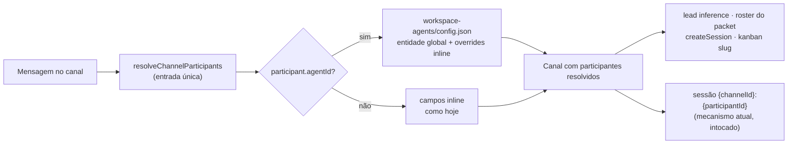
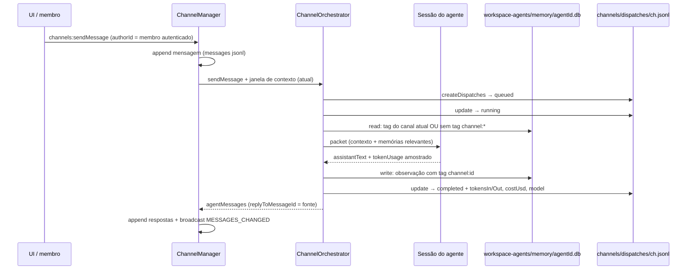
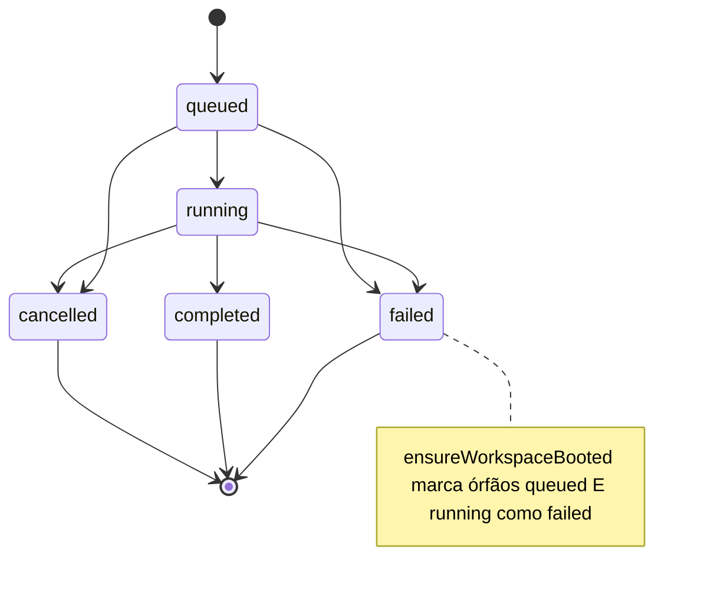

# feat: War Room — agente como membro do workspace

**Target repo:** craft-agents-oss

---

## Summary

Evoluir os canais War Room de "participantes-string dentro de um canal" para o modelo
que faz o Buzz (block/buzz) funcionar como workspace de humanos + agentes: **agente
como entidade do workspace**, com identidade própria, memória própria escopada,
rastro auditável de custo e autoria, threads visíveis, e — como fase final —
membros humanos convidados por token individual sobre o servidor headless já
existente.

Nada aqui troca o substrato: sem relay, sem keypair Nostr, sem federação. Cada fase
constrói sobre mecanismos já presentes no repo (routing de canais, dispatch durável,
sistema de memória, servidor WebSocket multi-cliente).

---

## Revisão de código (2026-08-07)

Este plano foi revisado contra o código e cinco premissas foram corrigidas. As
mudanças estão inline nas seções abaixo; o resumo existe para que um leitor da
versão anterior saiba o que mudou:

1. **Métricas de turno moram no registro de dispatch, não num log novo.** Todo turno
   de agente é 1:1 com um dispatch (`channel-orchestrator.ts:363-372`, fechado em
   `:415`/`:423`), e `WarRoomDispatch` já é keyed por `sourceMessageId`. A versão
   anterior criava `channels/metrics/<id>.jsonl` — exatamente o "quarto arquivo para
   drift" que o próprio KTD5 rejeitava.
2. **`MemorySearchOptions.tags` é campo morto.** Declarado em
   `memory/types.ts:22-29`, descartado por `searchHybrid`
   (`memory-store.ts:190-196`). Escopo por tag exige método novo em `MemoryStore`.
3. **`ObservationPipeline` não aceita tag do chamador** (`observation-pipeline.ts:7-13`).
4. **Autenticação headless não produz identidade.** `validateToken` e
   `validateSessionCookie` retornam `Promise<boolean>`, e a validação roda no envelope
   `handshake`, não no upgrade HTTP (`transport/server.ts:342-343`, `:440-462`).
5. **`costUsd` não precisa de tabela de preço** — todo backend já entrega custo do
   provider (`claude/event-adapter.ts:507`, `pi:275`, `hermes:313`).

Correções menores estão marcadas com `[rev]` no ponto onde importam.

---

## Problem Frame

Hoje um "agente" de canal é um objeto inline em `channels/config.json`
(`WarRoomParticipant`, `packages/shared/src/channels/types.ts:31-40`): id, display
name, conexão LLM e modelo, persistido dentro de cada canal. Consequências:

- O agente não existe fora da sala — sem reuso entre canais, sem página de agentes,
  sem identidade contínua. Duplicar um agente significa redigitar o objeto.
- Nenhuma memória: a doc de manutenção declara "the channel log is the shared
  memory" (`channels-war-room.md:70`), e o sistema de memória do repo
  (`packages/shared/src/memory/`) está desligado (`isMemoryEnabled()` → default
  `false`, `feature-flags.ts:62-66`) e sem escopo: o path é uma constante num único
  callsite, `base-agent.ts:471-474`.
- Nenhuma contabilização: o dispatch já registra participante, `sourceMessageId` e
  status, mas **não** uso nem custo (`channels/types.ts:50-61` não tem campo de
  usage), e `channel-manager.ts:370-376` tem `session.tokenUsage` em mãos e o
  descarta.
- Threads: `replyToMessageId` é gravado nos dois caminhos principais de resposta de
  agente (`channel-manager.ts:157`, `:297`) mas **não** no follow-up do Hermes-Kanban
  (`:479-483`) `[rev]`, e nenhuma UI o renderiza (zero ocorrências sob
  `apps/electron/src/renderer/`).
- Multi-humano: o transporte existe e é genuinamente multi-cliente
  (`transport/server.ts:124`, `maxClients` default 50 em `:159`), mas auth é
  igualdade de string contra um token único (`headless-start.ts:302`) que **não
  devolve identidade**, e `authorId` é default `'human'` escolhido pelo cliente
  (`rpc/channels.ts:44` → `channel-manager.ts:136`) `[rev]`.

Análise de referência do Buzz (specs NIP-AA/AP/AE/AM/AO/CW + três reviews em vídeo)
identificou o que copiar (identidade, memória, auditoria, custo por turno) e o que
explicitamente **não** copiar (handoff por menção — quebrado no teste real; reenvio
de histórico integral — 31k tokens para responder "oi"; agente sem escopo — visto
como falha de segurança).

## Decisões fechadas (grill, 2026-08-05)

| # | Decisão | Escolha |
|---|---|---|
| D1 | Núcleo | Agente como membro (identidade, memória, auditoria) |
| D2 | Onde mora o agente | Entidade global do workspace (`workspace-agents/config.json`) |
| D3 | Contexto por turno | Manter janela atual; instrumentar custo antes de otimizar |
| D4 | Handoff agente→agente | Somente `channel_dispatch` explícito; menção em texto livre não dispara |
| D5 | Escopo do agente | Global com membership explícita por canal |
| D6 | Memória | Uma por agente, tag de canal por item, leitura filtrada (canal atual + core sem tag) |
| D7 | Comunidade | Local/self-hosted: membros + token por pessoa sobre o servidor headless |

## Decisões tomadas na revisão (2026-08-07)

| # | Decisão | Escolha | Alternativa rejeitada |
|---|---|---|---|
| D8 | Onde mora o uso do turno | Campos opcionais no `WarRoomDispatch` existente | Log `channels/metrics/*.jsonl` — quarto arquivo, contradiz KTD5 |
| D9 | Origem do `costUsd` | Número do provider já acumulado em `Session.tokenUsage` | Tabela de preço local — não existe no repo e envelhece silenciosamente |
| D10 | Caminho único de memória em canal | Orchestrator é o único leitor/escritor; `memory_store`/`memory_recall` desligados em sessão de canal | Manter as ferramentas apontando pro db global → dois sistemas de memória divergentes |
| D11 | Nome do módulo | `packages/shared/src/workspace-agents/` | `agents/` — quase-colisão de uma letra com `agent/` (runtime nativo) |
| D12 | Ponto do gate de permissão | `WsRpcServer.onRequest` (choke point único) | Checagem por handler — é o "namespace esquecido" do R-risco 4 |

---

## Requirements

- **R1** — Um agente definido uma única vez pode ser adicionado a N canais e responde
  em todos com a mesma identidade (nome, avatar, prompt, modelo).
- **R2** — Canais existentes com participantes inline continuam funcionando sem
  migração obrigatória.
- **R3** — Agente só age em canais onde é membro (participa da lista `participants`
  do canal); não há acesso implícito a outros canais.
- **R4** — Memória por agente: aprendizado num canal fica disponível nos turnos
  seguintes; aprendizado com tag de canal não vaza para outros canais; itens core
  (sem tag) valem em qualquer canal. Dono vê tudo na UI.
- **R5** — Cada turno de agente em canal registra tokens in/out, custo, agente,
  canal e desfecho — consultável por canal e por agente.
- **R6** — Toda ação disparada em canal é rastreável à origem: mensagem-fonte, quem
  autorou a mensagem, qual participante executou.
- **R7** — Threads: respostas agrupadas sob a mensagem-raiz na UI, com contagem;
  timeline principal não polui com o corpo da thread.
- **R8** — Handoff agente→agente exclusivamente via `channel_dispatch`; resposta de
  agente contendo `@outro` **não** re-roteia (comportamento atual preservado por
  decisão, agora documentado e testado como invariante).
- **R9** — (Fase comunidade) Uma segunda pessoa em outra máquina entra por convite
  com token próprio, envia mensagem e ela aparece com o nome dela; não enxerga
  sessões privadas nem credenciais de sources.
- **R10** — Segredos nunca entram em definição de agente, mensagem de canal ou
  registro de auditoria (regra herdada do contrato existente e do NIP-AP do Buzz).
- **R11** `[rev]` — Toda string de UI nova passa pelo i18n com paridade nos 8 locales
  (`de/en/es/hu/ja/pl/pt-BR/zh-Hans`), registro formal em `de`/`hu` conforme
  `AGENTS.md`.

---

## Key Technical Decisions

- **KTD1 — `agentId` opcional em `WarRoomParticipant`, resolução antes de qualquer
  consumidor.** Participante ganha `agentId?: string`; quando presente,
  displayName/prompt/conexão/modelo/sources resolvem da entidade global. Sem
  `agentId`, o objeto inline continua autoritativo (R2).
  `[rev]` A resolução **não** cabe só no orchestrator: os campos do participante são
  lidos em sete lugares — `channel-orchestrator.ts:106` (inferência de lead), `:151-153`
  (`kanbanAssigneeSlug`), `:171-176` (roster do packet), `:190` ("You are responding
  as"), `:336-343` (`createSession`), `channel-manager.ts:385` (set de profiles Hermes
  pro Kanban) e `crud.ts:70-87` (validação). O plano resolve o **array
  `participants` inteiro na entrada** (`resolveChannelParticipants(channel, agents)`),
  de modo que todo consumidor a jusante vê participantes já resolvidos.
  Alternativa rejeitada: migrar tudo para referências e converter configs — quebra
  canais existentes sem ganho.
- **KTD2 — Storage de agentes espelha o padrão de canais.**
  `workspace-agents/config.json` no workspace root, load/save/list em
  `packages/shared/src/workspace-agents/` copiando a forma de
  `packages/shared/src/channels/{storage,crud}.ts` (leitura do disco sem cache,
  tolerância a arquivo ausente). Sem SQLite aqui: o volume é dezenas, não milhares.
  `[rev]` Nome com `workspace-` por D11.
- **KTD3 — Memória reusa `packages/shared/src/memory/` sem mudança de schema, mas
  exige métodos novos de query.** Escopo por agente = um banco por agente
  (`workspace-agents/memory/<agentId>.db`) — isolamento físico, sem risco de filtro
  esquecido entre agentes; `MemoryStore` é path-paramétrico (`memory-store.ts:52-56`)
  e o driver é factory pura sem singleton (`sqlite-driver.ts:54-88`), então N stores
  concorrentes já são o status quo.
  `[rev]` Correção importante: `MemorySearchOptions.tags` **existe mas não filtra** —
  `searchHybrid` repassa só `{ target, category, limit }` (`memory-store.ts:190-196`)
  e o SQL de `searchFTS` nunca toca `memory_tags` (`:145-152`); o único SELECT na
  tabela de tags é hidratação por id (`:338-341`). Como `db` é `private`, o filtro
  "tag do canal atual OU sem tag `channel:%`" precisa de **um método novo em
  `MemoryStore`** (`schema.ts:26-32` já tem a tabela e `idx_memory_tags_tag`, então
  o SQL é trivial e o schema fica intocado). O `ObservationPipeline` também não
  aceita tag do chamador (`TurnParams`, `observation-pipeline.ts:7-13`): tags saem da
  extração por LLM (`:93`, `:128-130`). Ambas as assinaturas mudam.
  Alternativa rejeitada: banco único global com tag de agente — um `WHERE`
  esquecido vaza memória entre agentes; isolamento por arquivo é mais barato de
  garantir que por query.
- **KTD4 `[rev]` — Uso e custo do turno moram no registro de dispatch que já
  existe.** Todo turno de agente é 1:1 com um dispatch:
  `createDispatches` cria um por target (`channel-orchestrator.ts:363-372`) e
  `dispatchParticipant` fecha em `completed` (`:415`) ou `failed` + `error` (`:423`).
  `WarRoomDispatch` já carrega `channelId`, `participantId`, `sourceMessageId`,
  `sourceSessionId`, `status`, `error`, `createdAt`, `updatedAt`
  (`channels/types.ts:50-61`). O log é append-only com validador que checa apenas as
  chaves obrigatórias (`dispatches.ts:33-44`), então acrescentar campos opcionais
  `agentId?`, `model?`, `tokensIn?`, `tokensOut?`, `costUsd?` é retrocompatível com
  qualquer jsonl já gravado. Agregação é função pura em leitura sobre
  `listChannelDispatches`, que já tem RPC (`channels:listDispatches`).
  Alternativa rejeitada: `channels/metrics/<channelId>.jsonl` + `channels:listTurnMetrics`
  — um quarto log keyed pelos mesmos campos, com o mesmo drift que KTD5 rejeita,
  mais um RPC e um handler para manter.
- **KTD5 — Auditoria é junção, não novo log.** "Quem fez o quê a pedido de quem"
  sai de `channels/messages/*.jsonl` (autor + texto) ⋈ `channels/dispatches/*.jsonl`
  (participante + `sourceMessageId` + status + erro + uso). `[rev]` Com KTD4 isso é
  uma junção **dupla** de dois RPCs que já existem (`channels:listMessages`,
  `channels:listDispatches`), não tripla: a fase de auditoria entrega uma função pura
  de junção mais a UI, sem RPC novo e sem módulo de servidor.
- **KTD6 — Threads client-side.** Volume local é pequeno; agrupar por
  `replyToMessageId` no renderer, sem overlay computado no servidor (o NIP-CW do
  Buzz resolve paginação em relay — problema que não temos; ver Deferred).
- **KTD7 `[rev]` — Membros com token individual exigem que a autenticação devolva
  identidade.** `members/config.json` (id, displayName, role `owner|member`) + token
  por membro no cofre de credenciais existente — nunca no config (R10).
  A premissa da versão anterior estava errada em dois pontos: (a) a auth **não** roda
  no upgrade do WebSocket — o upgrade só captura o cookie
  (`transport/server.ts:342-343`) e a validação acontece no primeiro envelope
  `handshake` (`:440-462`); (b) `validateToken` e `validateSessionCookie` retornam
  `Promise<boolean>` (`headless-start.ts:51`, `transport/server.ts:94`), ou seja, hoje
  autenticar **não produz identidade alguma**. Carimbar `memberId` significa: os dois
  validadores passam a devolver um principal, `ClientConnection` ganha o campo
  (`server.ts:41-58`, populado em `:588-600`) e `RequestContext`
  (`transport/types.ts:7-11`) é alargado — a partir daí o `memberId` chega a todo
  handler de graça. `HandlerDeps` é o lugar errado: é construído uma vez por processo
  (`headless-start.ts:331-335`).
  Boa notícia: o cofre é usável sem Electron. `packages/shared/src/credentials/` é
  AES-256-GCM em `~/.craft-agent/credentials.enc` com chave PBKDF2 de UUID de máquina
  e importa só `node:crypto`/`fs` (`backends/secure-storage.ts:1-24`, `:62-96`); o
  comentário em `:100-110` diz explicitamente que `safeStorage` não é default porque
  `shared` roda no servidor headless. O custo é só ampliar a união fechada
  `CredentialType` + a whitelist runtime `VALID_CREDENTIAL_TYPES`
  (`credentials/types.ts:19-55`).
- **KTD8 — Nenhum auto-routing de menção em resposta de agente (R8/D4).** O loop
  agente→agente do Buzz quebrou no teste real; o mecanismo explícito
  (`channel_dispatch`) já é durável e auditável. Menção de agente em resposta vira
  no máximo highlight visual. Verificado: `resolveChannelMentions`
  (`channels/mentions.ts:38`) tem um único chamador de produção
  (`channel-orchestrator.ts:117`), alcançado só pelo `channels:sendMessage`; texto de
  agente reentra apenas como `recentMessages` plano.
- **KTD9 `[rev]` — O gate de permissão vive no dispatch do transporte.** Hoje existe
  exatamente um gate inbound, o handshake (`server.ts:440-462`); `onRequest` não tem
  authz, `registerCoreRpcHandlers` registra os 22 grupos incondicionalmente
  (`handlers/rpc/index.ts:32-59`) e o `handshake_ack` anuncia os ~55 namespaces ao
  cliente (`server.ts:597`) — incluindo `credentials:*`, `file:read`, `shell:openFile`.
  Uma allowlist em `onRequest` torna o default-deny do R-risco 4 estrutural. Espalhar
  a checagem pelos handlers é precisamente o modo de falha que aquele risco nomeia.

---

## High-Level Technical Design

### Resolução de participante (KTD1)



### Fluxo de um turno com memória, uso e auditoria



### Estados de dispatch (existente — invariante a preservar)



`[rev]` A reconciliação cobre `queued` **e** `running` (`channel-manager.ts:228-238`) e
o gatilho é `ensureWorkspaceBooted`, lazy no primeiro RPC que toca o workspace
(`:191-203`), não o boot do processo.

---

## Scope Boundaries

### In scope
Fases 0–5 abaixo, restritas à superfície de canais + a nova entidade de agentes +
membership de humanos sobre o servidor existente.

### Deferred to Follow-Up Work
- **Reações, edição e deleção de mensagens** — depois de threads; aux-closure do
  Buzz é referência de forma.
- **Paginação por cursor em `listChannelMessages`** — hoje lê o jsonl inteiro a
  cada `list` **e** a cada send (`messages.ts:79-95`, `channel-manager.ts:128`,
  `:266`); tratar como perf fix quando um canal real crescer (composite cursor do
  NIP-CW como referência).
- **`respond_to` / allowlist por agente** — campo previsto no schema desde já,
  checagem só quando houver multiplayer ativo (no próprio Buzz está `reserved`).
- **Auto-routing de menção partindo do lead** — extensão possível do D4; mesma
  máquina, uma condição a mais; só com demanda real.
- **Otimização de contexto por delta/watermark** — só depois que as métricas da
  Fase 3 mostrarem onde o custo está de fato (D3).
- **`[rev]` Per-agent db no `BaseAgent`** — D10 mantém um caminho único desligando
  `memory_store`/`memory_recall` em sessão de canal. Fazer o `BaseAgent` abrir o db
  do agente exige levar a identidade por `createSession` → `SessionManager` → factory
  → `base-agent.ts:471-474`, atravessando três pacotes; só quando a ferramenta
  explícita de memória for pedida em canal.
- **`[rev]` `stopReason` real por turno** — não existe como sinal propagado: é
  consumido dentro dos adapters para derivar `isIntermediate`
  (`claude/event-adapter.ts:334-337`, `pi/event-adapter.ts:366-368`) e não aparece em
  `protocol/dto.ts`. O desfecho do turno vem de `dispatch.status` + `dispatch.error`,
  que já existem. Widening do evento `complete` (`dto.ts:506`) fica para quando
  alguém precisar distinguir causas além de sucesso/erro.

### Outside this product's identity
- Identidade criptográfica por keypair, relay Nostr, federação, E2E entre membros.
- Huddles/voz.
- Compute sharing entre máquinas.

---

## Fases

| Fase | U-IDs | Seções | Entrega | UAT mode | Depends on | Audit state | Audited commit |
|---|---|---|---|---|---|---|---|
| F0 | U1 | baseline | Motor de canais validado ponta a ponta | manual | — | pending | — |
| F1 | U2, U3 | agentes | Entidade global + resolução + UI | manual | F0 | pending | — |
| F2 | U4 | memória | Memória por agente com escopo de canal | manual | F1 | pending | — |
| F3 | U5, U6 | custo/auditoria | Uso no dispatch + painel de atividade | manual | F0 | pending | — |
| F4 | U7 | threads | Threads renderizadas na UI | manual | F0 | pending | — |
| F5 | U8, U9 | comunidade | Membros com token próprio + authorId real | manual | F0 | pending | — |

`[rev]` **F3 desceu de F1 para F0.** Com KTD4 o uso monta no dispatch, cuja chave é
`participantId` — `agentId` é enriquecimento opcional, não pré-requisito. F1, F3, F4
e F5 passam a depender só de F0.

**Conflito textual a coordenar:** F2 (U4) e F3 (U5) editam a mesma função,
`dispatchParticipant` (`channel-orchestrator.ts:386-426`). São independentes em
lógica e conflitantes em diff — se rodarem em paralelo, um dos dois rebaseia.

F5 pode andar em paralelo desde F0, mas recomenda-se por último por ser a de maior
risco de segurança.

---

## Implementation Units

### U1. Validar e blindar o baseline de canais

**Goal:** Observar o motor atual funcionando ponta a ponta, congelar os invariantes
que as fases seguintes assumem e corrigir os três defeitos que bloqueiam F3/F4.

**Requirements:** R2, R7 (pré-requisito), R8.

**Dependencies:** —

**Files:**
- `packages/server-core/src/channels/channel-manager.ts` (fix: `replyToMessageId` no
  caminho Kanban, `:479-483`)
- `packages/server-core/src/channels/channel-orchestrator.ts` (fix: fallback de lead
  obsoleto, `:101-108`)
- `packages/server-core/src/channels/channel-orchestrator.test.ts` (ampliar)
- `packages/server-core/src/handlers/rpc/channels.test.ts` (ampliar)

**Approach:** Smoke manual na UI antes de qualquer mudança (canal com lead +
reviewer, routing `lead`: mensagem sem menção roteia ao lead; lead delega via
`channel_dispatch`; dispatch aparece em `channels/dispatches/<id>.jsonl` com
`completed`; resposta volta ao canal). Depois, três correções mínimas e os
invariantes gravados como teste.

`[rev]` Os três defeitos observados na revisão:
1. **`replyToMessageId` ausente no follow-up Hermes-Kanban** (`:479-483`), enquanto os
   dois caminhos principais o gravam (`:157`, `:297`). Sem isso o agrupamento
   client-side do U7 mostra follow-ups de Kanban como top-level. É um campo.
2. **`leadParticipantId` obsoleto zera a sala.** `resolveLeadParticipant`
   (`:101-108`) faz `find` pelo id explícito e, não achando, devolve `undefined` sem
   cair na inferência Hermes/first — a sala não roteia nada. Isso viola o espírito de
   `channels-war-room.md:53` ("do not require `leadParticipantId` for a usable lead
   room"). Fallback para a inferência.
3. **Modo default é `manual-tags`, que não roteia ninguém** (`:97-99`, `:147`) — não é
   defeito, é o comportamento correto, mas o smoke precisa exercitar os **quatro**
   modos porque a doc exige os quatro cobertos (`channels-war-room.md:288`).

**Execution note:** Característico-primeiro — não alterar comportamento antes de
observá-lo. As três correções entram como commits separados do smoke.

**Test scenarios:**
- Mensagem sem menção em canal `lead` → dispatch criado para o lead; resposta
  anexada com `authorType: 'agent'` e `replyToMessageId` da fonte.
- Mensagem sem menção em canal `manual-tags` (default) → nenhum dispatch, mensagem
  permanece no canal.
- Resposta de agente contendo `@outro-participante` → **nenhum** novo dispatch é
  criado (invariante R8).
- `[rev]` Follow-up Hermes-Kanban → mensagem de agente gravada **com**
  `replyToMessageId` da fonte.
- `[rev]` `leadParticipantId` apontando para participante removido → routing cai na
  inferência (Hermes primeiro, depois o primeiro participante), não em ninguém.
- `[rev]` `ensureWorkspaceBooted` com dispatch `queued` **e** com dispatch `running`
  → ambos marcados `failed` com a mensagem de restart.

**Verification:** Smoke da UI documentado com o jsonl resultante, cobrindo os quatro
modos de routing; testes novos verdes junto aos 22 existentes (13 em
`channel-orchestrator.test.ts` + 9 em `channels.test.ts`).

**must_haves:**
- truths: "uma mensagem sem menção num canal lead produz resposta de agente
  visível no canal"; "menção em resposta de agente não dispara segundo agente";
  "follow-up de Kanban carrega o id da mensagem-fonte".
- artifacts: `channels/dispatches/<test>.jsonl` com registro `completed` real.
- key_links: `grep "replyToMessageId" packages/server-core/src/channels/channel-manager.ts`.

---

### U2. Entidade de agente do workspace

**Goal:** Agente existe fora do canal: storage, tipos e resolução.

**Requirements:** R1, R2, R3, R10.

**Dependencies:** U1.

**Files:**
- `packages/shared/src/workspace-agents/types.ts` (novo)
- `packages/shared/src/workspace-agents/storage.ts` (novo)
- `packages/shared/src/workspace-agents/crud.ts` (novo)
- `packages/shared/src/workspace-agents/resolve.ts` (novo — `resolveChannelParticipants`)
- `packages/shared/src/workspace-agents/index.ts` (novo)
- `packages/shared/src/workspace-agents/__tests__/storage.test.ts` (novo)
- `packages/shared/src/workspace-agents/__tests__/resolve.test.ts` (novo)
- `packages/shared/src/channels/types.ts` (campo `agentId` em `WarRoomParticipant`)
- `packages/shared/src/channels/crud.ts` `[rev]` (validação: aceitar
  `{ id, agentId }`)
- `packages/shared/package.json` `[rev]` (chaves `exports`)
- `packages/server-core/src/channels/channel-orchestrator.ts` (consumir participantes
  resolvidos)
- `packages/server-core/src/channels/channel-manager.ts` (idem, `:385`)
- `packages/server-core/src/channels/channel-orchestrator.test.ts`

**Approach:** `WorkspaceAgent { id, displayName, systemPrompt?, avatarColor?,
llmConnection, model?, hermesProfile?, defaultSourceSlugs?, permissionMode?,
workingDirectory?, createdAt }`. Storage espelha `channels/storage.ts` (KTD2).
Resolução única `resolveChannelParticipants(channel, agents)` (KTD1) roda na entrada
e devolve um canal cujos participantes já estão resolvidos: `agentId` presente →
global ⭠ overrides inline; ausente → inline puro. **Validação: `agentId`
referenciando agente inexistente falha o send com erro nomeando o id, não
silenciosamente.** Campos de segredo não existem no tipo (R10).

`[rev]` Dois obstáculos concretos que a versão anterior não previa:

1. **`normalizeParticipants` rejeita `{ id, agentId }`.** `crud.ts:70-77` faz
   `participant.displayName.trim()` e `participant.llmConnection.trim()` e lança se
   qualquer um vier vazio. Um participante que é só referência não persiste hoje. A
   validação passa a aceitar a forma referência: com `agentId`, `displayName` e
   `llmConnection` são opcionais e vêm da entidade; sem `agentId`, a exigência atual
   continua idêntica (R2).
2. **`packages/shared/package.json:14-86` é um mapa de subpaths explícito.** Sem as
   chaves `"./workspace-agents"` e `"./workspace-agents/types"`, o renderer não
   importa o módulo — e `AGENTS.md` trata imports do renderer para `shared` como
   fronteira pública de pacote.

**Patterns to follow:** `packages/shared/src/channels/storage.ts` (load tolerante,
save atômico), `packages/shared/src/channels/crud.ts` (validação de id).
`[rev]` Nome `workspace-agents` (D11): `./agent` singular já é a árvore do runtime
nativo, e a convenção do repo para coleções de entidade é plural inequívoco
(`./channels`, `./skills`, `./labels`, `./projects`).

**Test scenarios:**
- Criar agente, referenciar em dois canais, resolver → mesmos displayName/modelo
  nos dois.
- Participante inline sem `agentId` → resolução idêntica ao comportamento atual
  (snapshot dos campos).
- `[rev]` `updateChannel` com participante `{ id, agentId }` → persiste sem erro de
  validação.
- `[rev]` `updateChannel` com participante sem `agentId` e sem `displayName` → ainda
  lança, com a mensagem atual.
- `agentId` órfão → erro nomeando o id, mensagem não é enviada ao LLM.
- Override inline (ex.: modelo diferente num canal) vence o campo global.
- `workspace-agents/config.json` ausente ou corrompido → lista vazia, canais inline
  seguem funcionando.
- `[rev]` Participante resolvido a partir de agente com `llmConnection: 'hermes'` e
  `hermesProfile` → `hermesProfilesForChannel` (`channel-manager.ts:385`) e
  `kanbanAssigneeSlug` (`orchestrator.ts:151-153`) enxergam o profile, não o id.

**Verification:** Testes acima verdes; typecheck de `server-core` e `electron`;
teste de exports do pacote se houver import do renderer nesta unit.

**must_haves:**
- truths: "o mesmo agente responde em dois canais com a mesma identidade";
  "canal antigo sem agentId continua respondendo"; "participante-referência
  persiste pelo CRUD existente".
- artifacts: `packages/shared/src/workspace-agents/storage.ts` (load/save/list);
  chaves novas em `packages/shared/package.json`.
- key_links: `grep "agentId" packages/shared/src/channels/types.ts`;
  `grep -r "resolveChannelParticipants" packages/server-core/src/channels/`.

---

### U3. RPC e UI de agentes

**Goal:** CRUD de agentes pela interface; editor de participante do canal passa a
oferecer agentes globais.

**Requirements:** R1, R3, R11.

**Dependencies:** U2.

**Files:**
- `packages/shared/src/protocol/channels.ts` (namespace `workspaceAgents:` —
  LIST/CREATE/UPDATE/DELETE/CHANGED)
- `apps/electron/src/shared/types.ts` `[rev]` (`RPC_CONTRACT` — é daí que
  `CHANNEL_MAP` é derivado)
- `packages/server-core/src/handlers/rpc/workspace-agents.ts` (novo)
- `packages/server-core/src/handlers/rpc/workspace-agents.test.ts` (novo)
- `packages/server-core/src/handlers/rpc/index.ts` (registro)
- `apps/electron/src/renderer/components/app-shell/WorkspaceAgentsListPanel.tsx` (novo)
- `apps/electron/src/renderer/components/app-shell/AppShell.tsx` (mount no slot do
  navigator)
- `apps/electron/src/renderer/components/app-shell/ChannelConversationPanel.tsx`
  (editor de participante: dropdown de agentes globais + caminho inline preservado)
- `packages/shared/src/i18n/locales/*.json` `[rev]` (8 locales)

**Approach:** Espelhar o padrão RPC de canais. No editor de participante existente —
que já tem cinco campos de draft e um `<form onSubmit={saveParticipant}>`
(`ChannelConversationPanel.tsx:64-71`, `:246`, `:172-211`) — "Adicionar agente"
oferece: escolher agente do workspace (gera participante `{ id, agentId }`) ou criar
inline (fluxo atual, atrás de "avançado"). Painel de agentes lista cartões com
nome/modelo/canais onde é membro (varredura dos canais — R3 visível).

`[rev]` Três precisões:
- **`protocol/channels.ts` é a tabela de nomes RPC de todo o app** (561 linhas, ~55
  namespaces), não um arquivo do War Room. Convenção: chave `CONSTANT_CASE`, valor
  `lowerCamel` com prefixo de domínio (`LIST_MESSAGES: 'channels:listMessages'`).
- **`channel-map.ts` deriva de `RPC_CONTRACT`** em `apps/electron/src/shared/types.ts`,
  não de `RPC_NAMESPACES` (`channel-map.ts:10-14`). A paridade IPC se ganha ali; o
  `channel-map.ts` em si não muda.
- **Padrão de painel de lista:** `SkillsListPanel.tsx` e `ProjectsListPanel.tsx` são os
  precedentes — props-in/callbacks-out, `useTranslation()`, `EntityListEmpty` para
  vazio, `*Menu.tsx` irmão para ações de linha.

**Nota de i18n `[rev]`:** `ChannelConversationPanel.tsx` hoje é português hardcoded
sem `useTranslation()` (`:12-16`, `:290`, `:353`), divergindo dos irmãos
(`SkillsListPanel.tsx:33`). O painel novo nasce com i18n; as strings que esta unit
**toca** no painel de canal são migradas para chaves. Não é refactor do arquivo
inteiro — é não adicionar dívida nova.

**Patterns to follow:** `packages/server-core/src/handlers/rpc/channels.ts`;
`SkillsListPanel.tsx`; estados de draft do editor inline atual.

**Test scenarios:**
- `workspaceAgents:create` persiste e `workspaceAgents:list` devolve; broadcast
  `workspaceAgents:changed`.
- Delete de agente referenciado por canal → bloqueado com a lista dos canais.
  `[rev]` Decidido: **bloquear** e nomear os canais. Confirmação silenciosa deixa
  participantes órfãos que só falham no próximo send, e U2 já trata `agentId` órfão
  como erro — bloquear mantém as duas pontas coerentes.
- Editor: selecionar agente global adiciona participante com `agentId` e sem
  campos duplicados inline (integra com o fix de `crud.ts` do U2).
- `[rev]` `bun run lint:i18n:parity` verde.

**Verification:** Fluxo completo na UI real: criar agente, adicionar a dois
canais, conversar nos dois; screenshot no PR.

**must_haves:**
- truths: "usuário cria agente na UI e o adiciona a um canal sem editar JSON";
  "deletar agente em uso é recusado com os canais nomeados".
- artifacts: `WorkspaceAgentsListPanel.tsx`; handlers `workspaceAgents:*`.
- key_links: `grep "workspaceAgents:" packages/shared/src/protocol/channels.ts`.

---

### U4. Memória por agente com escopo de canal

**Goal:** Agente lembra entre turnos e canais; aprendizado marcado por canal não
vaza; dono enxerga tudo.

**Requirements:** R4.

**Dependencies:** U2.

**Files:**
- `packages/shared/src/memory/memory-store.ts` `[rev]` (método novo de busca com
  filtro de tag; schema intocado)
- `packages/shared/src/memory/__tests__/memory-store.test.ts` (cobrir o método novo)
- `packages/shared/src/memory/observation-pipeline.ts` `[rev]` (aceitar tags do
  chamador)
- `packages/shared/src/memory/__tests__/observation-pipeline.test.ts`
- `packages/shared/src/workspace-agents/memory-paths.ts` (novo — resolve
  `workspace-agents/memory/<agentId>.db` no workspace)
- `packages/server-core/src/channels/channel-orchestrator.ts` (leitura pré-packet,
  observação pós-turno, dentro de `dispatchParticipant`)
- `packages/server-core/src/channels/channel-memory.test.ts` (novo)
- `apps/electron/src/renderer/components/app-shell/WorkspaceAgentsListPanel.tsx`
  (aba Memórias)
- `packages/shared/src/i18n/locales/*.json`

**Approach:** Um `MemoryStore` por agente, aberto sob demanda e cacheado por
`agentId` (KTD3). Participante inline sem `agentId` não tem memória (memória é
atributo da entidade, não do participante). Gate `CRAFT_FEATURE_MEMORY` respeitado:
canal ativa memória apenas quando a flag está ligada e o participante resolve para
um agente global.

`[rev]` O que a versão anterior tratava como "reuso" e é trabalho real:

- **Filtro de tag não existe.** `searchHybrid` descarta `options.tags`
  (`memory-store.ts:190-196`) e o SQL de `searchFTS` (`:145-152`) só filtra
  `target`/`category`. Como `db` é `private`, esta unit adiciona **um** método —
  `searchScoped({ query, tags, excludeTagPrefix, ... })` — que resolve
  "tag do canal atual OU sem tag `channel:%`" numa query, usando
  `idx_memory_tags_tag` (`schema.ts:26-32`). O filtro morar num único método é o que
  torna o R-risco 2 verificável.
- **Escrita não aceita tag do chamador.** `TurnParams`
  (`observation-pipeline.ts:7-13`) não tem `tags`; elas vêm da extração por LLM
  (`:93`, `:128-130`) e seguem para `store.upsert` (`:60-66`). O pipeline ganha
  `extraTags?: string[]`, unidos aos extraídos antes do upsert — que já aceita `tags`
  (`memory-store.ts:69-77`).
- **`maxCompactTokens` não configura nada.** Declarado (`memory/types.ts:55`, `:67`)
  e sem consumidor: `MemoryContextBuilder` não recebe config
  (`memory-context-builder.ts:25-27`) e hardcoda
  `Math.min(availableTokens * 0.05, 1000)` (`:33`). O orçamento desta unit é o do
  builder; não há config a "respeitar".
- **Caminho único (D10).** Memória hoje é atributo do `BaseAgent`: gate em
  `base-agent.ts:467`, path constante em `:471-474`, ferramentas injetadas via
  `session-scoped-tools.ts:254`. Se o orchestrator lesse/escrevesse um db por agente
  enquanto `memory_store`/`memory_recall` continuassem apontando para
  `~/.craft-agent/memory.db`, existiriam dois sistemas divergentes. Esta unit desliga
  as duas ferramentas para sessões ligadas a canal (`includeMemory: false`), deixando
  o orchestrator como único leitor/escritor. Re-apontar o `BaseAgent` fica no
  Deferred, nomeado.
- **Core sem tag.** A promoção usa a categoria `profile` como sinal — escolha
  sustentada pelo código: `profile` já tem `RETENTION_DAYS: Infinity` e
  `pruneExpired` a pula (`memory/types.ts:89-95`, `memory-store.ts:271-273`), e a
  meia-vida mais longa (`types.ts:81-87`). O eixo ortogonal `MemoryTarget`
  (`'agent' | 'user'`, `types.ts:3`) fica disponível se `profile` se mostrar grosseiro.

**Execution note:** Test-first no isolamento — o teste de vazamento entre canais e o
teste do `searchScoped` escrevem-se antes da integração.

**Test scenarios:**
- `[rev]` `searchScoped` com `excludeTagPrefix: 'channel:'` → devolve itens sem tag
  de canal e omite os de outro canal, numa única query.
- "Lembre que prefiro X" no canal A → turno seguinte no canal A reflete X.
- Item com tag `channel:A` → busca no canal B não o retorna.
- Item core (sem tag de canal) → aparece em A e B.
- Dois agentes no mesmo canal → memória de um nunca aparece no packet do outro
  (isolamento físico por arquivo).
- `[rev]` `extraTags` no pipeline → item gravado carrega a tag do canal **e** as tags
  extraídas pelo LLM.
- `[rev]` Sessão ligada a canal → `getSessionToolDefs` não expõe `memory_store` nem
  `memory_recall` (caminho único, D10).
- Flag `CRAFT_FEATURE_MEMORY` desligada → canal funciona exatamente como hoje.
- Banco corrompido/ausente → turno prossegue sem memória, com log de aviso
  (nunca derruba o send).

**Verification:** Cenários acima como testes + demonstração na UI (aba Memórias
mostrando o item gravado com sua tag de canal). Rodar também
`bun test packages/shared/src/memory/__tests__/` — esta unit muda dois módulos
compartilhados.

**must_haves:**
- truths: "agente aplica no turno N+1 o que aprendeu no turno N"; "aprendizado de
  canal privado não aparece noutro canal"; "dono lê as memórias do agente na UI".
- artifacts: `workspace-agents/memory/<agentId>.db` criado no workspace de teste;
  `channel-memory.test.ts`; `searchScoped` em `memory-store.ts`.
- key_links: `grep "excludeTagPrefix" packages/shared/src/memory/memory-store.ts`;
  `grep "channel:" packages/server-core/src/channels/channel-orchestrator.ts`.

---

### U5. Uso e custo por turno no registro de dispatch

**Goal:** Cada turno registra tokens e custo no dispatch que já o representa;
agregação por canal e por agente é leitura.

**Requirements:** R5.

**Dependencies:** U1. `[rev]` Não depende de U2: a chave é `participantId`, que já
existe; `agentId` entra como campo opcional quando F1 estiver pronto.

**Files:**
- `packages/shared/src/channels/types.ts` (campos opcionais em `WarRoomDispatch`)
- `packages/shared/src/channels/dispatches.ts` (`UpdateChannelDispatchInput` aceita
  os campos novos)
- `packages/shared/src/channels/__tests__/dispatches.test.ts`
- `packages/shared/src/channels/turn-usage.ts` (novo — agregação pura por canal /
  agente / dia)
- `packages/shared/src/channels/__tests__/turn-usage.test.ts` (novo)
- `packages/server-core/src/channels/channel-orchestrator.ts` (contrato
  `ChannelAgentRuntime.sendMessage` + gravação em `:415`/`:423`)
- `packages/server-core/src/channels/channel-manager.ts` `[rev]` (amostrar
  `tokenUsage` no bridge do runtime)

**Approach `[rev]` (KTD4/D8/D9):** `WarRoomDispatch` ganha `agentId?`, `model?`,
`tokensIn?`, `tokensOut?`, `costUsd?`. `UpdateChannelDispatchInput` — hoje só
`{ status?, error? }` (`dispatches.ts:17-20`) — passa a aceitá-los, e
`dispatchParticipant` os grava junto do `completed` (`orchestrator.ts:415`) e do
`failed` (`:423`). O jsonl é append-only e `isWarRoomDispatch` valida apenas as
chaves obrigatórias (`dispatches.ts:33-44`), então logs antigos seguem legíveis.
Nenhum RPC novo: `channels:listDispatches` já existe; a agregação é função pura sobre
o resultado dele.

Três detalhes que decidem se os números são honestos:

1. **A fonte já está no bridge.** `channel-manager.ts:370-376` pega
   `sessionManager.getSession()` antes e depois do send e descarta `tokenUsage`. O
   contrato `ChannelAgentRuntime.sendMessage` (`orchestrator.ts:19`) devolve só
   `{ assistantText }`; alarga para `{ assistantText?, usage? }`.
2. **`tokensIn` é armadilha.** `SessionManager.ts:8461-8463` documenta que
   `inputTokens` **não** acumula — é o tamanho de contexto corrente; só
   `outputTokens` e `costUsd` acumulam (`:8465-8467`). Portanto: `tokensOut` e
   `costUsd` por diferença `after − before`; `tokensIn` por **amostragem** de
   `after.tokenUsage.inputTokens`. Diferença em `tokensIn` produz números negativos
   ou absurdos.
3. **`costUsd` vem do provider, não de tabela.** Não existe tabela de preço no repo,
   e não precisa: todo backend já entrega custo calculado —
   `claude/event-adapter.ts:507` (`total_cost_usd`), `pi/event-adapter.ts:275`,
   `hermes/event-adapter.ts:313` — acumulado em `Session.tokenUsage.costUsd`. Quando o
   provider não informa, o campo fica ausente: **nunca inventar valor**. (A única
   fonte de rate por token no repo é uma query runtime ao `pi-ai`, só para providers
   Pi, `llm-connections.ts:404-412`; não serve como tabela.)

Desfecho do turno vem de `dispatch.status` + `dispatch.error`, que já existem —
`stopReason` não é um sinal disponível (ver Deferred).

**Patterns to follow:** `packages/shared/src/channels/dispatches.ts` (append-only +
reconstrução por `latestById`), `messages.ts` (tolerância a linha corrompida).

**Test scenarios:**
- Turno concluído → o último registro do dispatch tem `status: 'completed'` mais
  `tokensIn`/`tokensOut`/`costUsd`.
- Turno falho → registro `failed` com `error` **e** com o uso consumido até a falha
  (não silêncio).
- `[rev]` jsonl gravado antes desta unit (sem os campos novos) → `listChannelDispatches`
  devolve os registros normalmente, campos ausentes.
- Linha corrompida no meio do arquivo → list ignora a linha, não o arquivo.
- Agregação por canal soma dois participantes; agregação por agente soma dois canais.
- `[rev]` Provider sem custo → `costUsd` ausente, tokens presentes.
- `[rev]` Dois turnos na mesma sessão → `tokensOut` do segundo é a diferença, não o
  acumulado; `tokensIn` é o contexto do segundo, não a soma.

**Verification:** Após uma conversa real de 3+ turnos, `channels:listDispatches`
devolve uso consistente com o observado, e a agregação bate com a soma manual das
linhas.

**must_haves:**
- truths: "usuário responde 'quanto este canal custou' a partir de
  `channels:listDispatches`, sem log novo"; "turno que falhou aparece com o uso que
  consumiu".
- artifacts: `channels/dispatches/<id>.jsonl` real com campos de uso; `turn-usage.ts`.
- key_links: `grep "tokensOut" packages/shared/src/channels/types.ts`;
  `grep "usage" packages/server-core/src/channels/channel-orchestrator.ts`.

---

### U6. Atividade do canal: quem pediu, quem executou, quanto custou

**Goal:** "Quem fez o quê, a pedido de quem" como junção e painel — sem log novo e
sem RPC novo.

**Requirements:** R6, R11.

**Dependencies:** U5.

**Files:**
- `packages/shared/src/channels/activity.ts` (novo — junção pura
  mensagens ⋈ dispatches)
- `packages/shared/src/channels/__tests__/activity.test.ts` (novo)
- `packages/shared/package.json` (chave `exports`)
- `apps/electron/src/renderer/components/app-shell/ChannelActivityTab.tsx` (novo)
- `apps/electron/src/renderer/components/app-shell/ChannelConversationPanel.tsx`
  (aba "Atividade")
- `packages/shared/src/i18n/locales/*.json`

**Approach `[rev]` (KTD5):** Junção **dupla** em leitura: mensagem-fonte (autor
humano/agente) ⋈ dispatches por `sourceMessageId`, onde o dispatch já traz
participante, status, erro e — depois do U5 — uso e custo. Os dois lados já têm RPC
(`channels:listMessages`, `channels:listDispatches`), então **nenhum handler novo e
nenhum módulo de servidor**: a junção é função pura em `shared`, testável com
`bun:test`, consumida pelo renderer. A versão anterior propunha
`packages/server-core/src/channels/audit-view.ts` + `channels:audit` para juntar três
fontes; com o uso no dispatch, ambos deixam de existir.

Saída ordenada por tempo, filtrável por participante. UI: aba "Atividade" no canal
mostrando cada dispatch com "pedido por", "executado por", status e custo —
tornando visível o que hoje só existe em jsonl.

**Test scenarios:**
- Mensagem do dono → dispatch → resposta: a entrada de atividade liga os dois
  lados pelo `sourceMessageId`.
- Dispatch `failed` aparece com erro — nunca omitido (contrato UI existente:
  "do not hide unknown mentions or failed agent dispatches silently",
  `channels-war-room.md:246`).
- Mensagem sem dispatch (modo `manual-tags` sem menção) → aparece como mensagem,
  sem entrada de execução.
- `[rev]` Dispatch cujo `sourceMessageId` não está no log de mensagens (log
  truncado) → entrada aparece com origem desconhecida, sem crash e sem sumir.
- `[rev]` Dispatch sem campos de uso (gravado antes do U5) → linha renderiza com
  status, sem custo.
- `[rev]` `bun run lint:i18n:parity` verde.

**Verification:** Painel na UI real exibindo uma cadeia completa
pedido→execução→custo de uma conversa de verdade.

**must_haves:**
- truths: "para qualquer resposta de agente, a UI mostra quem pediu e quanto custou";
  "dispatch que falhou aparece com o erro".
- artifacts: `activity.ts`; aba Atividade.
- key_links: `grep -r "buildChannelActivity" apps/electron/src/renderer/components/app-shell/`.

---

### U7. Threads na UI

**Goal:** Respostas agrupadas sob a mensagem-raiz; timeline limpa; base para
adversarial review legível.

**Requirements:** R7, R11.

**Dependencies:** U1 — `[rev]` inclusive o fix de `replyToMessageId` no caminho
Hermes-Kanban (`channel-manager.ts:479-483`), sem o qual follow-ups de Kanban
aparecem como top-level.

**Files:**
- `apps/electron/src/renderer/components/app-shell/channel-thread-grouping.ts`
  (novo — função pura de agrupamento)
- `apps/electron/src/renderer/components/app-shell/__tests__/channel-thread-grouping.test.ts`
  (novo)
- `apps/electron/src/renderer/components/app-shell/ChannelThread.tsx` (novo)
- `apps/electron/src/renderer/components/app-shell/ChannelConversationPanel.tsx`
- `packages/shared/src/i18n/locales/*.json`

**Approach:** Agrupamento client-side por `replyToMessageId` (KTD6): mensagem com
`replyToMessageId` renderiza dentro do colapso da raiz; raiz mostra contagem de
respostas e último timestamp (equivalente mínimo do resumo `kind:39005` do Buzz,
computado no cliente). Composer ganha "responder em thread" (define
`replyToMessageId` no send — o campo já trafega no RPC). Mensagens antigas sem o
campo continuam top-level.

**Nota de harness `[rev]` — a incógnita da versão anterior está resolvida:** o repo
**não tem** RTL, happy-dom nem jsdom em nenhum pacote; os únicos dois testes `.tsx`
do renderer usam `bun:test` + `renderToStaticMarkup`
(`components/ui/__tests__/data-table-row-id.test.tsx:1-21`), e `packages/ui` documenta
a ausência em comentário (`__tests__/accept-plan-chevron-group.test.ts:10`). Logo,
teste de interação não é escrevível. A decisão é a convenção dominante do repo
(`session-batch-actions.test.ts`, `model-picker-helpers.test.ts`): **extrair o
agrupamento para um módulo `.ts` puro e testá-lo com `bun:test`**; o resto por UAT
manual. Isso também tira `ChannelConversationPanel.tsx` do estado atual de zero
helpers extraídos e zero testes (`slugifyParticipantId` `:24-31` e `getActiveMention`
`:41-51` são privados do arquivo e não testados).

**Test scenarios:** (unit, sobre a função pura)
- Agrupamento: 1 raiz + 3 respostas → timeline mostra 1 item com contador 3.
- Resposta de resposta (aninhamento) → achatada na thread da raiz (sem árvore
  profunda na v1).
- Canal legado sem `replyToMessageId` → todas as mensagens top-level, ordem
  preservada.
- `[rev]` `replyToMessageId` apontando para mensagem ausente do log → item fica
  top-level, não desaparece.
- `[rev]` Contagem e último timestamp da raiz derivam das respostas, não do
  timestamp da raiz.

**Verification:** UAT: pedir a dois agentes que debatam num thread
(adversarial review) e verificar que o debate fica agrupado e o timeline legível.

**must_haves:**
- truths: "debate de dois agentes fica agrupado sob uma raiz e não polui o
  timeline"; "mensagem órfã nunca desaparece da timeline".
- artifacts: `channel-thread-grouping.ts` + seu teste unitário.
- key_links: `grep "replyToMessageId" apps/electron/src/renderer/components/app-shell/`.

---

### U8. Membros do workspace e identidade na autenticação (servidor)

**Goal:** Pessoas distintas com token próprio; `authorId` real nas mensagens;
permissão mínima viável default-deny.

**Requirements:** R9, R10.

**Dependencies:** U1.

**Files:**
- `packages/shared/src/members/types.ts` (novo)
- `packages/shared/src/members/storage.ts` (novo)
- `packages/shared/src/members/__tests__/storage.test.ts` (novo)
- `packages/shared/package.json` `[rev]` (chaves `exports`)
- `packages/shared/src/credentials/types.ts` `[rev]` (variante nova em
  `CredentialType` + `VALID_CREDENTIAL_TYPES`)
- `packages/server-core/src/transport/types.ts` `[rev]` (`RequestContext` ganha
  `memberId`/`role`)
- `packages/server-core/src/transport/server.ts` `[rev]` (validadores devolvem
  principal; `ClientConnection` carrega; gate default-deny em `onRequest`)
- `packages/server-core/src/transport/__tests__/authz.test.ts` (novo)
- `packages/server-core/src/bootstrap/headless-start.ts` (resolução token→membro;
  exportar `validateTokenEntropy`)
- `packages/server-core/src/handlers/rpc/channels.ts` (`authorId` forçado ao membro
  autenticado)
- `packages/server/src/index.ts` (wiring do validador de cookie)

**Approach:** `members/config.json` { id, displayName, role: 'owner'|'member',
createdAt } (KTD7). Tokens por membro gerados com `generateServerToken()`
(`headless-start.ts:113-117`, 192 bits) e guardados no cofre — nunca no config.
Retrocompatibilidade: sem `members/config.json`, o token único atual segue valendo
como owner implícito (deploy existente não quebra).

`[rev]` O trabalho real, que a versão anterior descrevia como "adicionar resolução no
mesmo ponto":

1. **A auth não roda no upgrade.** O upgrade só captura o cookie
   (`server.ts:342-343`); a validação acontece no primeiro envelope `handshake`
   (`:440-462`), com timeout de 5s (`:400-404`). É ali que o principal se resolve.
2. **Autenticar hoje não devolve identidade.** `validateToken`
   (`headless-start.ts:302`) e `validateSessionCookie` (`:51`,
   `transport/server.ts:94`) retornam `Promise<boolean>`. Ambos passam a devolver
   `Principal | null` (`{ memberId, role }`); o caminho sem members config devolve
   `{ memberId: 'owner', role: 'owner' }`. Note que o caminho de cookie também
   colapsa no mesmo segredo hoje, com `sub` fixo `'webui'` (`webui/auth.ts:48`).
3. **O principal precisa sobreviver ao handshake.** `ClientConnection`
   (`server.ts:41-58`) ganha o campo, populado no registro da conexão (`:588-600`,
   hoje só `workspaceId`/`webContentsId`/`capabilities`), e `RequestContext`
   (`transport/types.ts:7-11`) é alargado — a partir daí `memberId` chega a todo
   handler sem plumbing por namespace. **`HandlerDeps` é o lugar errado**: é
   construído uma vez por processo (`headless-start.ts:331-335`) e não tem dimensão
   de conexão.
4. **O gate vive em `onRequest` (KTD9/D12).** Allowlist de namespaces liberados a
   `member`; todo o resto exige `owner`. Hoje `onRequest` não tem authz nenhuma e o
   `handshake_ack` anuncia os ~55 namespaces (`server.ts:597`), incluindo
   `credentials:*`, `file:read` e `shell:openFile`.
5. **`validateTokenEntropy` não é exportado** (`headless-start.ts:87-108`; o próprio
   `__tests__/token-entropy.test.ts:5-9` afirma isso). Reusar "a mesma validação de
   entropia" exige exportá-lo.
6. **`CredentialType` é união fechada** + whitelist runtime
   (`credentials/types.ts:19-55`), validada por `isValidCredentialType`. Token de
   membro é variante nova nos dois lugares. O backend em si já é headless-safe
   (KTD7).
7. **`authorId` é escolhido pelo cliente hoje** (`rpc/channels.ts:44` →
   `channel-manager.ts:136`, `:144`), sem validação. O servidor passa a sobrescrever.
   (`authorType` já é fixo `'user'` nesse caminho, `:135`.)

**Execution note:** Test-first no gate de permissão. A allowlist é enumerada em
teste, com o teste falhando se um namespace novo aparecer sem classificação — assim
o gate não depende da memória do revisor.

**Test scenarios:**
- Token de membro válido → handshake aceito, `RequestContext.memberId` = id do
  membro, `authorId` das mensagens = memberId **mesmo que o cliente envie outro
  `authorId` no payload**.
- Token inválido/revogado → handshake rejeitado com `AUTH_FAILED` e close 4005.
- `member` chamando `credentials:*`, `sources:*`, `file:read` ou `shell:openFile` →
  negado; `owner` → permitido.
- `[rev]` Namespace registrado que não está nem na allowlist de `member` nem
  marcado como owner-only → o teste de enumeração falha (default-deny explícito).
- Workspace sem members config → comportamento atual intacto (token único,
  principal owner implícito).
- Dois membros conectados simultaneamente → mensagens de cada um com seu authorId.
- `[rev]` Cookie de WebUI → principal owner (paridade com o comportamento atual).

**Verification:** Duas conexões reais (duas instâncias/máquinas) contra o servidor
headless, cada uma com seu token, conversando no mesmo canal. Rodar também as suítes
de transporte e bootstrap — esta unit muda o caminho de auth de todo o app.

**must_haves:**
- truths: "segunda pessoa entra com token próprio e a mensagem dela sai com o nome
  dela"; "member não lê credenciais de sources"; "namespace novo sem classificação
  quebra o build de testes".
- artifacts: `members/storage.ts`; principal em `ClientConnection`; gate em
  `onRequest`; `authz.test.ts`.
- key_links: `grep "memberId" packages/server-core/src/transport/types.ts`;
  `grep "Principal" packages/server-core/src/transport/server.ts`.

---

### U9. Convite e identidade visual de membros (UI)

**Goal:** Fluxo de convite sem edição manual de config; mensagens com nome/avatar
do autor.

**Requirements:** R9, R11.

**Dependencies:** U8.

**Files:**
- `packages/shared/src/protocol/channels.ts` (`members:*` RPCs)
- `apps/electron/src/shared/types.ts` (`RPC_CONTRACT`)
- `packages/server-core/src/handlers/rpc/members.ts` (novo)
- `packages/server-core/src/handlers/rpc/members.test.ts` (novo)
- `apps/electron/src/shared/settings-registry.ts` `[rev]` (entrada em
  `SETTINGS_PAGES`)
- `apps/electron/src/renderer/pages/settings/MembersSettingsPage.tsx` (novo)
- `apps/electron/src/renderer/pages/settings/settings-pages.ts` `[rev]`
  (`SETTINGS_PAGE_COMPONENTS`)
- `apps/electron/src/renderer/components/icons/SettingsIcons.tsx` `[rev]` (ícone)
- `apps/electron/src/renderer/components/app-shell/channel-author-label.ts` (novo —
  resolução pura `authorId` → label)
- `apps/electron/src/renderer/components/app-shell/__tests__/channel-author-label.test.ts`
  (novo)
- `apps/electron/src/renderer/components/app-shell/ChannelConversationPanel.tsx`
  (usar o resolvedor no lugar de `formatAuthor`)
- `packages/shared/src/i18n/locales/*.json`

**Approach:** Convite = criar membro + gerar token + apresentar `wss://host:porta` +
token para envio manual (transportar o convite está fora do escopo). Revogação
invalida o token imediatamente e derruba conexões ativas do membro. Mensagens no
canal resolvem `authorId` → displayName via members + agentes; ids desconhecidos
renderizam cru (histórico antigo).

`[rev]` Duas incógnitas resolvidas:

1. **O caminho de settings está documentado no próprio repo** — 4 passos: entrada em
   `SETTINGS_PAGES` (`apps/electron/src/shared/settings-registry.ts:37-51`, ordem do
   array = ordem do navigator, e `SettingsSubpage` é derivado dela em `:57`); página
   em `apps/electron/src/renderer/pages/settings/`; registro em
   `SETTINGS_PAGE_COMPONENTS` (`settings-pages.ts:36-49` — é um `Record` sobre a união
   derivada, então esquecer o passo 3 é **erro de compilação**, `:33-34`); ícone em
   `SettingsIcons.tsx`. Análogo mais próximo para copiar: `LabelsSettingsPage.tsx`
   (CRUD de entidade com escopo de workspace). `labelKey`/`descriptionKey` são chaves
   i18n resolvidas no render — `settings-registry.ts:33-34` proíbe chamar `i18n.t()`
   naquele módulo. Sai do Deferred.
2. **`formatAuthor` hoje não resolve nome nenhum** — `ChannelConversationPanel.tsx:12-16`
   devolve `@${authorId}` para agente e `authorId` cru para humano, mesmo com
   `participants[].displayName` disponível e já usado no mesmo arquivo para sugestão
   de menção (`:225-227`, `:428`). O resolvedor sai para módulo `.ts` puro para ser
   testável (sem harness de DOM, ver U7).

**Test scenarios:**
- Fluxo de convite gera token que funciona num segundo cliente (integração com U8).
- Revogar membro → próxima tentativa de conexão falha; conexão ativa cai.
- Mensagem histórica com `authorId: 'human'` → renderiza sem crash, rotulada
  como legado/dono.
- `[rev]` `authorId` de agente global → label é o `displayName` da entidade;
  `authorId` de participante inline → `displayName` do participante; id desconhecido
  → id cru.
- `[rev]` Página aparece no navigator de settings na posição declarada e
  `bun run lint:i18n:parity` verde.

**Verification:** UAT completo do R9: segunda máquina entra por convite, conversa,
aparece com o nome; depois é revogada e perde acesso.

**must_haves:**
- truths: "convite acontece inteiro pela UI"; "revogação corta acesso na hora";
  "mensagem mostra o nome da pessoa, não o id".
- artifacts: `MembersSettingsPage.tsx`; handlers `members:*`;
  `channel-author-label.ts` + teste.
- key_links: `grep "members:" packages/shared/src/protocol/channels.ts`.

---

## Risks & Mitigations

- **R-risco 1 — Fase 1 toca fora de canais.** Mitigação: superfície nova mínima
  (um config, um painel, um namespace RPC); o motor de canais ganha uma resolução na
  entrada e passa a consumir participantes já resolvidos.
- **R-risco 2 — Vazamento de memória entre canais.** O filtro por tag é convenção.
  Mitigação: isolamento entre **agentes** é físico (arquivo por agente); o filtro por
  canal vive num **único método** (`searchScoped`) cujo teste de vazamento é
  test-first (U4).
- **R-risco 3 — Regressão em canais existentes.** Mitigação: R2 coberto por
  snapshot em U2 e cenários "sem agentId"/"sem members config"/"jsonl sem campos de
  uso" nas fases correspondentes; os 22 testes existentes rodam em todo PR.
- **R-risco 4 — Permissão de membro mal fechada (F5).** Um namespace esquecido no
  gate expõe credenciais. Mitigação: gate **num único ponto** (`onRequest`,
  KTD9/D12), default-deny por allowlist, com teste que **enumera** os namespaces
  registrados e falha quando aparece um sem classificação. F5 por último, atrás do
  smoke das outras fases.
- **R-risco 5 `[rev]` — Números de custo enganosos (F3).** Muito menor do que na
  versão anterior, porque não há tabela de preço local a envelhecer: o custo é o do
  provider. O que sobra: (a) provider que não informa custo → campo ausente, nunca
  zero nem estimativa; (b) `tokensIn` amostrado, não diferenciado
  (`SessionManager.ts:8461-8463`), com teste de dois turnos na mesma sessão.
- **R-risco 6 — Editor de participante vira dois caminhos confusos (U3).**
  Mitigação: caminho global é o default visual; inline fica atrás de "avançado".
- **R-risco 7 `[rev]` — F2 e F3 colidem no mesmo arquivo.** Ambas editam
  `dispatchParticipant` (`channel-orchestrator.ts:386-426`). Mitigação: se rodarem em
  paralelo, F3 entra primeiro (é o diff menor e mais mecânico) e F2 rebaseia; a
  alternativa é serializar as duas.
- **R-risco 8 `[rev]` — U4 e U8 mudam módulos compartilhados fora de canais.** U4
  altera `memory-store.ts` e `observation-pipeline.ts` (usados por `BaseAgent` e pelas
  session tools); U8 altera o caminho de auth de todo o app. Mitigação: em ambos,
  campos/parâmetros novos são opcionais e o comportamento default é o atual; as
  suítes dos módulos tocados entram na verificação da fase, não só as de canais.
- **R-risco 9 `[rev]` — Dívida de i18n no painel de canal.** O arquivo é português
  hardcoded sem `useTranslation()`; três units (U3, U6, U9) adicionam UI ali.
  Mitigação: R11 + `lint:i18n:parity` por PR, e a regra "não adicionar dívida nova":
  strings novas nascem com chave, strings tocadas migram, o arquivo inteiro não é
  refatorado numa fase de feature.

## Deferred implementation notes (execution-time)

- **Forma final da promoção item→core na observação (U4)** — a categoria `profile`
  é o sinal inicial (sustentado por `RETENTION_DAYS: Infinity` e pela meia-vida mais
  longa); ajustar com uso real, com `MemoryTarget` como eixo alternativo.
- **`[rev]` Chave e forma do `Principal` (U8)** — se `{ memberId, role }` basta ou se
  o principal deve carregar workspace; decidir ao alargar `RequestContext`, com a
  restrição de que o caminho sem members config precisa produzir owner implícito.

Resolvidas na revisão e removidas desta lista: ponto de captura do usage (é
`channel-manager.ts:370-376`, já em mãos), caminho da tela de settings (4 passos
documentados em `settings-registry.ts`/`settings-pages.ts`), comportamento do delete
de agente referenciado (bloquear, U3), harness de teste do renderer (não existe DOM;
extrair função pura).

## Verification (todas as fases)

`[rev]` Checklist completo da doc de manutenção (`channels-war-room.md:264-286`) — a
versão anterior citava só o primeiro bloco:

```bash
bun test packages/server-core/src/handlers/rpc/channels.test.ts \
  packages/server-core/src/channels/channel-orchestrator.test.ts \
  packages/server-core/src/channels/hermes-kanban.test.ts

bun test packages/shared/src/hermes/__tests__/acp-config.test.ts \
  packages/shared/src/hermes/__tests__/auth-bridge.test.ts \
  packages/shared/src/mcp/session-tools-server.test.ts \
  packages/shared/src/agent/__tests__/hermes-agent.test.ts \
  packages/server-core/src/handlers/rpc/hermes.test.ts \
  apps/electron/src/main/handlers/__tests__/registration.test.ts

cd packages/server-core && bun run typecheck
cd ../../apps/electron && bun run typecheck
cd ../.. && bun run electron:build:renderer

git diff --check
```

Mais, por PR que toque UI ou IPC:

```bash
bun run lint:i18n:parity
bun run lint:ipc-sends
```

Mais as suítes dos módulos compartilhados que a fase tocar
(`packages/shared/src/memory/__tests__/` em F2; transporte/bootstrap em F5), os
testes novos da fase, e **validação na UI real antes de declarar a fase pronta** —
teste verde não é funcionalidade observada.

---

## Sources & Research

- Contrato de manutenção: `apps/electron/docs/channels-war-room.md` (rotas,
  durabilidade, coisas a não quebrar — este plano respeita todas).
- `[rev]` Código verificado com citação linha a linha nesta revisão:
  `packages/shared/src/channels/{types,crud,storage,messages,dispatches,mentions}.ts`,
  `packages/server-core/src/channels/{channel-orchestrator,channel-manager}.ts`,
  `packages/server-core/src/handlers/rpc/{channels,index}.ts`,
  `packages/shared/src/memory/{types,schema,memory-store,observation-pipeline,memory-context-builder,sqlite-driver}.ts`,
  `packages/shared/src/agent/base-agent.ts`,
  `packages/shared/src/feature-flags.ts`,
  `packages/server-core/src/transport/{server,types}.ts`,
  `packages/server-core/src/bootstrap/headless-start.ts`,
  `packages/server-core/src/handlers/handler-deps.ts`,
  `packages/shared/src/credentials/{types,manager}.ts`,
  `packages/shared/src/credentials/backends/secure-storage.ts`,
  `packages/server-core/src/sessions/SessionManager.ts`,
  `packages/shared/src/agent/backend/{claude,pi,hermes}/event-adapter.ts`,
  `packages/shared/package.json`,
  `apps/electron/src/shared/{settings-registry,types}.ts`,
  `apps/electron/src/renderer/pages/settings/settings-pages.ts`,
  `apps/electron/src/renderer/components/app-shell/{ChannelConversationPanel,MainContentPanel,SkillsListPanel}.tsx`,
  `apps/electron/src/transport/channel-map.ts`,
  `Dockerfile.server`.
- Referência externa (load-bearing): specs do block/buzz — NIP-AA (auth de agente),
  NIP-AP (personas; regra "sem segredo na definição" adotada em R10; campos
  `respond_to` lá ainda `reserved`), NIP-AE (engrams → nosso U4 usa o sistema
  local, mais rico), NIP-AM (métricas de turno → U5, agora montadas no dispatch),
  NIP-AO (telemetria efêmera — não adotado), NIP-CW (janela/cursor — deferred).
- Reviews em vídeo do Buzz (2026): handoff por menção falhando em teste real
  (motivou D4/R8); 31k tokens por saudação por reenvio de histórico (motivou D3);
  agente sem escopo por canal apontado como falha (motivou D5/R3); agentes locais
  morrem com o notebook (motivou o posicionamento da F5 sobre servidor headless).
