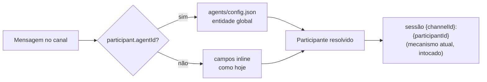
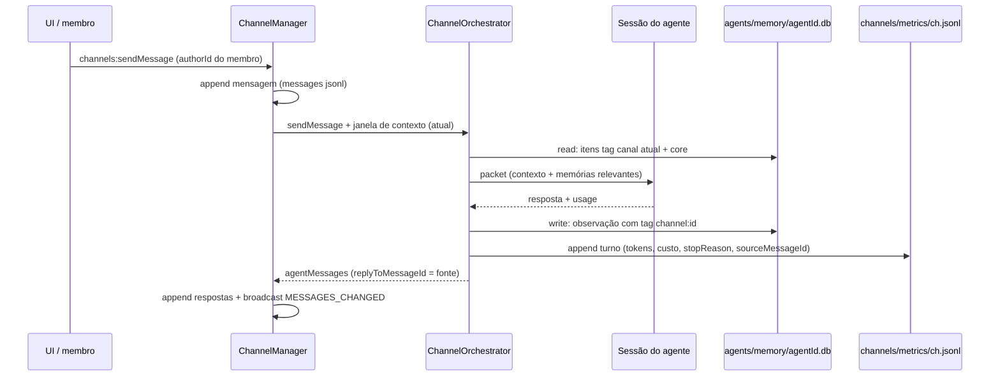
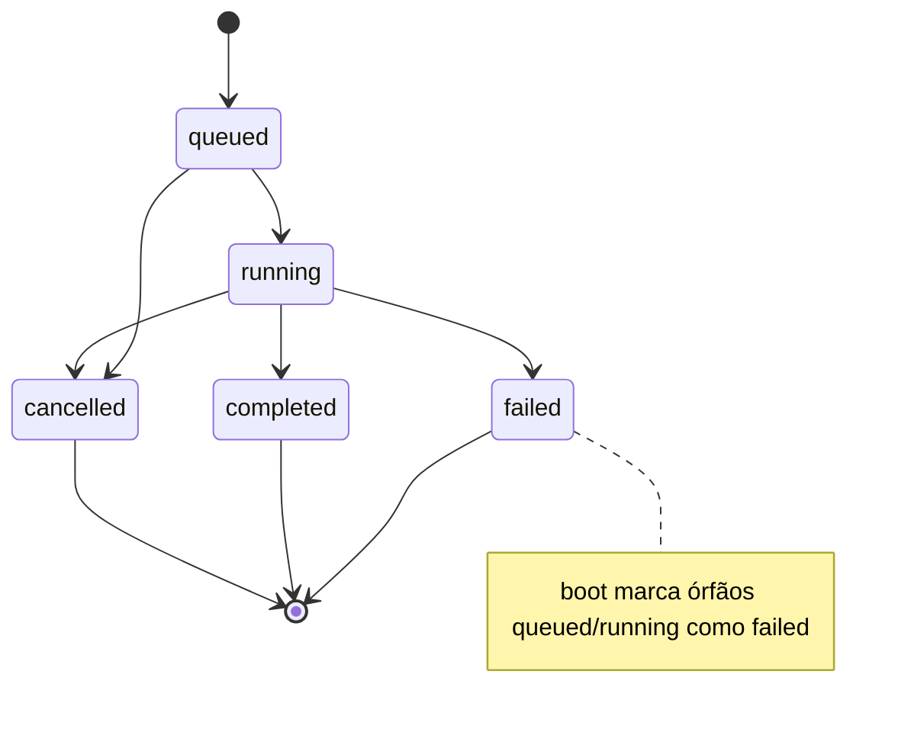

# feat: War Room — agente como membro do workspace

**Target repo:** craft-agents-oss

---

## Summary

Evoluir os canais War Room de "participantes-string dentro de um canal" para o modelo
que faz o Buzz (block/buzz) funcionar como workspace de humanos + agentes: **agente
como entidade do workspace**, com identidade própria, memória própria escopada,
rastro auditável de custo e autoria, threads visíveis, e — como fase final —
membros humanos convidados por token individual sobre o servidor headless já
existente.

Nada aqui troca o substrato: sem relay, sem keypair Nostr, sem federação. Cada fase
constrói sobre mecanismos já presentes no repo (routing de canais, dispatch durável,
sistema de memória, servidor WebSocket multi-cliente).

---

## Problem Frame

Hoje um "agente" de canal é um objeto inline em `channels/config.json`
(`WarRoomParticipant`): uma string de id, conexão LLM e modelo. Consequências:

- O agente não existe fora da sala — sem reuso entre canais, sem página de agentes,
  sem identidade contínua.
- Nenhuma memória: a doc de manutenção declara "the channel log is the shared
  memory", e o sistema de memória do repo (`packages/shared/src/memory/`) está
  desligado (`isMemoryEnabled()` → default `false`) e sem escopo (banco único em
  `~/.craft-agent/memory.db`).
- Nenhuma contabilização: impossível responder "quanto este canal custou" ou "quem
  mandou o agente fazer isso" sem ler jsonl na mão.
- Threads: `replyToMessageId` é gravado em toda resposta de agente
  (`packages/server-core/src/channels/channel-manager.ts`), mas nenhuma UI o
  renderiza.
- Multi-humano: o transporte existe (`packages/server-core/src/bootstrap/headless-start.ts`,
  `Dockerfile.server`), mas auth é token único e `authorId` default `'human'` —
  não há pessoas distintas.

Análise de referência do Buzz (specs NIP-AA/AP/AE/AM/AO/CW + três reviews em vídeo)
identificou o que copiar (identidade, memória, auditoria, custo por turno) e o que
explicitamente **não** copiar (handoff por menção — quebrado no teste real; reenvio
de histórico integral — 31k tokens para responder "oi"; agente sem escopo — visto
como falha de segurança).

## Decisões fechadas (grill, 2026-08-05)

| # | Decisão | Escolha |
|---|---|---|
| D1 | Núcleo | Agente como membro (identidade, memória, auditoria) |
| D2 | Onde mora o agente | Entidade global do workspace (`agents/config.json`) |
| D3 | Contexto por turno | Manter janela atual; instrumentar custo antes de otimizar |
| D4 | Handoff agente→agente | Somente `channel_dispatch` explícito; menção em texto livre não dispara |
| D5 | Escopo do agente | Global com membership explícita por canal |
| D6 | Memória | Uma por agente, tag de canal por item, leitura filtrada (canal atual + core sem tag) |
| D7 | Comunidade | Local/self-hosted: membros + token por pessoa sobre o servidor headless |

---

## Requirements

- **R1** — Um agente definido uma única vez pode ser adicionado a N canais e responde
  em todos com a mesma identidade (nome, avatar, prompt, modelo).
- **R2** — Canais existentes com participantes inline continuam funcionando sem
  migração obrigatória.
- **R3** — Agente só age em canais onde é membro (participa da lista `participants`
  do canal); não há acesso implícito a outros canais.
- **R4** — Memória por agente: aprendizado num canal fica disponível nos turnos
  seguintes; aprendizado com tag de canal não vaza para outros canais; itens core
  (sem tag) valem em qualquer canal. Dono vê tudo na UI.
- **R5** — Cada turno de agente em canal registra tokens in/out, custo estimado,
  stopReason, agente, canal — consultável por canal e por agente.
- **R6** — Toda ação disparada em canal é rastreável à origem: mensagem-fonte, quem
  autorou a mensagem, qual participante executou (dispatch já carrega
  `sourceMessageId`/`participantId`; falta expor e ligar).
- **R7** — Threads: respostas agrupadas sob a mensagem-raiz na UI, com contagem;
  timeline principal não polui com o corpo da thread.
- **R8** — Handoff agente→agente exclusivamente via `channel_dispatch`; resposta de
  agente contendo `@outro` **não** re-roteia (comportamento atual preservado por
  decisão, agora documentado e testado como invariante).
- **R9** — (Fase comunidade) Uma segunda pessoa em outra máquina entra por convite
  com token próprio, envia mensagem e ela aparece com o nome dela; não enxerga
  sessões privadas nem credenciais de sources.
- **R10** — Segredos nunca entram em definição de agente, mensagem de canal ou
  registro de auditoria (regra herdada do contrato existente e do NIP-AP do Buzz).

---

## Key Technical Decisions

- **KTD1 — `agentId` opcional em `WarRoomParticipant`, resolução em um ponto.**
  Participante ganha `agentId?: string`; quando presente, displayName/prompt/
  conexão/modelo/sources resolvem da entidade global via um único
  `resolveParticipant(channel, participant, agentsConfig)`. Sem `agentId`, o objeto
  inline continua autoritativo (R2). Alternativa rejeitada: migrar tudo para
  referências e converter configs — quebra canais existentes sem ganho.
- **KTD2 — Storage de agentes espelha o padrão de canais.** `agents/config.json`
  no workspace root, load/save/list em `packages/shared/src/agents/` copiando a
  forma de `packages/shared/src/channels/{storage,crud}.ts` (leitura do disco sem
  cache, tolerância a arquivo ausente). Sem SQLite aqui: o volume é dezenas, não
  milhares.
- **KTD3 — Memória reusa `packages/shared/src/memory/` sem mudança de schema.**
  Escopo por agente = um banco por agente (`agents/memory/<agentId>.db` no
  workspace) — isolamento físico, sem risco de filtro esquecido entre agentes.
  Escopo por canal = tag `channel:<channelId>` nos itens + filtro na leitura
  (`MemorySearchOptions.tags` já existe). Core = item sem tag de canal.
  Alternativa rejeitada: banco único global com tag de agente — um `WHERE`
  esquecido vaza memória entre agentes; isolamento por arquivo é mais barato de
  garantir que por query.
- **KTD4 — Custo por turno como log append-only por canal.**
  `channels/metrics/<channelId>.jsonl`, uma linha por turno concluído
  (`agentId`, `participantId`, `sessionId`, tokens in/out, custo, stopReason,
  `sourceMessageId`, timestamps). Mesmo padrão de durabilidade dos dispatches;
  agregação em leitura (RPC), sem banco novo. Equivalente funcional do
  `kind:44200` do Buzz sem criptografia (single-tenant local).
- **KTD5 — Auditoria é junção, não novo log.** "Quem fez o quê a pedido de quem"
  já existe distribuído entre `channels/messages/*.jsonl` (autor + texto),
  `channels/dispatches/*.jsonl` (participante + sourceMessageId + status) e o novo
  metrics log. A fase de auditoria entrega a **consulta** (RPC `channels:audit`
  juntando os três por `sourceMessageId`) e a UI — não um quarto arquivo para
  drift. Alternativa rejeitada: log de auditoria dedicado duplicando os três.
- **KTD6 — Threads client-side.** Volume local é pequeno; agrupar por
  `replyToMessageId` no renderer, sem overlay computado no servidor (o NIP-CW do
  Buzz resolve paginação em relay — problema que não temos; ver Deferred).
- **KTD7 — Membros com token individual, validados no upgrade do WebSocket.**
  `members/config.json` (id, displayName, role `owner|member`) + token por membro
  no keychain/armazenamento de credenciais existente — nunca no config (R10).
  O handshake já suporta validação plugável (`validateSessionCookie` em
  `headless-start.ts`); adicionar resolução token→membro no mesmo ponto e carimbar
  `authorId` do membro na conexão. Permissão mínima viável: `member` acessa RPCs de
  canais; RPCs de sources/conexões/sessões privadas exigem `owner`.
- **KTD8 — Nenhum auto-routing de menção em resposta de agente (R8/D4).** O loop
  agente→agente do Buzz quebrou no teste real; o mecanismo explícito
  (`channel_dispatch`) já é durável e auditável. Menção de agente em resposta vira
  no máximo highlight visual.

---

## High-Level Technical Design

### Resolução de participante (KTD1)



### Fluxo de um turno com memória, métrica e auditoria



### Estados de dispatch (existente — invariante a preservar)



---

## Scope Boundaries

### In scope
Fases 0–5 abaixo, restritas à superfície de canais + a nova entidade de agentes +
membership de humanos sobre o servidor existente.

### Deferred to Follow-Up Work
- **Reações, edição e deleção de mensagens** — depois de threads; aux-closure do
  Buzz é referência de forma.
- **Paginação por cursor em `listChannelMessages`** — hoje lê o jsonl inteiro a
  cada send; tratar como perf fix quando um canal real crescer (composite cursor
  do NIP-CW como referência).
- **`respond_to` / allowlist por agente** — campo previsto no schema desde já,
  checagem só quando houver multiplayer ativo (no próprio Buzz está `reserved`).
- **Auto-routing de menção partindo do lead** — extensão possível do D4; mesma
  máquina, uma condição a mais; só com demanda real.
- **Otimização de contexto por delta/watermark** — só depois que as métricas da
  Fase 3 mostrarem onde o custo está de fato (D3).

### Outside this product's identity
- Identidade criptográfica por keypair, relay Nostr, federação, E2E entre membros.
- Huddles/voz.
- Compute sharing entre máquinas.

---

## Fases

| Fase | U-IDs | Seções | Entrega | UAT mode | Depends on | Audit state | Audited commit |
|---|---|---|---|---|---|---|---|
| F0 | U1 | baseline | Motor de canais validado ponta a ponta | manual | — | pending | — |
| F1 | U2, U3 | agentes | Entidade global + resolução + UI | manual | F0 | pending | — |
| F2 | U4 | memória | Memória por agente com escopo de canal | manual | F1 | pending | — |
| F3 | U5, U6 | custo/auditoria | Métricas por turno + consulta de auditoria | manual | F1 | pending | — |
| F4 | U7 | threads | Threads renderizadas na UI | manual | F0 | pending | — |
| F5 | U8, U9 | comunidade | Membros com token próprio + authorId real | manual | F0 | pending | — |

F2, F3, F4 são independentes entre si (todas dependem de F1 ou F0); F5 depende só
de F0 e pode andar em paralelo com F1–F4 se houver mão de obra, mas recomenda-se
por último por ser a de maior risco de segurança.

---

## Implementation Units

### U1. Validar e blindar o baseline de canais

**Goal:** Observar o motor atual funcionando ponta a ponta e congelar os
invariantes que as fases seguintes assumem.

**Requirements:** R2, R8.

**Dependencies:** —

**Files:**
- `packages/server-core/src/channels/channel-orchestrator.test.ts` (ampliar)
- `packages/server-core/src/handlers/rpc/channels.test.ts` (ampliar)

**Approach:** Smoke manual na UI (canal com lead + reviewer, routing `lead`:
mensagem sem menção roteia ao lead; lead delega via `channel_dispatch`; dispatch
aparece em `channels/dispatches/<id>.jsonl` com `completed`; resposta volta ao
canal). Corrigir o que quebrar (fix mínimo). Em seguida, gravar como teste o
invariante do D4/R8 que hoje é comportamento implícito.

**Execution note:** Característico-primeiro — não alterar comportamento antes de
observá-lo.

**Test scenarios:**
- Mensagem sem menção em canal `lead` → dispatch criado para o lead; resposta
  anexada com `authorType: 'agent'` e `replyToMessageId` da fonte.
- Resposta de agente contendo `@outro-participante` → **nenhum** novo dispatch é
  criado (invariante R8).
- App reiniciado com dispatch `running` → boot marca `failed` com a mensagem de
  restart (cobre regressão do contrato de durabilidade).

**Verification:** Smoke da UI documentado com o jsonl resultante; testes novos
verdes junto aos 22 existentes.

**must_haves:**
- truths: "uma mensagem sem menção num canal lead produz resposta de agente
  visível no canal"; "menção em resposta de agente não dispara segundo agente".
- artifacts: `channels/dispatches/<test>.jsonl` com registro `completed` real.
- key_links: `grep "replyToMessageId" packages/server-core/src/channels/channel-manager.ts`.

---

### U2. Entidade de agente do workspace

**Goal:** Agente existe fora do canal: storage, tipos e resolução.

**Requirements:** R1, R2, R3, R10.

**Dependencies:** U1.

**Files:**
- `packages/shared/src/agents/types.ts` (novo)
- `packages/shared/src/agents/storage.ts` (novo)
- `packages/shared/src/agents/crud.ts` (novo)
- `packages/shared/src/agents/__tests__/storage.test.ts` (novo)
- `packages/shared/src/channels/types.ts` (campo `agentId` em `WarRoomParticipant`)
- `packages/server-core/src/channels/channel-orchestrator.ts` (resolução)
- `packages/server-core/src/channels/channel-orchestrator.test.ts`

**Approach:** `WorkspaceAgent` { id, displayName, systemPrompt?, avatarColor?,
llmConnection, model?, defaultSourceSlugs?, permissionMode?, workingDirectory?,
createdAt }. Storage espelha `channels/storage.ts` (KTD2). Resolução única
`resolveParticipant` (KTD1): `agentId` presente → merge global ⭠ overrides inline
do participante; ausente → inline puro. **Validação: `agentId` referenciando
agente inexistente falha o send com erro claro, não silenciosamente.** Campos de
segredo não existem no tipo (R10).

**Patterns to follow:** `packages/shared/src/channels/storage.ts` (load tolerante,
save atômico), `packages/shared/src/channels/crud.ts` (validação de id).

**Test scenarios:**
- Criar agente, referenciar em dois canais, resolver → mesmos displayName/modelo
  nos dois.
- Participante inline sem `agentId` → resolução idêntica ao comportamento atual
  (snapshot dos campos).
- `agentId` órfão → erro nomeando o id, mensagem não é enviada ao LLM.
- Override inline (ex.: modelo diferente num canal) vence o campo global.
- `agents/config.json` ausente ou corrompido → lista vazia, canais inline seguem
  funcionando.

**Verification:** Testes acima verdes; typecheck de `server-core` e `electron`.

**must_haves:**
- truths: "o mesmo agente responde em dois canais com a mesma identidade";
  "canal antigo sem agentId continua respondendo".
- artifacts: `packages/shared/src/agents/storage.ts` (load/save/list).
- key_links: `grep "agentId" packages/shared/src/channels/types.ts`;
  `grep "resolveParticipant" packages/server-core/src/channels/channel-orchestrator.ts`.

---

### U3. RPC e UI de agentes

**Goal:** CRUD de agentes pela interface; editor de participante do canal passa a
oferecer agentes globais.

**Requirements:** R1, R3.

**Dependencies:** U2.

**Files:**
- `packages/shared/src/protocol/channels.ts` (namespace `agents:` — LIST/CREATE/UPDATE/DELETE/CHANGED)
- `packages/server-core/src/handlers/rpc/agents.ts` (novo)
- `packages/server-core/src/handlers/rpc/agents.test.ts` (novo)
- `apps/electron/src/transport/channel-map.ts` (paridade IPC)
- `apps/electron/src/renderer/components/app-shell/AgentsPanel.tsx` (novo)
- `apps/electron/src/renderer/components/app-shell/ChannelConversationPanel.tsx`
  (editor de participante: dropdown de agentes globais + caminho inline preservado)

**Approach:** Espelhar o padrão RPC de canais (registro em `registerChannelsHandlers`
adjacente). No editor de participante existente, "Adicionar agente" oferece:
escolher agente do workspace (gera participante `{ id, agentId }`) ou criar inline
(fluxo atual). Página de agentes lista cartões com nome/modelo/canais onde é membro
(computado por varredura dos canais — R3 visível).

**Patterns to follow:** `packages/server-core/src/handlers/rpc/channels.ts`;
estados de draft do editor inline atual (`ChannelConversationPanel.tsx`).

**Test scenarios:**
- `agents:create` persiste e `agents:list` devolve; broadcast `agents:changed`.
- Delete de agente referenciado por canal → bloqueado com lista dos canais, ou
  exige confirmação explícita (comportamento decidido no code review — registrar
  no PR).
- Editor: selecionar agente global adiciona participante com `agentId` e sem
  campos duplicados inline.

**Verification:** Fluxo completo na UI real: criar agente, adicionar a dois
canais, conversar nos dois; screenshot no PR.

**must_haves:**
- truths: "usuário cria agente na UI e o adiciona a um canal sem editar JSON".
- artifacts: `AgentsPanel.tsx`; handlers `agents:*`.
- key_links: `grep "agents:" packages/shared/src/protocol/channels.ts`.

---

### U4. Memória por agente com escopo de canal

**Goal:** Agente lembra entre turnos e canais; aprendizado marcado por canal não
vaza; dono enxerga tudo.

**Requirements:** R4.

**Dependencies:** U2.

**Files:**
- `packages/server-core/src/channels/channel-orchestrator.ts` (leitura pré-packet,
  observação pós-turno)
- `packages/shared/src/memory/memory-store.ts` (apenas se precisar de helper de
  filtro por ausência de tag; schema intocado)
- `packages/shared/src/agents/memory-paths.ts` (novo — resolve
  `agents/memory/<agentId>.db` no workspace)
- `packages/server-core/src/channels/channel-memory.test.ts` (novo)
- `apps/electron/src/renderer/components/app-shell/AgentsPanel.tsx` (aba Memórias)

**Approach:** Um `MemoryStore` por agente, aberto sob demanda e cacheado por
`agentId` (KTD3). Escrita: `ObservationPipeline` existente, cada item com tag
`channel:<channelId>`; itens promovidos a core (preferências do dono, identidade)
sem tag de canal — a promoção usa a categoria já existente (`profile`) como sinal.
Leitura pré-packet: busca com filtro (tag do canal atual OU sem tag `channel:*`),
budget compacto (`maxCompactTokens` da config). Participante inline sem `agentId`
não tem memória (decisão: memória é atributo da entidade, não do participante).
Gate por `CRAFT_FEATURE_MEMORY` respeitado: canal ativa memória apenas quando a
flag e o agente global existem.

**Execution note:** Test-first no isolamento — o teste de vazamento entre canais
escreve-se antes da integração.

**Test scenarios:**
- "Lembre que prefiro X" no canal A → turno seguinte no canal A reflete X.
- Item com tag `channel:A` → busca no canal B não o retorna.
- Item core (sem tag de canal) → aparece em A e B.
- Dois agentes no mesmo canal → memória de um nunca aparece no packet do outro
  (isolamento físico por arquivo).
- Flag `CRAFT_FEATURE_MEMORY` desligada → canal funciona exatamente como hoje.
- Banco corrompido/ausente → turno prossegue sem memória, com log de aviso
  (nunca derruba o send).

**Verification:** Cenários acima como testes + demonstração na UI (aba Memórias
mostrando o item gravado com sua tag de canal).

**must_haves:**
- truths: "agente aplica no turno N+1 o que aprendeu no turno N"; "aprendizado de
  canal privado não aparece noutro canal"; "dono lê as memórias do agente na UI".
- artifacts: `agents/memory/<agentId>.db` criado no workspace de teste;
  `channel-memory.test.ts`.
- key_links: `grep "channel:" packages/server-core/src/channels/channel-orchestrator.ts`.

---

### U5. Métricas de turno (custo por agente e por canal)

**Goal:** Cada turno registra uso e custo; consulta agregada por canal e agente.

**Requirements:** R5.

**Dependencies:** U2 (usa `agentId` resolvido; participante inline registra sob o
id do participante).

**Files:**
- `packages/shared/src/channels/turn-metrics.ts` (novo — shape + append + list)
- `packages/shared/src/channels/__tests__/turn-metrics.test.ts` (novo)
- `packages/server-core/src/channels/channel-orchestrator.ts` (emitir no fim do turno)
- `packages/shared/src/protocol/channels.ts` (`channels:listTurnMetrics`)
- `packages/server-core/src/handlers/rpc/channels.ts` (handler)

**Approach:** `channels/metrics/<channelId>.jsonl` (KTD4), shape
{ id, channelId, participantId, agentId?, sessionId, sourceMessageId, model,
tokensIn, tokensOut, costUsd?, stopReason?, startedAt, finishedAt }. Fonte dos
números: o usage que o runtime da sessão já reporta ao concluir o turno — a
descoberta do ponto exato de captura é execution-time (deferred note). Custo
estimado por tabela de preço local; campo opcional quando o modelo não tem preço
conhecido — **nunca inventar valor**. Agregação (soma por canal, por agente, por
dia) computada no handler em leitura.

**Patterns to follow:** `packages/shared/src/channels/dispatches.ts`
(append-only + reconstrução) e `messages.ts` (tolerância a linha corrompida).

**Test scenarios:**
- Turno concluído → exatamente uma linha nova no jsonl do canal.
- Turno falho → linha com stopReason de erro (não silêncio).
- Linha corrompida no meio do arquivo → list ignora a linha, não o arquivo.
- Agregação por canal soma dois agentes; agregação por agente soma dois canais.
- Modelo sem preço → `costUsd` ausente, tokens presentes.

**Verification:** Após uma conversa real de 3+ turnos, `channels:listTurnMetrics`
devolve linhas consistentes com o observado.

**must_haves:**
- truths: "usuário responde 'quanto este canal custou' com um RPC".
- artifacts: `channels/metrics/<id>.jsonl` real; `turn-metrics.ts`.
- key_links: `grep "listTurnMetrics" packages/shared/src/protocol/channels.ts`.

---

### U6. Consulta de auditoria e superfície na UI

**Goal:** "Quem fez o quê, a pedido de quem" como consulta e painel — sem novo log.

**Requirements:** R6.

**Dependencies:** U5.

**Files:**
- `packages/server-core/src/channels/audit-view.ts` (novo — junção por `sourceMessageId`)
- `packages/server-core/src/channels/audit-view.test.ts` (novo)
- `packages/shared/src/protocol/channels.ts` (`channels:audit`)
- `packages/server-core/src/handlers/rpc/channels.ts` (handler)
- `apps/electron/src/renderer/components/app-shell/ChannelConversationPanel.tsx`
  (painel/aba: linha do tempo de dispatches com origem, status, custo)

**Approach:** Junção em leitura (KTD5): mensagem-fonte (autor humano/agente) ←
dispatches (participante, status, erro) ← métricas (custo do turno). Saída
ordenada por tempo, filtrável por participante. UI: aba "Atividade" no canal
mostrando cada dispatch com "pedido por", "executado por", status e custo —
tornando visível o que hoje só existe em jsonl.

**Test scenarios:**
- Mensagem do dono → dispatch → resposta: a entrada de auditoria liga os três
  pelo `sourceMessageId`.
- Dispatch `failed` aparece com erro — nunca omitido (contrato UI existente:
  "do not hide failed agent dispatches silently").
- Mensagem sem dispatch (modo manual-tags sem menção) → aparece como mensagem,
  sem entrada de execução.

**Verification:** Painel na UI real exibindo uma cadeia completa
pedido→execução→custo de uma conversa de verdade.

**must_haves:**
- truths: "para qualquer resposta de agente, a UI mostra quem pediu e quanto custou".
- artifacts: `audit-view.ts`; aba Atividade.
- key_links: `grep "channels:audit" packages/shared/src/protocol/channels.ts`.

---

### U7. Threads na UI

**Goal:** Respostas agrupadas sob a mensagem-raiz; timeline limpa; base para
adversarial review legível.

**Requirements:** R7.

**Dependencies:** U1 (invariantes validados; dado já existe).

**Files:**
- `apps/electron/src/renderer/components/app-shell/ChannelConversationPanel.tsx`
- `apps/electron/src/renderer/components/app-shell/ChannelThread.tsx` (novo, se a
  extração melhorar a legibilidade do painel — decisão do implementador)

**Approach:** Agrupamento client-side por `replyToMessageId` (KTD6): mensagem com
`replyToMessageId` renderiza dentro do colapso da raiz; raiz mostra contagem de
respostas e último timestamp (equivalente mínimo do resumo `kind:39005` do Buzz,
computado no cliente). Composer ganha "responder em thread" (define
`replyToMessageId` no send — o campo já trafega no RPC). Mensagens antigas sem o
campo continuam top-level.

**Test scenarios:** (component-level, na infra de teste de renderer existente; se
o repo não tiver harness de componente para este painel, cobrir a função de
agrupamento pura como unit test e o resto por UAT manual)
- Agrupamento: 1 raiz + 3 respostas → timeline mostra 1 item com contador 3.
- Resposta de resposta (aninhamento) → achatada na thread da raiz (sem árvore
  profunda na v1).
- Canal legado sem `replyToMessageId` → renderização idêntica à atual.

**Verification:** UAT: pedir a dois agentes que debatam num thread
(adversarial review) e verificar que o debate fica agrupado e o timeline legível.

**must_haves:**
- truths: "debate de dois agentes fica agrupado sob uma raiz e não polui o
  timeline".
- artifacts: agrupamento por `replyToMessageId` no painel.
- key_links: `grep "replyToMessageId" apps/electron/src/renderer/components/app-shell/ChannelConversationPanel.tsx`.

---

### U8. Membros do workspace e auth por pessoa (servidor)

**Goal:** Pessoas distintas com token próprio; `authorId` real nas mensagens;
permissão mínima viável.

**Requirements:** R9, R10.

**Dependencies:** U1.

**Files:**
- `packages/shared/src/members/types.ts` (novo)
- `packages/shared/src/members/storage.ts` (novo)
- `packages/shared/src/members/__tests__/storage.test.ts` (novo)
- `packages/server-core/src/bootstrap/headless-start.ts` (resolução token→membro
  no upgrade; conexão carimbada com memberId)
- `packages/server-core/src/handlers/rpc/channels.ts` (`authorId` forçado ao
  membro autenticado — cliente não escolhe mais o próprio authorId)
- `packages/server-core/src/handlers/handler-deps.ts` (contexto de membro para
  handlers)

**Approach:** `members/config.json` { id, displayName, role: 'owner'|'member',
createdAt } (KTD7). Tokens por membro gerados com o utilitário de token existente
(mesma validação de entropia), armazenados fora do config. Retrocompatibilidade:
sem `members/config.json`, o token único atual segue valendo como owner implícito
(deploy existente não quebra). Gate de permissão nos handlers: RPCs de canais
liberados a `member`; sources/conexões/sessões fora de canal exigem `owner` — a
**lista exata de namespaces bloqueados é enumerada em teste**, para o gate não
depender de memória de revisor.

**Execution note:** Test-first no gate de permissão.

**Test scenarios:**
- Token de membro válido → conexão aceita, `authorId` das mensagens = memberId
  (mesmo que o cliente envie outro `authorId` no payload — servidor sobrescreve).
- Token inválido/revogado → upgrade rejeitado.
- `member` chamando RPC de sources → negado; owner → permitido.
- Workspace sem members config → comportamento atual intacto (token único, owner).
- Dois membros conectados simultaneamente → mensagens de cada um com seu authorId.

**Verification:** Duas conexões reais (duas instâncias/máquinas) contra o servidor
headless, cada uma com seu token, conversando no mesmo canal.

**must_haves:**
- truths: "segunda pessoa entra com token próprio e a mensagem dela sai com o nome
  dela"; "member não lê credenciais de sources".
- artifacts: `members/storage.ts`; validação no upgrade.
- key_links: `grep "memberId" packages/server-core/src/bootstrap/headless-start.ts`.

---

### U9. Convite e identidade visual de membros (UI)

**Goal:** Fluxo de convite sem edição manual de config; mensagens com nome/avatar
do autor.

**Requirements:** R9.

**Dependencies:** U8.

**Files:**
- `apps/electron/src/renderer/components/app-shell/ChannelConversationPanel.tsx`
  (autor por mensagem: nome do membro, do agente global, ou `authorId` cru como
  fallback)
- Superfície de settings do workspace (tela de membros: listar, convidar = gerar
  token + instrução de conexão, revogar) — caminho exato a confirmar na estrutura
  de settings existente no início da fase
- `packages/shared/src/protocol/channels.ts` (`members:*` RPCs)
- `packages/server-core/src/handlers/rpc/members.ts` (novo)

**Approach:** Convite = criar membro + gerar token + apresentar
`wss://host:porta` + token para envio manual (email/chat — fora do escopo
transportar o convite). Revogação invalida o token imediatamente (conexões ativas
do membro são derrubadas). Mensagens no canal resolvem `authorId` → displayName
via members + agents; ids desconhecidos renderizam cru (histórico antigo).

**Test scenarios:**
- Fluxo de convite gera token que funciona num segundo cliente (integração com U8).
- Revogar membro → próxima tentativa de conexão falha; conexão ativa cai.
- Mensagem histórica com `authorId: 'human'` → renderiza sem crash, rotulada
  como legado/dono.

**Verification:** UAT completo do R9: segunda máquina entra por convite, conversa,
aparece com o nome; depois é revogada e perde acesso.

**must_haves:**
- truths: "convite acontece inteiro pela UI"; "revogação corta acesso na hora".
- artifacts: tela de membros; handlers `members:*`.
- key_links: `grep "members:" packages/shared/src/protocol/channels.ts`.

---

## Risks & Mitigations

- **R-risco 1 — Fase 1 toca fora de canais.** Mitigação: superfície nova mínima
  (um config, um painel, um namespace RPC); motor de canais só ganha
  `resolveParticipant`.
- **R-risco 2 — Vazamento de memória entre canais.** O filtro por tag é convenção.
  Mitigação: isolamento entre **agentes** é físico (arquivo por agente); o teste
  de vazamento entre canais é test-first (U4) e o filtro vive num único helper.
- **R-risco 3 — Regressão em canais existentes.** Mitigação: R2 coberto por
  snapshot em U2 e cenários "sem agentId"/"sem members config" em todas as fases;
  os 22 testes existentes rodam em todo PR.
- **R-risco 4 — Permissão de membro mal fechada (F5).** Um namespace esquecido no
  gate expõe credenciais. Mitigação: gate default-deny por lista de namespaces
  permitidos a `member` (allowlist, não blocklist) + teste enumerando os RPCs
  sensíveis; F5 por último, atrás do smoke das outras fases.
- **R-risco 5 — Números de custo enganosos (F3).** Preço desatualizado gera
  confiança falsa. Mitigação: `costUsd` opcional e omitido sem preço conhecido;
  tokens são sempre os números primários.
- **R-risco 6 — Editor de participante vira dois caminhos confusos (U3).**
  Mitigação: caminho global é o default visual; inline fica atrás de "avançado".

## Deferred implementation notes (execution-time)

- Ponto exato de captura do usage/stopReason no fim do turno da sessão (U5) — 
  depende de onde o runtime da sessão reporta; descobrir na implementação.
- Forma final da promoção item→core na observação (U4) — a categoria `profile`
  é o sinal inicial; ajustar com uso real.
- Caminho exato da tela de settings para membros (U9) — confirmar na estrutura
  de settings vigente ao iniciar a fase.
- Comportamento do delete de agente referenciado (U3) — bloquear vs. confirmar;
  decidir no review com a UI na mão.

## Verification (todas as fases)

Checklist da doc de manutenção do próprio repo, por PR:

```
bun test packages/server-core/src/handlers/rpc/channels.test.ts \
  packages/server-core/src/channels/channel-orchestrator.test.ts \
  packages/server-core/src/channels/hermes-kanban.test.ts
(typecheck server-core e electron; build do renderer)
```

Mais os testes novos da fase, e **validação na UI real antes de declarar a fase
pronta** — teste verde não é funcionalidade observada.

---

## Sources & Research

- Contrato de manutenção: `apps/electron/docs/channels-war-room.md` (rotas,
  durabilidade, coisas a não quebrar — este plano respeita todas).
- Código verificado: `packages/shared/src/channels/*`,
  `packages/server-core/src/channels/*`, `packages/shared/src/memory/*`,
  `packages/shared/src/feature-flags.ts`,
  `packages/server-core/src/bootstrap/headless-start.ts`,
  `apps/electron/src/renderer/components/app-shell/ChannelConversationPanel.tsx`.
- Referência externa (load-bearing): specs do block/buzz — NIP-AA (auth de agente),
  NIP-AP (personas; regra "sem segredo na definição" adotada em R10; campos
  `respond_to` lá ainda `reserved`), NIP-AE (engrams → nosso U4 usa o sistema
  local, mais rico), NIP-AM (métricas de turno → U5), NIP-AO (telemetria efêmera —
  não adotado), NIP-CW (janela/cursor — deferred).
- Reviews em vídeo do Buzz (2026): handoff por menção falhando em teste real
  (motivou D4/R8); 31k tokens por saudação por reenvio de histórico (motivou D3);
  agente sem escopo por canal apontado como falha (motivou D5/R3); agentes locais
  morrem com o notebook (motivou o posicionamento da F5 sobre servidor headless).
