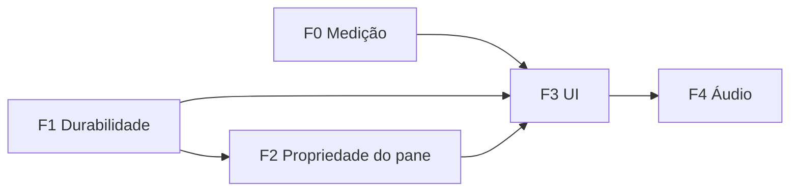

# Craft Recording Capture Hardening Implementation Plan

> **For agentic workers:** REQUIRED SUB-SKILL: Use superpowers:subagent-driven-development (recommended) ou superpowers:executing-plans para implementar este plano. As **requirements** vivem na change OpenSpec `harden-craft-recording-capture` (`openspec/changes/harden-craft-recording-capture/specs/meetings/spec.md`); o **checklist executável** com checkbox é `openspec/changes/harden-craft-recording-capture/tasks.md`. Este plano é o mapa técnico (achados, contratos e código concreto) — ele **não** duplica a lista de tarefas.

**Goal:** Endurecer a gravação nativa de reuniões ("craft capture") para que o `.webm` sobreviva a quit/crash/destroy do pane, para que um pane em gravação nunca seja adotado por uma sessão de agente, e para que a UI mostre tempo decorrido, estado "Interrompida" e ações só-ícone.

**Arquitetura:** A gravação craft nasce no renderer (`apps/electron/src/renderer/browser-toolbar.tsx`: `getDisplayMedia` + `MediaRecorder.start(1000)`), transita por IPC (`apps/electron/src/main/handlers/meetings.ts`) e é serializada em disco pelo `RecordingService` (`apps/electron/src/main/meetings/recording-service.ts`), enquanto o `MeetingService` (`apps/electron/src/main/meetings/meeting-service.ts`) persiste o record em `meetings.json`. O pane físico é uma `pageView` por janela gerida pelo `BrowserPaneManager` (`apps/electron/src/main/browser-pane-manager.ts`), cuja adoção por sessões de agente passa por `findReusableUnboundInstance`/`createForSession`. A capability afetada é única: `meetings`.

**Stack:** Electron + Bun + TypeScript strict, `bun:test`, React + `react-i18next` (8 locales em `packages/shared/src/i18n/locales/`), `MediaRecorder`/`getDisplayMedia`, Node `fs` streams.

## Restrições globais

- Capability única afetada: `meetings`. Não criar capability nova; a garantia "pane gravando não é adotado por agente" é enunciada do lado meetings e implementada no `browser-pane-manager`.
- `strict: true`; nunca `any`. Named exports. Reutilizar convenções existentes — `updateRecord`, `completeRecording`, padrão fire-and-forget com catch, `t()` no renderer.
- Ordem canônica das fases, imutável: `F0 — Medição` → `F1 — Durabilidade da gravação` → `F2 — Propriedade do pane em gravação` → `F3 — UI de gravação` → `F4 — Áudio da gravação`.
- Toda string visível ao usuário via i18n (`t()` com chave nos 8 locales: de, en, es, hu, ja, pl, pt-BR, zh-Hans). `bun run lint:i18n:parity` deve passar.
- Lógica de UI testável MUST sair como helper puro em `apps/electron/src/renderer/lib/`, com teste em `apps/electron/src/renderer/lib/__tests__/` — não há harness de render de componente no repo.
- Gates por fase: `bun test <caminhos focados>`, `bun run typecheck:all`, `bun run lint:i18n:parity`, `openspec validate harden-craft-recording-capture --strict --no-interactive`, e validação em Google Meet real.
- Non-goals: caminho Hermes, `endReason` no DTO/UI, abas dentro de um pane, pipeline de video-analysis/Deepgram/summary, refatorar os `formatElapsed` de `ChatDisplay`/`TaskActionMenu`, push/deploy/release (ver `## Non-goals`).

## Achados verificados

Base factual (comprovada em código/teste, com path e linha). Não repetir como hipótese.

1. **Gravação escreve incrementalmente.** `recorder.start(1000)` (`browser-toolbar.tsx:342`) → IPC → `stream.write` (`recording-service.ts:96-100`). Bytes ficam no disco com o record ainda `running`.
2. **`shutdown()` ignora captura craft de propósito.** `if (record.captureMode !== 'craft' && ...)` (`meeting-service.ts:518`). Nada no main finaliza o `RecordingService` no quit — o único `finalize` é o handler IPC (`handlers/meetings.ts:131`).
3. **`reconcileOrphanRecordings` apaga todo `.webm` não referenciado** por `record.recording.path` (`meeting-service.ts:1622-1651`). Crash mid-recording → parcial existe → apagado no boot seguinte.
4. **`completeRecording` persiste `recording` ANTES de transcrição/summary/video-analysis**, todos fire-and-forget com catch (`meeting-service.ts:666-697`). Falha downstream não toca no `.webm`.
5. **Adoção do pane.** `findReusableUnboundInstance` filtra `boundSessionId === null && ownerType === 'manual'` e prefere a visível (`browser-pane-manager.ts:1595-1604`); `createForSession` usa `allowReuseManual ?? true` (`:1628`); `SessionManager` chama sem o flag (`packages/server-core/src/sessions/SessionManager.ts:3686`, `:3746`, `:4000`). Só o seam remoto passa `false` (`browser-pane-manager.ts:2167-2174`). Teste que documenta o comportamento atual: `apps/electron/src/main/__tests__/browser-pane-manager.test.ts:541`.
6. **Fechar a janela do pane = `hide`** (`browser-pane-manager.ts:2807-2816`), não destrói: a gravação continua. `destroyInstance` (`:633`), recriação em `switchProfile` (`:774-786`) e `deleteProfile` (`:809-811`) destroem.
7. **`setDisplayMediaRequestHandler` concede a própria frame do Meet**, vídeo+áudio, sem picker (`browser-pane-manager.ts:2755-2776`).
8. **Toolbar só valida `hasVideo`** (`browser-toolbar.tsx:296-299`); nada valida faixa de áudio.
9. **Nenhum `backgroundThrottling` é configurado** no main (webPreferences em `browser-pane-manager.ts:451-494`) → default `true` para os panes.
10. **Testes de renderer são de módulos puros** em `apps/electron/src/renderer/lib/__tests__/*.test.ts` — sem harness de render de componente.

Inferências **não verificadas** (a medir em F0 / validar em call real, nunca assumir como fato):

- **[INFERÊNCIA — F0/Q1]** Uma janela escondida (`window.hide()`) pode ser _throttled_ pelo Chromium (finding 9: `backgroundThrottling` default `true`), reduzindo/parando a cadência de chunks do `MediaRecorder`. Não comprovado; medir antes de priorizar F3.
- **[INFERÊNCIA — F0/Q2]** Navegação cross-document do pane (`loadURL`) pode encerrar o `MediaStreamTrack` (`track-ended`), do qual depende a auto-finalização em `browser-toolbar.tsx:330-341`. Não comprovado; medir.
- **[INFERÊNCIA — F4]** A voz local do usuário não entra na gravação, porque a captura é áudio de aba (finding 7) e o Meet não faz playback do próprio mic; nenhum `getUserMedia` existe no fluxo. A confirmar em call real antes de escrever F4.

## Contratos compartilhados

Reprodução literal dos contratos normativos C1–C10, para o implementador não reabrir o arquivo de contrato. Assinaturas e nomes são canônicos.

**C1 — `MeetingRecordingMetadata.partial`** (`packages/shared/src/protocol/dto.ts:73-78`):

```ts
export interface MeetingRecordingMetadata {
  path: string
  mimeType?: string
  bytesWritten?: number
  durationMs?: number
  /** True enquanto o .webm tem stream aberto ou nunca foi selado
   *  (crash/quit/destroy do pane). Limpo por completeRecording. */
  partial?: boolean
}
```

`sanitizeRecord` (`meeting-service.ts:1996-2033`) MUST preservar `partial` no ramo `recording` (`:2032`). Depois de `completeRecording`, `recording.partial` MUST ser falsy.

**C2 — `MeetingService.attachRecordingTarget`**:

```ts
attachRecordingTarget(
  workspaceRootPath: string,
  meetingId: string,
  target: { outputPath: string; mimeType: string },
): void
```

Persiste via `updateRecord`: `recording: { path: target.outputPath, mimeType: target.mimeType, bytesWritten: 0, durationMs: 0, partial: true }`. NÃO muda `status` (segue `running`), NÃO dispara transcrição/summary. Chamado no handler `RECORDING_PREPARE` logo após `recordingService.prepare`.

**C3 — `mimeType` entra no prepare** (`recording-service.ts`):

```ts
export interface ActiveRecording {
  // ...campos existentes...
  mimeType: string
}
export interface PrepareRecordingInput {
  workspaceId: string
  workspaceRoot: string
  browserInstanceId: string
  meetingId?: string
  urlOrCode?: string
  mimeType: string // obrigatório
}
export interface FinalizeRecordingResult {
  // ...campos existentes...
  mimeType: string
  /** Necessário para limpar o `captureLock` do pane dono (C6) sem consultar
   *  a tabela de gravações de fora do serviço. */
  browserInstanceId: string
}
async finalize(recordingId: string, mimeType?: string): Promise<FinalizeRecordingResult> // omitido → usa o armazenado
// abort passa a devolver também o pane dono, pelo mesmo motivo:
abort(recordingId: string): { meetingId?: string; workspaceId: string; browserInstanceId: string } | null
```

Preload (`apps/electron/src/preload/browser-toolbar.ts:84-92`): `prepareRecording({ urlOrCode, workspaceId?, mimeType })`. No `browser-toolbar.tsx`, mover a escolha do mime (`:300-301`) para ANTES de `api.prepareRecording` (`:291`) e passar no payload.

**C4 — `RecordingService` sela sem o renderer**:

```ts
async finalizeAll(): Promise<FinalizeRecordingResult[]>
async finalizeForInstance(browserInstanceId: string): Promise<FinalizeRecordingResult[]>
```

Erro de uma gravação é logado e pulado — uma stream ruim MUST NOT bloquear as outras. Ambos reusam `finalize` internamente (idempotência já garantida: a segunda chamada lança `recording not found`, tolerado pelo chamador).

**C5 — Seal compartilhado + shutdown exportado** (`apps/electron/src/main/handlers/meetings.ts`):

```ts
async function sealRecording(result: FinalizeRecordingResult): Promise<void>
export async function shutdownCraftRecordings(): Promise<'idle' | 'sealed' | 'failed'>
export async function sealCraftRecordingsForInstance(browserInstanceId: string): Promise<void>
```

`sealRecording` = extração do bloco `completeRecording` inline em `RECORDING_FINALIZE` (`:133-142`), usado pelo handler e pelo shutdown. `shutdownCraftRecordings()` → `finalizeAll()` + `sealRecording` de cada; `'idle'` sem gravação ativa. Chamado em `index.ts:1144-1148` (antes de `shutdownMeetingCaptures()`) e em `index.ts:875` (`app:relaunch`, antes de `relaunchAfterSealingCaptures`).

**C6 — `captureLock` no pane** (`apps/electron/src/main/browser-pane-manager.ts`):

```ts
export interface BrowserPaneCaptureLock {
  reason: 'meeting-recording'
  since: number
}
// BrowserInstance.captureLock: BrowserPaneCaptureLock | null  (init null no bloco :507-549)
setCaptureLock(id: string, lock: BrowserPaneCaptureLock | null): void
getCaptureLock(id: string): BrowserPaneCaptureLock | null
setCaptureReleaseHook(hook: (browserInstanceId: string) => void): void
```

DTO: `BrowserInstanceInfo.captureLock?: BrowserPaneCaptureLock | null` (`dto.ts:1116`) + `toInfo` (`:2137`); `BrowserInstanceSnapshot` (`packages/server-core/src/handlers/browser-pane-manager-interface.ts:25`) + `toSnapshot` (`:3114`).

**C7 — Chaves i18n** (`packages/shared/src/i18n/locales/*.json`, 8 arquivos):

```jsonc
// exemplo en; traduzir de verdade nos outros 7 locales
"meetings.recordStopWithElapsed":    "Recording {{elapsed}} • Stop",
"meetings.statusRunningWithElapsed": "Recording {{elapsed}}",
"meetings.statusInterrupted":        "Interrupted",
"meetings.recordingNoAudio":         "No audio track captured — the recording will have video only."
```

`meetings.archive`/`meetings.delete` continuam em uso (viram `aria-label` + `title`) — NÃO remover.

**C8 — Formatter de tempo** (`apps/electron/src/renderer/lib/recording-elapsed.ts`):

```ts
/** m:ss abaixo de 1h, h:mm:ss a partir de 1h. Negativo/NaN → "0:00". */
export function formatRecordingElapsed(ms: number): string
```

**C9 — Timer no botão da toolbar** (`browser-toolbar.tsx`): `recordingStartedAt` (state), tick único de 1s guardado por `recordingState === 'recording' && recordingStartedAt !== null`, label via `meetings.recordStopWithElapsed`, `tabular-nums` no `recordingButtonClassName`.

**C10 — Sidebar** (`apps/electron/src/renderer/components/app-shell/MeetingsListPanel.tsx`): um tick por painel guardado por `hasLive`, subtitle live com `meetings.statusRunningWithElapsed`, `getStatusLabel` passa a receber o record (`stopped` + `recording?.partial` → `meetings.statusInterrupted`), ações Arquivar/Excluir só-ícone.

## F0 — Medição

**Objetivo:** responder Q1 (janela escondida continua produzindo chunks?) e Q2 (navegação cross-document encerra o track?) com um harness Electron descartável (NÃO commitar), gravando o resultado neste documento. Sem código de produção. O resultado decide se F3 precisa de uma requirement P0 nova (ex.: `backgroundThrottling: false`) antes de mexer na UI.

**Arquivos tocados:** nenhum arquivo do repo. Criar em `/tmp/craft-capture-harness/` (fora da árvore versionada): `main.mjs`, `page.html`.

**Passos em ordem:**

1. Criar `/tmp/craft-capture-harness/page.html` (canvas animado + oscillator + `MediaRecorder`, loga tamanho de chunk):

```html
<!doctype html>
<html>
  <body style="margin:0;background:#111">
    <canvas id="c" width="640" height="360"></canvas>
    <script>
      const { ipcRenderer } = require('electron')
      const canvas = document.getElementById('c')
      const ctx = canvas.getContext('2d')
      let hue = 0
      function draw() {
        hue = (hue + 2) % 360
        ctx.fillStyle = `hsl(${hue},80%,50%)`
        ctx.fillRect(0, 0, canvas.width, canvas.height)
        requestAnimationFrame(draw)
      }
      draw()

      async function main() {
        // Oscillator só para exercitar o grafo de áudio da aba.
        const audioCtx = new AudioContext()
        const osc = audioCtx.createOscillator()
        osc.connect(audioCtx.destination)
        osc.start()

        const stream = await navigator.mediaDevices.getDisplayMedia({ video: true, audio: true })
        ipcRenderer.send('harness:log', `tracks video=${stream.getVideoTracks().length} audio=${stream.getAudioTracks().length}`)

        // Q2: observar track-ended quando o main navegar a página.
        stream.getVideoTracks()[0].addEventListener('ended', () => {
          ipcRenderer.send('harness:log', `TRACK-ENDED at ${Date.now()}`)
        })

        const recorder = new MediaRecorder(stream, { mimeType: 'video/webm;codecs=vp9,opus' })
        recorder.ondataavailable = (e) => {
          ipcRenderer.send('harness:log', `chunk ${e.data.size} bytes at ${Date.now()}`)
        }
        recorder.start(1000)
        ipcRenderer.send('harness:log', `recorder started at ${Date.now()}`)
      }
      main().catch((err) => ipcRenderer.send('harness:log', `ERROR ${err.message}`))
    </script>
  </body>
</html>
```

2. Criar `/tmp/craft-capture-harness/main.mjs` (espelha `setDisplayMediaRequestHandler` de `browser-pane-manager.ts:2755-2776`; escreve num arquivo de log porque rodar o binário Electron por `bash` engoliu o stdout na primeira tentativa):

```js
import { app, BrowserWindow, ipcMain, session } from 'electron'
import { appendFileSync } from 'node:fs'
import { fileURLToPath } from 'node:url'
import { dirname, join } from 'node:path'

const __dirname = dirname(fileURLToPath(import.meta.url))
const LOG = join(__dirname, 'measure.log')
const log = (line) => appendFileSync(LOG, `${line}\n`)

app.whenReady().then(async () => {
  const win = new BrowserWindow({
    width: 720,
    height: 480,
    show: true,
    webPreferences: { nodeIntegration: true, contextIsolation: false },
  })

  session.defaultSession.setDisplayMediaRequestHandler(
    (_request, callback) => callback({ video: win.webContents.mainFrame, audio: 'loopback' }),
    { useSystemPicker: false },
  )

  ipcMain.on('harness:log', (_e, line) => log(line))

  await win.loadFile(join(__dirname, 'page.html'))

  // Q1: esconder após 4s, observar 6s, reexibir.
  setTimeout(() => { log(`HIDE at ${Date.now()}`); win.hide() }, 4000)
  setTimeout(() => { log(`SHOW at ${Date.now()}`); win.show() }, 10000)

  // Q2: navegação cross-document após reexibir; observar TRACK-ENDED no log.
  setTimeout(() => { log(`NAVIGATE at ${Date.now()}`); void win.webContents.loadURL('about:blank') }, 13000)

  setTimeout(() => { log('DONE'); app.quit() }, 16000)
})
```

3. Executar (usar `hub start` com PTY, ou ler `measure.log` depois — nunca confiar no stdout do binário direto):

```bash
: > /tmp/craft-capture-harness/measure.log
./node_modules/.bin/electron /tmp/craft-capture-harness/main.mjs
cat /tmp/craft-capture-harness/measure.log
```

4. Ler `measure.log` e concluir:
   - **Q1:** comparar cadência (intervalos ~1s) e tamanho dos chunks nos ~6s entre `HIDE` e `SHOW` contra a janela visível. Sucesso = cadência e tamanho comparáveis enquanto escondida.
   - **Q2:** confirmar se `TRACK-ENDED` aparece após `NAVIGATE`.
5. Se Q1 falhar (chunks somem/encolhem ao esconder): registrar requirement P0 na change (ex.: `backgroundThrottling: false` no `toolbarView`/`pageView`, ou mover a captura para o main) a ser implementada ANTES de F3.
6. Apagar `/tmp/craft-capture-harness/` (descartável).

### Resultado

Medido em 2026-07-29, Electron 43.1.1 (`node_modules/electron`), macOS arm64.
Harness em `/tmp/craft-capture-probe/` (descartável, com `package.json` +
`main` — sem manifesto o Electron não carrega o script e não emite nada).
Log completo produzido pelo próprio harness em `probe.log`.

- **Q1 (janela escondida × cadência de chunks): PASSA.** Cadência de 1/s
  preservada e volume igual ou maior enquanto escondida:

  | fase | janela | duração | chunks | bytes |
  |---|---|---|---|---|
  | `visible` | visível | 6s | 5 | 691.565 |
  | `hidden` | `window.hide()` | 6s | 6 | 932.710 |
  | `reshown` | visível | 3s | 3 | 500.304 |

  Conclusão: gravar com o pane escondido funciona; o default
  `backgroundThrottling: true` não afeta a captura por frame nem o
  `MediaRecorder` da view irmã. **Nenhuma requirement P0 disparada por Q1.**

- **Q2 (navegação cross-document × `track-ended`): FALHA — a inferência estava
  errada, e o caso real é pior.** Depois de `pageView.webContents.loadURL('about:blank')`
  o log NÃO registra nenhum `track-ended` e a gravação **continua**: 3 chunks em
  4s (121.821, 11.410, 341 bytes). O tamanho decai porque `about:blank` é
  estático e o vp9 comprime quase nada — ou seja, o `.webm` segue crescendo com
  o conteúdo novo da página.

  Consequências diretas:
  1. O comentário em `apps/electron/src/renderer/browser-toolbar.tsx:326-329`
     está factualmente errado: navegar para fora **não** encerra o track, então
     o auto-finalize por `track.ended` não cobre navegação. Ele cobre apenas
     "Stop sharing" e o teardown do frame capturado.
  2. Um agente que adota o pane não trunca a gravação — ele **contamina**: a
     call e depois a tela do agente ficam no mesmo arquivo, sem sinal terminal.
     Isso reforça F2 (`captureLock`) como única proteção real.
  3. Abre requirement nova (não-P0, escopo F2): a gravação craft SHALL
     finalizar quando o pane deixar a reunião, com a decisão isolada num helper
     puro `shouldFinalizeOnMeetNavigation(activeRecordingMeetUrl, currentUrl)`.

- **Requirement P0 disparada por Q1?** Não. A requirement aberta veio de Q2 e
  entra na F2 como tarefa 2.7.

## F1 — Durabilidade da gravação

**Objetivo:** o `.webm` passa a ser referenciado desde o primeiro byte e é selado pelo main no quit/relaunch — sobrevive a crash/quit sem depender do renderer. Cobre C1, C2, C3, C4, C5.

**Arquivos tocados:**
- `packages/shared/src/protocol/dto.ts:73-78` (C1: campo `partial`).
- `apps/electron/src/main/meetings/meeting-service.ts` — `sanitizeRecord` (`:1996-2033`), novo `attachRecordingTarget`, `completeRecording` (`:666-676` limpa `partial`).
- `apps/electron/src/main/meetings/recording-service.ts:9-43` (tipos), `:103` (`finalize` opcional), novos `finalizeAll`/`finalizeForInstance`.
- `apps/electron/src/preload/browser-toolbar.ts:84-92` (`mimeType` no prepare).
- `apps/electron/src/renderer/browser-toolbar.tsx:291,300-301` (mime antes do prepare).
- `apps/electron/src/main/handlers/meetings.ts:131-142` (extrair `sealRecording`; novos exports).
- `apps/electron/src/main/index.ts:875,1144-1148` (chamar `shutdownCraftRecordings`).
- Testes: `recording-service.test.ts`, `meeting-service.test.ts`.

**Passos em ordem:**

1. **C1** — adicionar `partial?: boolean` a `MeetingRecordingMetadata` (bloco literal em `## Contratos compartilhados`). Em `sanitizeRecord` (`:2032`), o ramo `recording` já passa o objeto inteiro quando `path` é string; garantir que `partial` sobrevive (o objeto é repassado como está — nenhum campo é omitido). Em `completeRecording` (`:669-674`), o record final NÃO seta `partial`, então o valor herdado precisa ser explicitamente limpo:

```ts
// meeting-service.ts, dentro de completeRecording, no updateRecord (:669-674)
recording: {
  path: recording.outputPath,
  mimeType: recording.mimeType,
  bytesWritten: recording.bytesWritten,
  durationMs: recording.durationMs,
  partial: false,
},
```

2. **C2** — `attachRecordingTarget` no `MeetingService` (assinatura canônica de C2). Persiste o alvo com `partial: true` sem mexer em status nem disparar pipeline:

```ts
attachRecordingTarget(
  workspaceRootPath: string,
  meetingId: string,
  target: { outputPath: string; mimeType: string },
): void {
  const state = this.getWorkspaceState(workspaceRootPath)
  this.ensureLoaded(state)
  this.updateRecord(state, meetingId, {
    recording: {
      path: target.outputPath,
      mimeType: target.mimeType,
      bytesWritten: 0,
      durationMs: 0,
      partial: true,
    },
  } as Partial<MeetingRecord>)
}
```

3. **C3** — tipos do `RecordingService` (`recording-service.ts`): `ActiveRecording` ganha `mimeType: string` (guardar no objeto de `prepare`, `:62-71`), `PrepareRecordingInput` ganha `mimeType: string` (`:22-28`), `FinalizeRecordingResult` ganha `mimeType: string` (`:36-43`), e `finalize` aceita mime opcional:

```ts
async finalize(recordingId: string, mimeType?: string): Promise<FinalizeRecordingResult> {
  const recording = this.recordings.get(recordingId)
  if (!recording) {
    throw new Error(`recording not found: ${recordingId}`)
  }
  this.recordings.delete(recordingId)
  const effectiveMimeType = mimeType ?? recording.mimeType
  if (recording.streamError) {
    try { recording.stream.destroy() } catch { /* ignore */ }
    throw new Error(`recording stream failed: ${recording.streamError.message}`)
  }
  await new Promise<void>((resolve, reject) => {
    recording.stream.end((err: NodeJS.ErrnoException | null | undefined) => (err ? reject(err) : resolve()))
  })
  const durationMs = Date.now() - recording.startedAt
  return {
    recordingId,
    meetingId: recording.meetingId,
    workspaceId: recording.workspaceId,
    outputPath: recording.outputPath,
    bytesWritten: recording.bytesWritten,
    durationMs,
    mimeType: effectiveMimeType,
  }
}
```

   No preload (`browser-toolbar.ts:84-92`) e em `browser-toolbar.tsx`, mover a escolha do mime (`:300-301`) para antes do prepare (`:291`) e passar no payload:

```ts
// browser-toolbar.tsx, dentro de handleToggleRecording, antes de prepareRecording
const mimeTypeCandidates = ['video/webm;codecs=vp9,opus', 'video/webm;codecs=vp8,opus', 'video/webm']
const mimeType = mimeTypeCandidates.find((type) => MediaRecorder.isTypeSupported(type))
  ?? mimeTypeCandidates[mimeTypeCandidates.length - 1]!
prepared = await api.prepareRecording({ urlOrCode: detectedMeetUrl, mimeType })
stream = await navigator.mediaDevices.getDisplayMedia({ video: true, audio: true })
```

   O handler `RECORDING_PREPARE` (`handlers/meetings.ts:114-120`) repassa `mimeType` a `recordingService.prepare` e, logo em seguida, chama `attachRecordingTarget`:

```ts
const prepared = recordingService!.prepare({
  workspaceId,
  workspaceRoot,
  browserInstanceId: payload.browserInstanceId,
  meetingId,
  urlOrCode: payload.urlOrCode,
  mimeType: payload.mimeType,
})
if (prepared.meetingId) {
  meetingService!.attachRecordingTarget(workspaceRoot, prepared.meetingId, {
    outputPath: prepared.outputPath,
    mimeType: payload.mimeType,
  })
}
return prepared
```

4. **C4** — `finalizeAll`/`finalizeForInstance` no `RecordingService`, reusando `finalize` e tolerando falhas individuais:

```ts
async finalizeAll(): Promise<FinalizeRecordingResult[]> {
  const results: FinalizeRecordingResult[] = []
  for (const id of Array.from(this.recordings.keys())) {
    try {
      results.push(await this.finalize(id))
    } catch (err) {
      mainLog.error(`[recording] finalizeAll skipped id=${id}: ${err instanceof Error ? err.message : String(err)}`)
    }
  }
  return results
}

async finalizeForInstance(browserInstanceId: string): Promise<FinalizeRecordingResult[]> {
  const ids = Array.from(this.recordings.values())
    .filter((r) => r.browserInstanceId === browserInstanceId)
    .map((r) => r.id)
  const results: FinalizeRecordingResult[] = []
  for (const id of ids) {
    try {
      results.push(await this.finalize(id))
    } catch (err) {
      mainLog.error(`[recording] finalizeForInstance skipped id=${id}: ${err instanceof Error ? err.message : String(err)}`)
    }
  }
  return results
}
```

5. **C5** — extrair `sealRecording` do bloco inline em `RECORDING_FINALIZE` (`handlers/meetings.ts:133-142`) e exportar o shutdown craft. O handler passa a chamar `sealRecording`:

```ts
async function sealRecording(result: FinalizeRecordingResult): Promise<void> {
  if (!result.meetingId) return
  try {
    await meetingService!.completeRecording(
      result.workspaceId,
      resolveWorkspaceRoot(result.workspaceId),
      result.meetingId,
      {
        outputPath: result.outputPath,
        bytesWritten: result.bytesWritten,
        durationMs: result.durationMs,
        mimeType: result.mimeType,
      },
    )
  } catch (err) {
    platform.logger.error('[meetings] completeRecording failed:', err)
  }
}

export async function shutdownCraftRecordings(): Promise<'idle' | 'sealed' | 'failed'> {
  if (!recordingService) return 'idle'
  let results: FinalizeRecordingResult[]
  try {
    results = await recordingService.finalizeAll()
  } catch (err) {
    platform.logger.error('[meetings] finalizeAll failed:', err)
    return 'failed'
  }
  if (results.length === 0) return 'idle'
  for (const result of results) {
    await sealRecording(result)
  }
  return 'sealed'
}

export async function sealCraftRecordingsForInstance(browserInstanceId: string): Promise<void> {
  if (!recordingService) return
  const results = await recordingService.finalizeForInstance(browserInstanceId)
  for (const result of results) {
    await sealRecording(result)
  }
}
```

   O `RECORDING_FINALIZE` (`:131-144`) passa a chamar `void sealRecording(result)` no lugar do bloco inline. Em `index.ts:1144-1148`, chamar `shutdownCraftRecordings()` **antes** de `shutdownMeetingCaptures()` (craft é fs local e rápido, independe de Hermes), no mesmo bloco bounded:

```ts
try {
  const craftShutdown = await shutdownCraftRecordings()
  if (craftShutdown !== 'idle') {
    mainLog.info(`[meetings] craft recordings shutdown outcome=${craftShutdown}`)
  }
} catch (error) {
  mainLog.error('[meetings] craft recordings shutdown failed:', error)
}
```

   Em `index.ts:875` (`app:relaunch`), aguardar `shutdownCraftRecordings()` antes de `relaunchAfterSealingCaptures`:

```ts
ipcMain.handle('app:relaunch', async () => {
  await shutdownCraftRecordings()
  return relaunchAfterSealingCaptures({
    relaunch: () => app.relaunch(),
    exit: () => app.exit(0),
  })
})
```

   Limitação aceita e documentada: no quit perde-se no máximo o último timeslice (~1s), porque o renderer não tem como dar flush. Não tentar resolver.

**Verificação da fase:** ver `## Verificação`.

## F2 — Propriedade do pane em gravação

**Objetivo:** um pane em gravação (`captureLock`) nunca é adotado por sessão de agente; se estiver `bound` e travado, é desvinculado e uma janela nova é criada. Destruir/trocar profile de um pane travado sela a gravação em voo. Cobre C6, e depende de `sealCraftRecordingsForInstance` (F1/C5).

**Arquivos tocados:**
- `apps/electron/src/main/browser-pane-manager.ts` — interface `BrowserPaneCaptureLock`, campo `captureLock` (`:507-549`), `setCaptureLock`/`getCaptureLock`/`setCaptureReleaseHook`, `findReusableUnboundInstance` (`:1596-1599`), `createForSession` (`:1607-1618`), `destroyInstance` (`:633`), `switchProfile` (`:774`), `toInfo` (`:2137`), seam `ownerKey` (`:2164-2230`, guard opcional).
- `packages/shared/src/protocol/dto.ts:1116` (`captureLock` em `BrowserInstanceInfo`).
- `packages/server-core/src/handlers/browser-pane-manager-interface.ts:25` (`BrowserInstanceSnapshot`) + `toSnapshot` (`:3114`).
- `apps/electron/src/main/handlers/meetings.ts` — set/clear do lock em `RECORDING_PREPARE`/`RECORDING_FINALIZE`/`RECORDING_ABORT`; registro do release hook.
- `apps/electron/src/main/index.ts` — registrar `setCaptureReleaseHook(sealCraftRecordingsForInstance)`.
- Testes: `browser-pane-manager.test.ts`.

**Passos em ordem:**

1. Interface + campo (init `null` no bloco `:507-549`) — bloco literal em `## Contratos compartilhados`. Adicionar `captureLock: null` junto aos demais campos de `BrowserInstance`.

2. Acessores + hook no `BrowserPaneManager`:

```ts
private captureReleaseHook: ((browserInstanceId: string) => void) | null = null

setCaptureReleaseHook(hook: (browserInstanceId: string) => void): void {
  this.captureReleaseHook = hook
}

setCaptureLock(id: string, lock: BrowserPaneCaptureLock | null): void {
  const instance = this.instances.get(id)
  if (!instance) return
  instance.captureLock = lock
  this.emitStateChange(instance)
  this.toolbarHost.pushState(instance)
}

getCaptureLock(id: string): BrowserPaneCaptureLock | null {
  return this.instances.get(id)?.captureLock ?? null
}
```

3. Filtro de adoção — `findReusableUnboundInstance` (`:1596-1599`) exclui pane travado:

```ts
const unbound = Array.from(this.instances.values()).filter(
  i => i.boundSessionId === null && i.ownerType === 'manual'
    && (i.workspaceId === null || i.workspaceId === workspaceId)
    && !i.captureLock,
)
```

4. Desvínculo do `bound` travado — em `createForSession`, antes de retornar o `existing` já bound (`:1607-1618`), se ele estiver travado, desvincular e cair no fluxo de reuso/criação (o filtro acima então o exclui, então o fluxo cai no `createInstance` de `:1641-1647`):

```ts
const existing = this.getBoundForSession(sessionId)
if (existing) {
  const inst = this.instances.get(existing)
  if (inst?.captureLock) {
    mainLog.warn(`[browser-pane] session ${sessionId} bound to capture-locked instance ${existing}; unbinding and creating a new window`)
    inst.boundSessionId = null
    inst.ownerType = 'manual'
    // ownerSessionId preservado — a janela segue rastreável à sessão original.
    this.emitStateChange(inst)
  } else {
    if (options?.workspaceId !== undefined && inst) inst.workspaceId = options.workspaceId
    if (options?.show) this.focus(existing)
    return existing
  }
}
```

5. Release hook no destroy/switch — no topo de `destroyInstance` (`:633`) e em `switchProfile` (`:774`, antes do `destroyInstance(instance.id)`), disparar o hook quando a instância tem `captureLock`. Fire-and-forget (destroy é sync; o arquivo já está no disco, só o tail em voo se perde):

```ts
// destroyInstance, logo após obter `instance` e antes de limpar timers (:640)
if (instance.captureLock) {
  this.captureReleaseHook?.(instance.id)
}
```

```ts
// switchProfile, imediatamente antes de this.destroyInstance(instance.id) (:778)
if (instance.captureLock) {
  this.captureReleaseHook?.(instance.id)
}
```

6. DTO — `BrowserInstanceInfo.captureLock?: BrowserPaneCaptureLock | null` (`dto.ts:1116`) espelhado em `toInfo` (`:2137`); `BrowserInstanceSnapshot` (`browser-pane-manager-interface.ts:25`) espelhado em `toSnapshot` (`:3114`). Ambos copiam `instance.captureLock`.

7. Guard opcional (defesa em profundidade) no seam por `ownerKey` (`:2164-2230`): `navigate` e `destroyInstance` do seam recusam pane travado com `new CodedError('BROWSER_INSTANCE_CAPTURE_LOCKED', ...)`. NÃO tocar no `navigate` público — o usuário tem de poder navegar o pane dele.

8. Set/clear + registro do hook — em `handlers/meetings.ts`: `RECORDING_PREPARE` seta `browserPaneManager.setCaptureLock(payload.browserInstanceId, { reason: 'meeting-recording', since: Date.now() })`; `RECORDING_FINALIZE` e `RECORDING_ABORT` limpam com `setCaptureLock(id, null)` num `finally`; `shutdownCraftRecordings`/`sealCraftRecordingsForInstance` limpam por instância. Em `index.ts`, registrar `browserPaneManager.setCaptureReleaseHook((id) => { void sealCraftRecordingsForInstance(id) })`.

**Verificação da fase:** ver `## Verificação`.

## F3 — UI de gravação

**Objetivo:** botão da toolbar mostra o tempo decorrido; sidebar mostra tempo + status "Interrompida" + ações só-ícone; ícone "Convidar Hermes" removido. Cobre C7, C8, C9, C10, C11. "Interrompida" depende de C1 (F1); o DTO do lock (C6/F2) já está disponível.

**Arquivos tocados:**
- `apps/electron/src/renderer/lib/recording-elapsed.ts` (novo, C8) + `apps/electron/src/renderer/lib/__tests__/recording-elapsed.test.ts`.
- `apps/electron/src/renderer/lib/meetings-status.ts` (novo helper puro para C10) + teste em `__tests__/`.
- `apps/electron/src/renderer/browser-toolbar.tsx` — imports (`:13`), timer (C9), remoção do `Sparkles` (C11, `:397-399`, `:409`).
- `apps/electron/src/renderer/components/app-shell/MeetingsListPanel.tsx` — tick, subtitle, `getStatusLabel`, botões (C10).
- `packages/shared/src/i18n/locales/*.json` (8 arquivos, C7).

**Passos em ordem:**

1. **C8** — criar `recording-elapsed.ts`:

```ts
/** m:ss abaixo de 1h, h:mm:ss a partir de 1h. Negativo/NaN → "0:00". */
export function formatRecordingElapsed(ms: number): string {
  if (!Number.isFinite(ms) || ms < 0) return '0:00'
  const totalSeconds = Math.floor(ms / 1000)
  const seconds = totalSeconds % 60
  const totalMinutes = Math.floor(totalSeconds / 60)
  const minutes = totalMinutes % 60
  const hours = Math.floor(totalMinutes / 60)
  const ss = String(seconds).padStart(2, '0')
  if (hours > 0) {
    return `${hours}:${String(minutes).padStart(2, '0')}:${ss}`
  }
  return `${minutes}:${ss}`
}
```

   Teste `recording-elapsed.test.ts` com os casos exatos do contrato: `0 → "0:00"`, `9_000 → "0:09"`, `65_000 → "1:05"`, `599_000 → "9:59"`, `3_600_000 → "1:00:00"`, `3_725_000 → "1:02:05"`, `-5 → "0:00"`, `NaN → "0:00"`.

2. **C7** — adicionar as 4 chaves nos 8 locales (traduzir de verdade, não copiar en). Bloco `en` literal em `## Contratos compartilhados`.

3. **C9** — timer na toolbar (`browser-toolbar.tsx`). Importar o helper e adicionar estado + tick único:

```ts
import { formatRecordingElapsed } from '@/lib/recording-elapsed'
// ...
const [recordingStartedAt, setRecordingStartedAt] = useState<number | null>(null)
const [nowTick, setNowTick] = useState<number>(() => Date.now())

useEffect(() => {
  if (recordingState !== 'recording' || recordingStartedAt === null) return
  const interval = setInterval(() => setNowTick(Date.now()), 1000)
  return () => clearInterval(interval)
}, [recordingState, recordingStartedAt])
```

   Marcar o início imediatamente após `recorder.start(1000)` (`:342`): `setRecordingStartedAt(Date.now())`. Limpar no `finally` de `stopRecording` (`:270-274`) e no ramo de erro de start (`:345-354`): `setRecordingStartedAt(null)`. Label do botão (`:439-440`):

```tsx
{recordingState === 'preparing'
  ? t('meetings.recordPreparing')
  : recordingState === 'stopping'
    ? t('meetings.recordSaving')
    : recordingState === 'recording'
      ? (recordingStartedAt !== null
          ? t('meetings.recordStopWithElapsed', { elapsed: formatRecordingElapsed(nowTick - recordingStartedAt) })
          : t('meetings.recordStop'))
      : recordingState === 'error'
        ? t('meetings.recordRetry')
        : t('meetings.recordStart')}
```

   Adicionar `tabular-nums` ao `recordingButtonClassName` (`:420-424`, no ramo `recording`) para a largura não oscilar. Não quebrar a string i18n em spans. O tempo é indicador do clock do renderer; `durationMs` autoritativo continua vindo de `finalize` (`recording-service.ts:116`).

4. **C11** — remover o ícone do "Convidar Hermes": apagar `<Sparkles className="size-3.5" />` (`:409`), remover `Sparkles` do import (`:13` → `import { EyeOff, Square, Video, X, XCircle } from 'lucide-react'`), remover `gap-1.5` de `inviteButtonClassName` (`:397-399`).

5. **C10** — helper puro `meetings-status.ts` para a decisão testável de rótulo de status:

```ts
import type { MeetingRecord } from '../../shared/types'

export function meetingStatusLabelKey(record: MeetingRecord): string {
  switch (record.status) {
    case 'starting':
      return 'meetings.statusStarting'
    case 'running':
      return 'meetings.statusRunning'
    case 'stopped':
      return record.recording?.partial ? 'meetings.statusInterrupted' : 'meetings.statusStopped'
    case 'error':
      return 'meetings.statusError'
    default:
      return record.status
  }
}
```

   Teste cobrindo: `stopped` + `partial: true` → `meetings.statusInterrupted`; `stopped` sem `partial` → `meetings.statusStopped`; `running` → `meetings.statusRunning`.

   Em `MeetingsListPanel.tsx`, trocar `getStatusLabel` (`:31-44`) por consumo do helper (`t(meetingStatusLabelKey(record))`) e um tick único por painel:

```tsx
const hasLive = records.some((r) => r.status === 'running' || r.status === 'starting')
const [nowTick, setNowTick] = React.useState<number>(() => Date.now())
React.useEffect(() => {
  if (!hasLive) return
  const interval = setInterval(() => setNowTick(Date.now()), 1000)
  return () => clearInterval(interval)
}, [hasLive])
```

   Subtitle da row live (`:230-233`) omite `transcriptionLabel` e mostra o tempo:

```tsx
<span className="block truncate text-xs leading-5 text-muted-foreground">
  {isLive
    ? `${formatMeetingDate(record.startedAt)} · ${getCaptureLabel(record)} · ${t('meetings.statusRunningWithElapsed', { elapsed: formatRecordingElapsed(nowTick - record.startedAt) })}`
    : `${formatMeetingDate(record.startedAt)} · ${getCaptureLabel(record)} · ${t(meetingStatusLabelKey(record))}${transcriptionLabel ? ` · ${transcriptionLabel}` : ''}`}
</span>
```

   Botões Arquivar/Excluir (`:263-290`) viram só-ícone: remover o texto, `className` passa a `h-7 w-7 p-0` (sai `gap-1.5 px-2 text-xs`), adicionar `aria-label` + `title`:

```tsx
<Button
  type="button"
  size="sm"
  variant="outline"
  className="h-7 w-7 p-0 opacity-90"
  aria-label={t('meetings.archive')}
  title={t('meetings.archive')}
  disabled={actionId === `archive:${record.id}` || actionId === `delete:${record.id}`}
  onClick={(event) => { event.stopPropagation(); void handleArchive(record) }}
>
  <Archive className="size-3" />
</Button>
<Button
  type="button"
  size="sm"
  variant="outline"
  className="h-7 w-7 p-0 text-destructive opacity-90 hover:text-destructive"
  aria-label={t('meetings.delete')}
  title={t('meetings.delete')}
  disabled={actionId === `archive:${record.id}` || actionId === `delete:${record.id}`}
  onClick={(event) => { event.stopPropagation(); void handleDelete(record) }}
>
  <Trash2 className="size-3" />
</Button>
```

   `MeetingAskButton` continua com texto. Importar `formatRecordingElapsed` e `meetingStatusLabelKey`.

**Verificação da fase:** ver `## Verificação`.

## F4 — Áudio da gravação

**Objetivo:** garantir que a gravação capture a voz local (se a validação em call real confirmar a ausência) e avisar — sem abortar — quando não há faixa de áudio alguma. Cobre C13. **Condicional:** só escrever a mixagem de mic após confirmar em Google Meet real que a voz local não entra. O aviso de "sem áudio" é incondicional.

> **Status (2026-07-29):** a hipótese da voz local ausente foi **provada por
> construção**, não só inferida: nenhum `getUserMedia` existia em todo o fluxo de
> gravação — o áudio vinha exclusivamente da frame da aba concedida por
> `setDisplayMediaRequestHandler`. Um áudio nunca solicitado não pode estar no
> arquivo. Por isso a mixagem foi implementada sem esperar a call real
> (best-effort: mic indisponível degrada para áudio de aba e avisa; a falha do
> mic nunca aborta). O que resta à call real é confirmar o resultado audível —
> tarefa 4.1/4.4 do tasks.md.

**Arquivos tocados:**
- `apps/electron/src/renderer/browser-toolbar.tsx` — pós-`getDisplayMedia` (`:292-295`), validação de áudio (`:296-299` só valida vídeo hoje).
- `packages/shared/src/i18n/locales/*.json` — chave `meetings.recordingNoAudio` (já criada em F3/C7).

**Passos em ordem:**

1. **Incondicional** — aviso de "sem áudio". Após validar `hasVideo` (`:296-299`), se não houver faixa de áudio, avisar via `setRecordingError` e **continuar gravando** (vídeo sem áudio é melhor que nada — diferente de `recordingNeedsVideo`, que aborta):

```ts
const hasVideo = stream.getVideoTracks().length > 0
if (!hasVideo) {
  throw new Error(t('meetings.recordingNeedsVideo'))
}
if (stream.getAudioTracks().length === 0) {
  setRecordingError(t('meetings.recordingNoAudio'))
  // Sem return/throw: segue gravando só o vídeo.
}
```

2. **Condicional (só se a call real confirmar a ausência da voz local)** — mixar o mic no stream. Após `getDisplayMedia`, também `getUserMedia({ audio: true })`, combinar num `AudioContext` e montar um novo `MediaStream`. Falha ao obter o mic MUST NOT abortar — degrada para áudio de aba e avisa:

```ts
const videoTrack = stream.getVideoTracks()[0]!
let recordingStream = stream
try {
  const micStream = await navigator.mediaDevices.getUserMedia({ audio: true })
  const audioCtx = new AudioContext()
  const destination = audioCtx.createMediaStreamDestination()
  for (const tabTrack of stream.getAudioTracks()) {
    audioCtx.createMediaStreamSource(new MediaStream([tabTrack])).connect(destination)
  }
  audioCtx.createMediaStreamSource(micStream).connect(destination)
  const mixedAudioTrack = destination.stream.getAudioTracks()[0]!
  recordingStream = new MediaStream([videoTrack, mixedAudioTrack])
} catch (error) {
  console.warn('[browser-toolbar] mic capture failed, degrading to tab audio', error)
  setRecordingError(t('meetings.recordingNoAudio'))
}
// A partir daqui usar `recordingStream` no MediaRecorder e no track-ended.
```

**Verificação da fase:** ver `## Verificação`.

## Sequenciamento e dependências



- **F0 antes de F3:** a medição decide se F3 exige uma requirement P0 (ex.: `backgroundThrottling: false`) para o timer/estado da UI refletirem uma gravação que de fato continua enquanto a janela está escondida. Sem o resultado de F0, F3 pode construir UI sobre um comportamento quebrado.
- **F1 antes de F2:** o release hook de F2 (`setCaptureReleaseHook` disparado no destroy/switch de um pane travado) chama `sealCraftRecordingsForInstance`, que só existe em F1/C5. F2 sem F1 não teria como selar o tail em voo ao destruir o pane.
- **F1 e F2 antes de F3:** o estado "Interrompida" (C10) depende de `recording.partial` (C1/F1); o consumo do DTO `captureLock` (C6/F2) já precisa existir para a UI não ficar defasada do main.
- **F4 por último e condicional:** a mixagem de mic (C13) só se justifica se a validação em call real confirmar que a voz local não entra. O aviso de "sem áudio" é incondicional, mas roda junto de F4 por tocar o mesmo trecho de `browser-toolbar.tsx`.

## Verificação

Gates por fase (rodados pelo coordenador; não rodar formatador/linter/testes/build ao escrever artefatos):

- **F0:** resultado escrito na subseção `### Resultado`. Sem gate estático (sem código de produção).
- **F1:** `bun test apps/electron/src/main/meetings/recording-service.test.ts apps/electron/src/main/meetings/meeting-service.test.ts` (prepare guarda o mime; finalize sem mime usa o guardado; `finalizeAll` sela várias e pula a que falha; `finalizeForInstance` filtra por instância; `attachRecordingTarget` persiste `partial` e o parcial SOBREVIVE ao sweep num restart; `completeRecording` limpa `partial`; boot deixa o record interrompido `stopped` mantendo o arquivo) + `bun run typecheck:all`.
- **F2:** `bun test apps/electron/src/main/__tests__/browser-pane-manager.test.ts` (pane travado não é adotado; bound travado é desvinculado e uma janela nova é criada; `captureLock` aparece em `toInfo`/`toSnapshot`; release hook dispara no destroy) + `bun run typecheck:all`.
- **F3:** `bun test apps/electron/src/renderer/lib/__tests__/recording-elapsed.test.ts` e o teste do helper de status da sidebar + `bun run typecheck:all` + `bun run lint:i18n:parity`.
- **F4:** `bun run typecheck:all` (lógica testável coberta pelo aviso de áudio; a mixagem de mic é verificada em call real).
- **Todas as fases:** `openspec validate harden-craft-recording-capture --strict --no-interactive`.

Validação em Google Meet real por fase (mesma disciplina do D-07 de `harden-meetings-vexa`):

- **F1:** gravar ~10s em call real, forçar quit (ou crash) do app mid-recording; no boot seguinte o `.webm` sobrevive ao sweep e a UI mostra "Interrompida".
- **F2:** com uma gravação ativa, disparar uma sessão de agente que abriria/adotaria um pane; a call em gravação NÃO cai — o agente ganha uma janela nova.
- **F3:** o timer da toolbar e da sidebar avançam a cada segundo com `tabular-nums`; ações Arquivar/Excluir aparecem como ícones com tooltip; "Interrompida" surge após um quit; sem string PT vazando em EN.
- **F4:** ouvir a gravação e confirmar a presença da voz local; forçar um cenário sem faixa de áudio e ver o aviso `meetings.recordingNoAudio` sem que a gravação aborte.

## Non-goals

- Caminho de captura Hermes (`captureMode: 'hermes'`) e qualquer item do `harden-meetings-vexa`.
- Expor `endReason` no DTO/UI — é F2 do `harden-meetings-vexa`.
- Abas dentro de um pane (o pane é uma `pageView` por janela).
- Pipeline de video-analysis, Deepgram, resumo por LLM.
- Refatorar os `formatElapsed` existentes de `ChatDisplay.tsx:319`/`TaskActionMenu.tsx:25` (formato e escopo diferentes).
- Push, deploy ou release.
